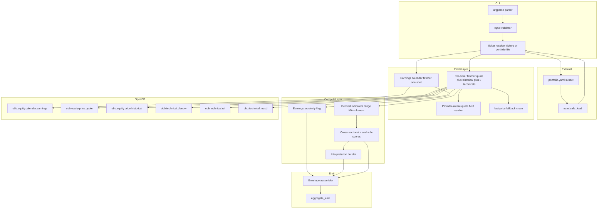
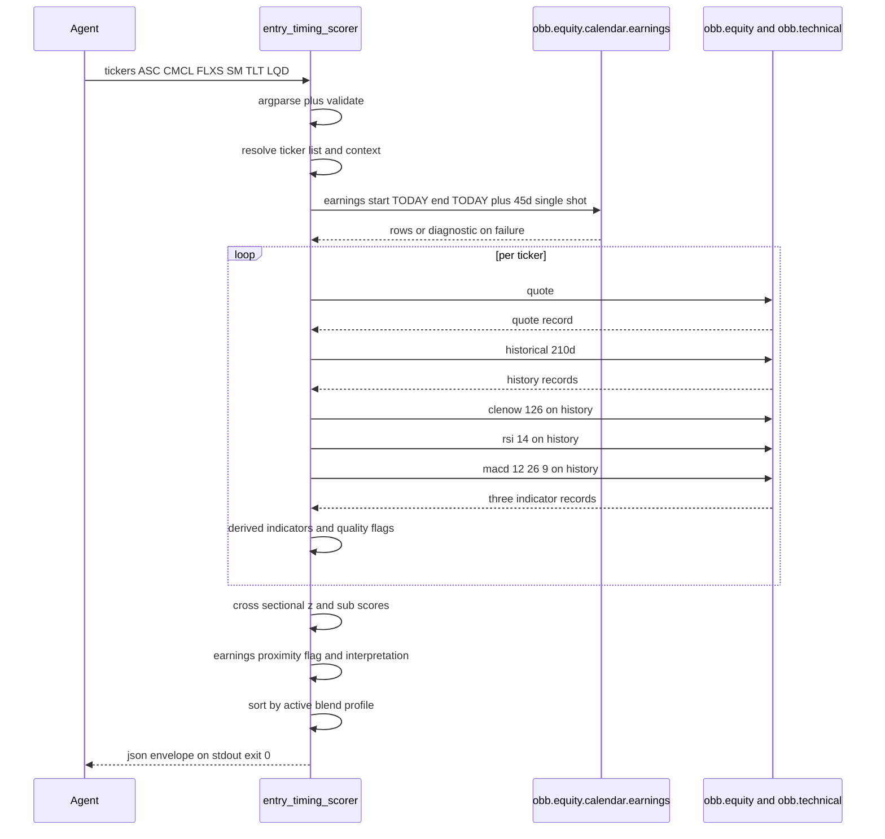

# Technical Design — entry-timing-scorer

---
**Purpose**: Translate the thirteen requirements in `requirements.md` into the architectural contract that `scripts/entry_timing_scorer.py` plus `skills/entry-timing-scorer/SKILL.md` must satisfy. Research findings live in `research.md`; this document is the self-contained build-ready artifact.
---

## Overview

**Purpose**: Deliver a thin CLI wrapper that takes a short list of tickers (typically 5–10 names already selected by the long/mid-term strategy) and emits per-ticker entry-timing analytics. The wrapper composes five already-live primitives (`obb.equity.price.quote`, `obb.equity.price.historical`, `obb.technical.{clenow,rsi,macd}`, `obb.equity.calendar.earnings`) into a two-axis output (`trend_score_0_100`, `mean_reversion_score_0_100`) with an opt-in blend, an earnings-proximity flag that is deliberately kept outside the composite, and a `volume_avg_window: "20d_real"` tag that permanently resolves reviewer R1's FLXS volume-label ambiguity.

**Users**: The analyst agent running the daily holdings-monitoring loop, and any AI agent invoking the wrapper for ad-hoc watchlist checks. Both reach it through `uv run scripts/entry_timing_scorer.py …`; both consume the JSON envelope programmatically.

**Impact**: Adds one new wrapper (`scripts/entry_timing_scorer.py`), one new `SKILL.md`, one new integration-test file, one `pyyaml>=6.0` direct dependency, and a one-row bump to `skills/INDEX.md` plus `README.md` §1-1. No changes to existing wrappers or helpers. No new providers, no new OpenBB endpoints, no envelope-contract deviation.

### Goals

- Expose one CLI invocation that delivers the five-signal entry-timing table the analyst currently assembles by hand.
- Keep `trend` and `mean_reversion` axes strictly separate, and keep earnings proximity as a standalone flag so FLXS-style "earnings close + momentum high" cases remain readable.
- Eliminate the volume-label ambiguity identified in reviewer R1 by tagging every `volume_z_20d` row with `volume_avg_window: "20d_real"` and by holding `volume_reference` (the provider-native 3-month / 10-day windows) in a separate, clearly-labelled block.
- Pass the repo-wide `tests/integration/test_json_contract.py` and `tests/integration/test_verification_gate.py` invariants on first landing.
- Remain a thin composition wrapper: re-use every primitive exactly as `momentum.py` / `sector_score.py` already use them; add only local math (range position, volume-z estimator, cross-sectional z, sub-score blend).

### Non-Goals

- Parsing `portfolio.yaml` beyond the `positions[].ticker` / `watchlist[].ticker` subset (Req 10.1); no trigger / exit-rule / targets fields are read.
- Macro-quadrant integration — `policy.md` §3 short-term strategy includes it as a judgment axis, but the wrapper stays at ticker level (Req 10.4).
- Alerts / Discord / any side effect beyond stdout JSON (Req 10.3, 10.5, 10.6).
- Backtesting, portfolio updates, final buy/sell decisions (those remain the analyst agent's responsibility).
- Absolute strength readings — cross-sectional z on n=5–10 collapses to a monotone function of within-basket rank; the wrapper's own output carries `analytical_caveats` acknowledging this (Req 9.9).

## Architecture

### Existing Architecture Analysis

The wrapper slots into an existing, tested thin-wrapper surface. Three architectural precedents are load-bearing and are re-used unchanged:

- **`scripts/sector_score.py`** is the direct architectural precedent for every major layer: cross-sectional z-score helper (`zscore`), descending-rank helper (`rank_desc`), 0–100 transform (`to_100 = clip(50 + z*25, 0, 100)`), weight-normalized composition (`sum-of-available-weights`), per-stage provider diagnostics (`data.provider_diagnostics[{provider, stage, error, error_category}]`), per-row failure shape (`{ok:false, error, error_type, error_category}`), and `aggregate_emit` envelope integration. The entry-timing wrapper mirrors these shapes rather than re-inventing them; shared extraction to `scripts/_*.py` is explicitly deferred (see Architecture Pattern decision below).
- **`scripts/momentum.py::_indicator_call`** (lines 89–126) and **`_last_with`** (lines 74–86) encode the single-fetch-feeds-three-technicals pattern (`data=history.results` consumed by `obb.technical.{clenow,rsi,macd}`) plus the suffix-search column-finding idiom. Both are adopted verbatim in shape; the wrapper does not add its own technical-indicator extraction strategy.
- **`scripts/_common.py`** (envelope, `safe_call`, `ErrorCategory`, `sanitize_for_json`, `aggregate_emit`) is used on the unchanged public surface. The wrapper adds no helpers to `_common.py`.

Existing envelope, exit-code, stdout-hygiene, and per-row-failure invariants in `docs/steering/tech.md` "JSON output contract" are respected without deviation; they are enforced mechanically by `tests/integration/test_json_contract.py::WRAPPER_HAPPY_ARGV` on every commit.

### Architecture Pattern & Boundary Map

Selected pattern: **new thin wrapper `scripts/entry_timing_scorer.py` modeled on `scripts/sector_score.py`** (Option B in `research.md` Architecture Pattern Evaluation). Deferred alternatives: extending `sector_score.py` (rejected — leaks short-term concepts into the mid-term sector wrapper), and extracting a shared `scripts/_scoring.py` (deferred — entry-timing needs `min_basket=3` and a different key-set; premature extraction would be immediately undone).



**Domain/feature boundaries**: the wrapper is a single file. Internal partitioning is function-level, not module-level: a boundary between (a) fetch, (b) derive, (c) cross-sectional score, (d) flag / interpret / emit. Each boundary is a pure-function interface with typed Python signatures; nothing crosses into another wrapper or into `_common.py` beyond the already-published envelope helpers.

**Existing patterns preserved**: `safe_call` guards every OpenBB call; `aggregate_emit` emits the envelope; `silence_stdout` is entered transitively through `safe_call`; `from __future__ import annotations` header; `apply_to_openbb()` is called once at module import. Per `structure.md` the file name `entry_timing_scorer.py` does not shadow any stdlib module.

**New components rationale**: only the ones that deliver the contractual deltas from `requirements.md`: the provider-aware quote field resolver (Req 4.1), the robust log-MAD volume-z estimator (Req 5.4), the interpretation builder (Req 9.4), the `analytical_caveats` constant (Req 9.9), the `data_quality_flags` closed-enum catalog (Req 9.10), the `SCORER_SIGNAL_KEYS` structural guard (Decision 5).

**Steering compliance**: flat-wrapper convention (`structure.md`), English-fixed `SKILL.md` (`structure.md`), key-free default provider (`tech.md`), envelope invariants (`tech.md`), ChangeBundleRule (`structure.md`: `scripts/<name>.py` requires matching `skills/<name>/SKILL.md` in the same commit).

### Technology Stack

| Layer | Choice / Version | Role in Feature | Notes |
|-------|------------------|-----------------|-------|
| CLI runtime | Python 3.12 (`>=3.12,<3.13`) + `uv` | Entry point, argparse, subprocess under `uv run` | No deviation from repo baseline |
| Data SDK | `openbb>=4.4.0` | `equity.price.{quote,historical}`, `technical.{clenow,rsi,macd}`, `equity.calendar.earnings` | No new endpoints; live-verified 2026-04-30 |
| Providers | yfinance (default, key-free), nasdaq (default earnings), fmp (opt-in via `--provider fmp`, full routing including earnings) | Quote / historical / technical / calendar | FMP credential gated; basket-parity check supports one default (`N=45`) across both |
| Shared envelope | `scripts/_common.py::{safe_call, aggregate_emit, ErrorCategory, sanitize_for_json}` | Envelope + partial-failure + NaN→null | Re-used unchanged |
| Dependency add | `pyyaml>=6.0` (transitively already 6.0.3 via OpenBB; declared directly for honesty — `research.md` Decision 1) | `--portfolio-file` parsing with `yaml.safe_load` | Only new direct dependency |
| Skill documentation | `skills/entry-timing-scorer/SKILL.md` (English, 30–80 lines) | Agent-facing CLI manual with one real output sample | ChangeBundleRule mandatory pair |
| Integration tests | `pytest -m integration` subprocess via `tests/integration/conftest.py::run_wrapper_or_xfail` | Envelope-shape + per-Req contract assertions | Auto-skipped where `FMP_API_KEY` absent |

## System Flows

### Per-invocation sequence



Flow-level decisions:

- **One earnings-calendar call per invocation, no retry on failure** (Req 3.1 / 3.7). Nasdaq's 403 poisons the Python process and cannot be recovered in-process; FMP has no such ceiling but the no-retry invariant stays universal for provider-agnostic behavior. A failure surfaces via `data.provider_diagnostics[{provider, stage: "earnings_calendar", error, error_category}]` and every per-ticker row still emits with `next_earnings_date: null` (Req 3.5).
- **Per-ticker calls are exactly five** (Req 4.8 / 13.3): 1 quote + 1 historical + 3 technicals, with the three technicals consuming `data=history.results` from the single historical fetch (Decision 2 in `research.md`).
- **Cross-sectional z only runs after every fetch completes**, so a late-arriving ticker never perturbs another ticker's score; `basket_size` is the count of rows that reached the scorer with at least one non-null signal (`research.md` Decision 3).

## Requirements Traceability

Numeric IDs match `requirements.md` verbatim. Columns reference the domain/layer sections under *Components and Interfaces* and the flow above.

| Requirement | Summary | Components | Interfaces | Flows |
|-------------|---------|------------|------------|-------|
| 1.1 | `--tickers <CSV>` parse, preserve order, dedupe | CLI Entry / Input Resolver | `parse_tickers_argument` | Sequence init |
| 1.2 | `--portfolio-file <path>` parse `positions[].ticker` + `watchlist[].ticker` | CLI Entry / Input Resolver | `load_portfolio_file` | Sequence init |
| 1.3 | Mutually-exclusive `--tickers` + `--portfolio-file` → validation error | CLI Entry / Input Validator | argparse mutex group | Sequence init (pre-call) |
| 1.4 | Neither supplied → validation error | CLI Entry / Input Validator | argparse group required | Sequence init (pre-call) |
| 1.5 | `.T` passthrough for JP tickers | CLI Entry / Input Resolver | no suffix-stripping | All OpenBB calls |
| 1.6 | Empty resolved list → validation error | CLI Entry / Input Validator | `validate_resolved_tickers` | Sequence init (pre-call) |
| 1.7 | Portfolio extraction tags `context: "holding"` / `"watchlist"` | CLI Entry / Context Tagger | `tag_ticker_context` | Sequence init |
| 1.8 | `--context` CLI flag under `--tickers`, default `unknown` | CLI Entry / Context Tagger | argparse choice | Sequence init |
| 1.9 | Duplicate ticker in `positions[]` + `watchlist[]` → `holding` + data-quality flag | CLI Entry / Context Tagger | `tag_ticker_context` | Sequence init |
| 2.1 | `--provider` omitted ⇒ yfinance (equity) + nasdaq (earnings) | CLI Entry / Provider Router | `resolve_providers` | Fetch layer |
| 2.2 | `--provider fmp` ⇒ FMP for every call including earnings | CLI Entry / Provider Router | `resolve_providers` | Fetch layer |
| 2.3 | argparse-closed `{yfinance, fmp}` choice set | CLI Entry / Provider Router | argparse choices | Sequence init |
| 2.4 | Exceptions propagate through `safe_call` with `ErrorCategory` | Fetch layer / safe_call | `safe_call` | Per-ticker loop |
| 3.1 | Single `obb.equity.calendar.earnings` call, `N=45` default | Earnings Calendar Fetcher | `fetch_earnings_window` | Calendar call |
| 3.2 | Filter returned rows to input-ticker set | Earnings Calendar Fetcher | `index_earnings_by_symbol` | Post-calendar |
| 3.3 | `next_earnings_date` = earliest `report_date ≥ TODAY` | Earnings Calendar Fetcher | `index_earnings_by_symbol` | Post-calendar |
| 3.4 | No row ⇒ all three earnings fields `null` | Earnings Calendar Fetcher | `index_earnings_by_symbol` | Post-calendar |
| 3.5 | Calendar failure ⇒ per-ticker row still emitted + `data.provider_diagnostics` | Earnings Calendar Fetcher + Envelope Assembler | `fetch_earnings_window` + `aggregate_emit` | Emit |
| 3.6 | `days_to_next_earnings_unit: "calendar_days"` under `data` | Envelope Assembler | `build_query_meta` | Emit |
| 3.7 | `--earnings-window-days` flag `[1, 90]`, echo under `data`, no in-process retry | CLI Entry / Earnings Calendar Fetcher | argparse `type=int` + custom bounds check | Calendar call |
| 4.1 | Quote call + provider-aware field resolver for MA + volume averages | Per-Ticker Data Fetcher + Quote Field Resolver | `resolve_quote_fields` | Per-ticker loop |
| 4.2 | Historical lookback ≥ 140 trading days | Per-Ticker Data Fetcher | `HISTORICAL_LOOKBACK_DAYS` constant | Per-ticker loop |
| 4.3 | Clenow `period=126` + `_to_float` on `factor` | Per-Ticker Data Fetcher | `extract_clenow_factor` | Per-ticker loop |
| 4.4 | RSI `length=14` + case-insensitive suffix search on `"RSI"` | Per-Ticker Data Fetcher | `extract_rsi_14` | Per-ticker loop |
| 4.5 | MACD `12,26,9` + case-sensitive suffix search on `"MACDh"` | Per-Ticker Data Fetcher | `extract_macd_histogram` | Per-ticker loop |
| 4.6 | Every OpenBB call guarded by `safe_call` | Per-Ticker Data Fetcher | `safe_call` | Per-ticker loop |
| 4.7 | `last_price → prev_close → historical[-1].close` fallback with per-rung flag | Last-Price Fallback | `resolve_last_price` | Per-ticker loop |
| 4.8 | Exactly 5 OpenBB calls per ticker | Per-Ticker Data Fetcher | `fetch_ticker_bundle` | Per-ticker loop |
| 5.1 | `range_pct_52w` computed when inputs present | Derived Indicators | `compute_range_pct_52w` | Post-fetch per ticker |
| 5.2 | `ma200_distance` computed when inputs present | Derived Indicators | `compute_ma200_distance` | Post-fetch per ticker |
| 5.3 | `volume_z_20d` computed when ≥21 history rows | Derived Indicators | `compute_volume_z_20d` | Post-fetch per ticker |
| 5.4 | `--volume-z-estimator {robust\|classical}` default `robust` + per-row echo | CLI Entry + Derived Indicators | argparse + `compute_volume_z_20d` | Post-fetch per ticker |
| 5.5 | Null + data-quality flag on degenerate input | Derived Indicators + Quality Flag Emitter | `compute_volume_z_20d` | Post-fetch per ticker |
| 5.6 | `volume_avg_window: "20d_real"` on every `volume_z_20d` row | Derived Indicators | `compute_volume_z_20d` | Post-fetch per ticker |
| 5.7 | `volume_reference` sibling block + FMP-null handling + flag | Quote Field Resolver + Quality Flag Emitter | `build_volume_reference_block` | Post-fetch per ticker |
| 6.1 | Per-signal cross-sectional z over five signals | Cross-Sectional Scorer | `zscore(min_basket=3)` | Post-loop |
| 6.2 | `trend_z` / `mean_reversion_z` sum-of-available-weights normalization | Cross-Sectional Scorer | `compose_subscore` | Post-loop |
| 6.3 | Sub-score weight flags with defaults | CLI Entry + Cross-Sectional Scorer | argparse + `compose_subscore` | Sequence init / post-loop |
| 6.4 | `clip(50 + z*25, 0, 100)` transform | Cross-Sectional Scorer | `to_100` | Post-loop |
| 6.5 | `--blend-profile` flag + `balanced` / `trend` / `mean_reversion` | CLI Entry + Cross-Sectional Scorer | argparse + `compose_blend` | Sequence init / post-loop |
| 6.6 | `--blend-profile none` omits `blended_score_0_100` | Envelope Assembler | `build_per_ticker_row` | Emit |
| 6.7 | Per-signal basket < 3 ⇒ null + `basket_too_small_for_z(<signal>)` | Cross-Sectional Scorer + Quality Flag Emitter | `zscore(min_basket=3)` | Post-loop |
| 6.8 | Whole-basket < 3 ⇒ null scores + top-level warning | Cross-Sectional Scorer + Envelope Assembler | `compose_subscore` + `aggregate_emit` | Emit |
| 6.9 | Sort by active blend profile, nulls sink | Envelope Assembler | `sort_results` | Emit |
| 6.10 | `z_scores` block per ticker | Envelope Assembler | `build_per_ticker_row` | Emit |
| 6.11 | `basket_size` + `basket_size_sufficient` per row | Cross-Sectional Scorer | `compute_basket_size` | Post-loop |
| 7.1 | Earnings fields excluded from every composite | Cross-Sectional Scorer | `SCORER_SIGNAL_KEYS` constant | Post-loop |
| 7.2 | `--earnings-proximity-days` flag default 5, echo under `data` | CLI Entry + Earnings-Proximity Flag | argparse + `compute_proximity_flag` | Emit |
| 7.3 | `days_to_next_earnings ≤ threshold` ⇒ warning true | Earnings-Proximity Flag | `compute_proximity_flag` | Emit |
| 7.4 | `>` threshold or null ⇒ warning false | Earnings-Proximity Flag | `compute_proximity_flag` | Emit |
| 7.5 | Raw `next_earnings_date` + `days_to_next_earnings` on every row | Earnings-Proximity Flag | `compute_proximity_flag` | Emit |
| 7.6 | Negative / non-integer proximity arg ⇒ validation exit | CLI Entry / Input Validator | argparse `type=int` + post-parse bound | Sequence init |
| 8.1 | Envelope via `aggregate_emit` with `tool="entry_timing_scorer"` | Envelope Assembler | `aggregate_emit` | Emit |
| 8.2 | `data.results[]` for rows, meta siblings of `results` | Envelope Assembler | `build_query_meta` | Emit |
| 8.3 | Per-row failure shape `{symbol, provider, ok:false, error, error_type, error_category}` + top-level warning mirror | Envelope Assembler | `build_failure_row` + `aggregate_emit` | Emit |
| 8.4 | All-fatal-same-category ⇒ exit 2 via `aggregate_emit` | Envelope Assembler | `aggregate_emit` | Emit |
| 8.5 | Full success + partial failure ⇒ exit 0 | Envelope Assembler | `aggregate_emit` | Emit |
| 8.6 | NaN / ±Inf → null via `sanitize_for_json` | Envelope Assembler | `emit` | Emit |
| 8.7 | Single stdout JSON doc, tracebacks to stderr | Envelope Assembler | `emit` + `safe_call` | Emit |
| 9.1 | Minimum per-row field set on every input ticker | Envelope Assembler | `build_per_ticker_row` | Emit |
| 9.2 | `blended_score_0_100` + `blend_profile` added when profile not `none` | Envelope Assembler | `build_per_ticker_row` | Emit |
| 9.3 | `signals` block populated with twelve named fields | Envelope Assembler | `build_signals_block` | Emit |
| 9.4 | `interpretation` block with five keys and context-tailored reading | Interpretation Builder | `build_interpretation` | Emit |
| 9.5 | No `interpretation_hint` scalar anywhere (negative invariant) | Envelope Assembler | absence of emitter | Emit |
| 9.6 | `rsi_oversold_lt_20` when `rsi_14 < 20` | Quality Flag Emitter | `collect_data_quality_flags` | Emit |
| 9.7 | `basket_too_small_for_z` row-level flag | Quality Flag Emitter | `collect_data_quality_flags` | Emit |
| 9.8 | `ok: false` rows omit score fields, retain envelope fields | Envelope Assembler | `build_failure_row` | Emit |
| 9.9 | `data.analytical_caveats` constant tuple | Envelope Assembler | `ANALYTICAL_CAVEATS` + `build_query_meta` | Emit |
| 9.10 | `data_quality_flags[]` drawn from closed enumeration | Quality Flag Emitter | `DATA_QUALITY_FLAGS` + `collect_data_quality_flags` | Emit |
| 10.1–10.6 | Scope boundaries (no trigger match / write / macro / notify / state) | CLI Entry + Envelope Assembler | absence of non-stdout writes | — |
| 11.1–11.8 | SKILL.md content, INDEX.md row, interpretation + reading-by-context sections | SKILL.md (companion file) | — | — |
| 12.1–12.11 | Integration-test coverage including provider-parametrized slice | `tests/integration/test_entry_timing_scorer.py` | subprocess harness | — |
| 13.1 | 10-ticker run within 90 seconds | Performance | budget accounting | — |
| 13.2 | Single-ticker run within 20 seconds | Performance | budget accounting | — |
| 13.3 | ≤1 earnings call + ≤5 per-ticker calls | Earnings Calendar Fetcher + Per-Ticker Data Fetcher | budget constants | — |
| 13.4 | No retry loops | Earnings Calendar Fetcher + Per-Ticker Data Fetcher | no retry construct | — |

## Components and Interfaces

Summary table (full blocks follow for components that introduce new boundaries; short entries are Implementation-Note style).

| Component | Domain/Layer | Intent | Req Coverage | Key Dependencies (P0/P1) | Contracts |
|-----------|--------------|--------|--------------|--------------------------|-----------|
| CLI Entry / Input Resolver | CLI | Parse argv; build `(tickers, contexts, providers, thresholds, weights, estimator, blend)` | 1.1–1.9, 2.1–2.3, 3.7, 5.4, 6.3, 6.5, 7.2, 7.6, 10.1 | argparse (P0), `yaml.safe_load` (P0), `pathlib` (P1) | Service |
| Provider Router | CLI | Map `--provider` to equity + calendar providers | 2.1, 2.2, 2.3 | argparse choices (P0) | Service |
| Earnings Calendar Fetcher | Fetch | One-shot earnings fetch + per-symbol index | 3.1–3.7, 13.3, 13.4 | `obb.equity.calendar.earnings` (P0), `safe_call` (P0) | Service, Batch |
| Per-Ticker Data Fetcher | Fetch | Emit 5 OpenBB calls per ticker into a single bundle | 4.2, 4.3, 4.4, 4.5, 4.6, 4.8, 13.3, 13.4 | `obb.equity.price.{quote,historical}`, `obb.technical.{clenow,rsi,macd}` (P0), `safe_call` (P0) | Service, Batch |
| Quote Field Resolver | Fetch | Provider-aware logical-field mapping | 4.1, 5.7 | Per-Ticker Data Fetcher (P0) | Service |
| Last-Price Fallback | Fetch | Resolve `last_price` via three-rung chain + flag | 4.7 | Per-Ticker Data Fetcher (P0), Quality Flag Emitter (P1) | Service |
| Derived Indicators | Compute | `range_pct_52w`, `ma200_distance`, `volume_z_20d` | 5.1, 5.2, 5.3, 5.4, 5.5, 5.6 | Last-Price Fallback (P0), Quote Field Resolver (P0) | Service |
| Cross-Sectional Scorer | Compute | Per-signal z, sub-scores, `basket_size` | 6.1–6.11, 7.1 | Derived Indicators (P0) | Service |
| Earnings-Proximity Flag | Compute | Flag vs. threshold, raw fields passthrough | 7.2–7.5 | Earnings Calendar Fetcher (P0) | Service |
| Interpretation Builder | Compute | Build per-row `interpretation` object | 9.4, 9.5, 11.7 | Context Tagger (P0) | Service |
| Quality Flag Emitter | Compute | Append closed-enum `data_quality_flags[]` entries | 1.9, 4.7, 5.5, 5.7, 9.6, 9.7, 9.10 | — | Service |
| Envelope Assembler | Emit | Build `data` namespace + per-row rows; delegate to `aggregate_emit` | 3.5, 3.6, 6.9, 8.1–8.7, 9.1–9.3, 9.8, 9.9 | `_common.aggregate_emit` (P0), `_common.sanitize_for_json` (P0) | Service, API |
| SKILL.md (companion) | Docs | English 30–80-line manual for agents | 11.1–11.8 | — | — |
| Integration Test | Test | Subprocess contract assertions + provider-parametrized slice | 12.1–12.11 | `tests/integration/conftest.py::run_wrapper_or_xfail` (P0) | Batch |

### CLI Layer

#### CLI Entry / Input Resolver

| Field | Detail |
|-------|--------|
| Intent | Parse argv into a typed configuration object and resolve the (ticker, context) list from `--tickers` or `--portfolio-file` |
| Requirements | 1.1, 1.2, 1.3, 1.4, 1.5, 1.6, 1.7, 1.8, 1.9, 2.3, 3.7, 5.4, 6.3, 6.5, 7.2, 7.6, 10.1 |

**Responsibilities & Constraints**
- Sole owner of argv-to-config translation; no OpenBB call occurs before validation completes.
- Validates input-argument combinations (mutex of `--tickers` + `--portfolio-file`, bounds on integer flags) and exits with `error_category: "validation"` before issuing any OpenBB call (Req 1.3, 1.4, 1.6, 7.6).
- Preserves input order for `--tickers`; for `--portfolio-file`, follows `positions[]` first then `watchlist[]`, preserving yaml declaration order.
- Does not parse any portfolio.yaml field beyond `positions[].ticker` / `watchlist[].ticker` (Req 10.1).

**Dependencies**
- Inbound: Argv (External, P0 — CLI boundary)
- Outbound: Earnings Calendar Fetcher, Per-Ticker Data Fetcher, Cross-Sectional Scorer (Internal, P0)
- External: argparse (stdlib, P0), `yaml.safe_load` (P0), `pathlib.Path` (stdlib, P1)

**Contracts**: Service [x]

##### Service Interface

```python
@dataclass(frozen=True)
class ScorerConfig:
    tickers: list[str]                       # deduplicated, input-order-preserved
    contexts: dict[str, str]                 # ticker → "holding" | "watchlist" | "unknown"
    provider: Literal["yfinance", "fmp"]
    calendar_provider: Literal["nasdaq", "fmp"]
    earnings_window_days: int                # [1, 90]; default 45
    earnings_proximity_days: int             # non-negative integer; default 5
    volume_z_estimator: Literal["robust", "classical"]  # default "robust"
    blend_profile: Literal["trend", "mean_reversion", "balanced", "none"]  # default "none"
    trend_weights: TrendWeights              # clenow, macd, volume (0.50/0.25/0.25 default)
    mean_reversion_weights: MeanReversionWeights  # range, rsi (0.60/0.40 default)
    context_duplicate_flags: dict[str, list[str]]  # ticker → pre-computed flags (Req 1.9)

def build_config(argv: list[str]) -> ScorerConfig: ...
```

- Preconditions: `argv` is the process argv tail (everything after `scripts/entry_timing_scorer.py`).
- Postconditions: either returns a validated `ScorerConfig`, or raises `SystemExit(2)` via argparse with a validation-category error envelope on stdout.
- Invariants: `len(tickers) >= 1`; `tickers` are unique; each `tickers[i]` has a matching `contexts[tickers[i]]`; `earnings_window_days ∈ [1, 90]`; `earnings_proximity_days >= 0`.

**Implementation Notes**
- Integration: `--tickers` and `--portfolio-file` occupy a `parser.add_mutually_exclusive_group(required=True)` so Req 1.3 + 1.4 are enforced at argparse-time. `--context` is only meaningful with `--tickers`; when `--portfolio-file` is supplied, `--context` is rejected as validation error (extends Req 1.8's "optional" wording in requirements without contradiction).
- Validation: `--earnings-window-days` uses `type=int` + a custom `action` that enforces `[1, 90]`; `--earnings-proximity-days` uses `type=int` + a post-parse `< 0` check; both failures produce `error_category: "validation"` (Req 3.7, 7.6).
- Risks: `yaml.safe_load` on a pathological file returns `None`; guard with an explicit type check and emit `error_category: "validation"` rather than letting a `TypeError` bubble up.

#### Provider Router

| Field | Detail |
|-------|--------|
| Intent | Resolve the `--provider` flag into the paired (equity_provider, calendar_provider) values used by every downstream fetcher |
| Requirements | 2.1, 2.2, 2.3 |

**Responsibilities & Constraints**
- `--provider yfinance` (default) ⇒ equity `yfinance`, calendar `nasdaq` (the keyless default path).
- `--provider fmp` ⇒ equity `fmp`, calendar `fmp` (Req 2.2: reaches FMP's full 90d earnings window cleanly, per Live finding L7).
- No other provider is accepted (Req 2.3, enforced via argparse `choices`).

**Contracts**: Service [x]

##### Service Interface

```python
def resolve_providers(cli_provider: Literal["yfinance", "fmp"]) -> tuple[str, str]:
    """Return (equity_provider, calendar_provider)."""
```

- Postconditions: the tuple maps to `("yfinance", "nasdaq")` or `("fmp", "fmp")`; no other value is emitted.

### Fetch Layer

#### Earnings Calendar Fetcher

| Field | Detail |
|-------|--------|
| Intent | Issue exactly one earnings-calendar call per invocation and return a symbol-indexed view plus an optional provider-diagnostics entry |
| Requirements | 3.1, 3.2, 3.3, 3.4, 3.5, 3.6, 3.7, 13.3, 13.4 |

**Responsibilities & Constraints**
- One call per invocation, no retry on failure (Req 3.1, 13.4). The nasdaq 403 cannot be recovered in-process; FMP has no ceiling but the no-retry invariant stays universal for provider-agnostic behavior.
- Filters rows to the input-ticker set before index construction (Req 3.2); for each ticker, picks the earliest `report_date ≥ TODAY` (Req 3.3).
- On failure, returns an empty index and a diagnostics entry `{provider, stage: "earnings_calendar", error, error_category}` (Req 3.5). The per-ticker rows still emit with `next_earnings_date: null` — caller plugs them in at row-build time.

**Dependencies**
- Inbound: CLI Entry (P0)
- Outbound: Earnings-Proximity Flag (P0), Envelope Assembler (P0 — diagnostics routing)
- External: `obb.equity.calendar.earnings` (P0), `_common.safe_call` (P0)

**Contracts**: Service [x], Batch [x]

##### Service Interface

```python
@dataclass(frozen=True)
class EarningsIndex:
    by_symbol: dict[str, date]          # symbol → earliest report_date on/after TODAY
    diagnostic: dict[str, str] | None   # None on success; single provider_diagnostics entry on failure

def fetch_earnings_window(
    tickers: list[str],
    *,
    calendar_provider: str,
    window_days: int,  # 1..90
    today: date,
) -> EarningsIndex: ...
```

- Preconditions: `window_days ∈ [1, 90]`; `tickers` non-empty.
- Postconditions: exactly one `obb.equity.calendar.earnings` invocation through `safe_call`. Rows with missing/invalid `report_date` or `symbol` are skipped defensively (research Decision 10). On calendar failure `by_symbol == {}` and `diagnostic` is set.
- Invariants: `by_symbol[symbol] >= today` for every surviving entry.

##### Batch / Job Contract

- Trigger: once per CLI invocation after `build_config` returns.
- Input / validation: `(tickers, calendar_provider, window_days, today)`.
- Output / destination: in-process `EarningsIndex`; consumed by Earnings-Proximity Flag at row-build time.
- Idempotency & recovery: no retry (Req 13.4); failure is observable via `diagnostic` and does not block per-ticker data fetches.

**Implementation Notes**
- Integration: on calendar failure the Envelope Assembler appends `diagnostic` to `data.provider_diagnostics` (mirroring `sector_score.fetch_performance`'s pattern).
- Validation: defensive `isinstance(row, dict)` + `row.get("symbol") and row.get("report_date")` before indexing (Decision 10 in research.md).
- Risks: `report_date` field drift across providers. yfinance-path uses nasdaq which emits ISO strings; FMP-path emits ISO strings as well; coerce via `datetime.date.fromisoformat` inside `safe_call` protection so malformed rows become `NoData` failures rather than exceptions.

#### Per-Ticker Data Fetcher

| Field | Detail |
|-------|--------|
| Intent | Issue the five OpenBB calls for one ticker and return a typed bundle ready for derivation |
| Requirements | 4.2, 4.3, 4.4, 4.5, 4.6, 4.8, 13.3, 13.4 |

**Responsibilities & Constraints**
- Per-ticker call sequence is fixed: `quote`, `historical(start=today-210d)`, `clenow(data=history, period=126)`, `rsi(data=history, length=14)`, `macd(data=history, fast=12, slow=26, signal=9)`. That is exactly five (Req 4.8, 13.3).
- `HISTORICAL_LOOKBACK_DAYS = 210` calendar days (module-scope constant; covers the 140-trading-day minimum in Req 4.2 plus RSI(14) warm-up).
- Every OpenBB call passes through `safe_call` so stdout warnings are absorbed and failures become structured records (Req 4.6).
- No historical re-fetch for rsi/macd; they consume the same `history.results` (Decision 2 in research.md).

**Dependencies**
- Inbound: CLI Entry (P0), Provider Router (P0)
- Outbound: Quote Field Resolver (P0), Last-Price Fallback (P0), Derived Indicators (P0), Cross-Sectional Scorer (P0)
- External: `obb.equity.price.{quote,historical}`, `obb.technical.{clenow,rsi,macd}` (P0), `_common.safe_call` (P0), `_common.to_records` (P0 — through `safe_call`)

**Contracts**: Service [x], Batch [x]

##### Service Interface

```python
@dataclass(frozen=True)
class TickerBundle:
    symbol: str
    provider: str                    # "yfinance" | "fmp" — mirrors equity provider
    ok: bool                         # False iff every call in the bundle failed or data is unusable
    quote_row: dict[str, Any] | None        # None iff quote failed
    history_rows: list[dict[str, Any]]      # [] iff historical failed
    clenow_row: dict[str, Any] | None       # None iff clenow failed or empty
    rsi_rows: list[dict[str, Any]]          # [] iff rsi failed or empty
    macd_rows: list[dict[str, Any]]         # [] iff macd failed or empty
    failures: list[dict[str, str]]          # per-stage failure records from safe_call
    fatal_category: str | None              # ErrorCategory value when every stage failed fatally

def fetch_ticker_bundle(
    ticker: str,
    *,
    provider: str,
    historical_lookback_days: int = 210,
) -> TickerBundle: ...
```

- Preconditions: `provider ∈ {"yfinance","fmp"}`.
- Postconditions: exactly five OpenBB calls through `safe_call`. `ok` is True iff *any* of the five primary artefacts (`quote_row`, `history_rows`, `clenow_row`, `rsi_rows`, `macd_rows`) carries usable data, mirroring `sector_score._classify_ticker_failure`'s partial-success handling.
- Invariants: `len(history_rows) >= 0`; every call has been issued exactly once; no fetch method is invoked after a primary-call fatal-category collapse (credential/plan — short-circuit to avoid burning budget needlessly, but continue on transient/other to keep partial data available).

**Implementation Notes**
- Integration: the three technicals are issued sequentially against the same `history.results` list-of-dicts; `close_RSI_14` extraction uses case-insensitive suffix on `"RSI"`; `close_MACDh_12_26_9` extraction uses case-sensitive suffix on `"MACDh"` to avoid the `MACD` / `MACDs` / `MACDh` collision (Req 4.4, 4.5). Clenow `factor` is coerced via `_to_float` (copied inline from `sector_score.py` — not promoted to `_common.py` yet).
- Validation: if `history_rows` is empty the three technicals are short-circuited to a documented `{ok: false, error: "empty_history"}` failure without issuing the OpenBB calls (saves three calls on the known-null path); this still reports the per-ticker call count as ≤5.
- Risks: FMP-fed historical carries extra pass-through columns (`symbol`, `change`, `change_percent`, `vwap`) — the suffix-search is column-name-robust by design, so these are not a hazard (Live finding L9).

##### Batch / Job Contract

- Trigger: one invocation per ticker after `fetch_earnings_window` returns.
- Input / validation: `(ticker, provider)`; per-ticker symbol is the unit of concurrency — the MVP runs them sequentially to stay within yfinance rate limits (Req 13.1 / 13.2 budget analysis confirms 90s/10 is achievable sequentially; concurrency is a deferred optimization).
- Output / destination: `TickerBundle`; consumed by Derived Indicators and feeds into `basket_size` accounting.
- Idempotency & recovery: no retry (Req 13.4); a single transient failure on `historical` collapses all three technicals for that ticker but does not affect other tickers.

#### Quote Field Resolver

| Field | Detail |
|-------|--------|
| Intent | Translate provider-native quote record keys into the wrapper's logical field names |
| Requirements | 4.1, 5.7 |

**Responsibilities & Constraints**
- Closed-choice provider map aligned with the `{yfinance, fmp}` set (Req 2.3).
- yfinance map: `ma_200d → ma_200d`, `ma_50d → ma_50d`, `volume_average → volume_average`, `volume_average_10d → volume_average_10d`.
- fmp map: `ma_200d → ma200`, `ma_50d → ma50`, `volume_average → None` (unavailable), `volume_average_10d → None` (unavailable).
- Logical names are what the wrapper emits downstream (Req 4.1 last sentence: "emitted under the logical names … regardless of which provider-native key").
- When the resolver returns `None` for a `volume_*` key under `--provider fmp`, the Quality Flag Emitter appends `"volume_reference_unavailable_on_provider"` exactly once per row (Req 5.7).

**Contracts**: Service [x]

##### Service Interface

```python
_QUOTE_FIELD_MAP: Mapping[str, Mapping[str, str | None]] = {
    "yfinance": {"ma_200d": "ma_200d", "ma_50d": "ma_50d",
                 "volume_average": "volume_average",
                 "volume_average_10d": "volume_average_10d"},
    "fmp":      {"ma_200d": "ma200",   "ma_50d": "ma50",
                 "volume_average": None,
                 "volume_average_10d": None},
}

def resolve_quote_fields(
    quote_row: dict[str, Any],
    provider: str,
) -> QuoteFields:
    """Return a typed view with logical field names and typed values."""
```

- Preconditions: `provider ∈ _QUOTE_FIELD_MAP`.
- Postconditions: returns `QuoteFields(last_price, prev_close, year_high, year_low, ma_200d, ma_50d, volume_average, volume_average_10d, latest_volume)`; each field is `float | None`. `volume_average*` are always `None` under `provider == "fmp"`.
- Invariants: adding a new `--provider` requires a new row in `_QUOTE_FIELD_MAP`; omission is caught by a `KeyError` at resolution time rather than silently falling back (Req 4.1 "closed-choice map").

#### Last-Price Fallback

| Field | Detail |
|-------|--------|
| Intent | Resolve the `last_price` used for `range_pct_52w` and `ma200_distance` via a documented three-rung chain |
| Requirements | 4.7, 9.10 |

**Responsibilities & Constraints**
- Chain order (research Decision 9): `quote.last_price → quote.prev_close → historical[-1].close`; first non-null rung wins.
- Fires exactly one `data_quality_flags` entry per row reflecting the rung that ultimately supplied the value:
  - rung 2 ⇒ `"last_price_from_prev_close"`
  - rung 3 ⇒ `"last_price_from_historical_close"`
  - no rung ⇒ `"last_price_unavailable"` + `last_price = None`
- Applied universally regardless of `--provider`; on FMP it is a no-op for bond ETFs (Live finding L8), on yfinance it keeps bond-ETF baskets usable (Live finding L3).

**Contracts**: Service [x]

##### Service Interface

```python
@dataclass(frozen=True)
class LastPriceResolution:
    value: float | None
    flag: Literal[
        None,
        "last_price_from_prev_close",
        "last_price_from_historical_close",
        "last_price_unavailable",
    ]

def resolve_last_price(
    quote: QuoteFields,
    history_rows: list[dict[str, Any]],
) -> LastPriceResolution: ...
```

- Postconditions: `value is None ⇔ flag == "last_price_unavailable"`; rung-1 success returns `flag=None`.

### Compute Layer

#### Derived Indicators

| Field | Detail |
|-------|--------|
| Intent | Compute `range_pct_52w`, `ma200_distance`, and `volume_z_20d` from the resolved inputs |
| Requirements | 5.1, 5.2, 5.3, 5.4, 5.5, 5.6 |

**Responsibilities & Constraints**
- `range_pct_52w = (last_price - year_low) / (year_high - year_low)` when all three inputs are non-null and the denominator is non-zero (Req 5.1).
- `ma200_distance = (last_price - ma_200d) / ma_200d` when both inputs are non-null and `ma_200d != 0` (Req 5.2).
- `volume_z_20d`: computed over the last 20 trading sessions **excluding** the latest session; requires ≥21 trailing rows (Req 5.3).
  - `robust` (default): `(log(latest_volume) - median(log(volume[-20:]))) / (1.4826 * MAD(log(volume[-20:])))` (Req 5.4).
  - `classical`: `(latest_volume - mean(volume[-20:])) / stdev(volume[-20:])` (Req 5.4).
- Degenerate-input flag order (research Topic 3): check `volume_window_too_short` first, then `volume_non_positive` (robust only), then `volume_zero_dispersion`; narrowest wins.
- Every row that reports a non-null `volume_z_20d` carries `volume_avg_window: "20d_real"` (Req 5.6).

**Dependencies**
- Inbound: Last-Price Fallback (P0), Quote Field Resolver (P0)
- Outbound: Cross-Sectional Scorer (P0)

**Contracts**: Service [x]

##### Service Interface

```python
@dataclass(frozen=True)
class DerivedIndicators:
    range_pct_52w: float | None
    ma200_distance: float | None
    volume_z_20d: float | None
    volume_avg_window: Literal["20d_real"]                  # constant string literal
    volume_z_estimator: Literal["robust", "classical"]      # echoed per row
    latest_volume: float | None
    extra_flags: list[str]                                  # volume_* flags to append

def compute_derived_indicators(
    quote: QuoteFields,
    last_price: LastPriceResolution,
    history_rows: list[dict[str, Any]],
    estimator: Literal["robust", "classical"],
) -> DerivedIndicators: ...
```

- Postconditions: `volume_z_20d is None ⇔ extra_flags` contains exactly one of `{"volume_window_too_short", "volume_non_positive", "volume_zero_dispersion"}`.

**Implementation Notes**
- Integration: uses only the already-fetched `history_rows`; does not issue any OpenBB call.
- Validation: latest session is identified via the row-ordering already guaranteed by `obb.equity.price.historical` (ascending by date). Defensive check: require `len(history_rows) >= 21` for the full estimator path; otherwise fall through to the `volume_window_too_short` flag.
- **`latest_volume` sourcing**: taken from `history_rows[-1].volume` (the last ascending-date bar), **not** from the quote record. This keeps `latest_volume` structurally aligned with the 20-day reference window `history_rows[-21:-1]` used by `volume_z_20d`, so the emitted scalar and the z-score computation see the same session. It also avoids the provider-shape divergence noted for quote-level volume fields (Live finding L10) — the historical path is shape-invariant across yfinance and fmp.
- Risks: `log(0)` on robust path is caught by the `volume_non_positive` flag gate; `MAD == 0` by the `volume_zero_dispersion` gate; both are raised **before** the estimator evaluates to avoid `ValueError` / `ZeroDivisionError` propagation.

#### Cross-Sectional Scorer

| Field | Detail |
|-------|--------|
| Intent | Normalize per-signal values across the basket, compose `trend_z` / `mean_reversion_z`, transform to 0–100, compute `basket_size`, and (optionally) compute `blended_score_0_100` |
| Requirements | 6.1, 6.2, 6.3, 6.4, 6.5, 6.6, 6.7, 6.8, 6.10, 6.11, 7.1 |

**Responsibilities & Constraints**
- `SCORER_SIGNAL_KEYS = ("clenow_126", "macd_histogram", "volume_z_20d", "inv_range_pct_52w", "oversold_rsi_14")` — a module-scope constant that structurally prevents earnings fields from ever being mixed into composites (Req 7.1; research Decision 5). The last two keys use the transformed sign convention: `inv_range_pct_52w = (1 - range_pct_52w)`, `oversold_rsi_14 = (50 - rsi_14)`, so a higher value consistently means "more mean-reverting".
- **Signal-name duality (transformed vs. original).** The *z_scores block* emits the transformed keys verbatim — `{"clenow_126", "macd_histogram", "volume_z_20d", "inv_range_pct_52w", "oversold_rsi_14"}` — so the auditable z-score values carry the same sign convention as the scorer math. The *Req 9.10 `basket_too_small_for_z(<signal>)` flag enum*, however, uses the **original** signal names (`range_pct_52w`, `rsi_14`) for the two transformed signals, since those are the names agents recognize from `signals.*`. A module-scope mapping bridges the two:
  ```python
  _SIGNAL_FLAG_NAME: dict[str, str] = {
      "clenow_126":        "clenow_126",
      "macd_histogram":    "macd_histogram",
      "volume_z_20d":      "volume_z_20d",
      "inv_range_pct_52w": "range_pct_52w",   # flag uses the original name
      "oversold_rsi_14":   "rsi_14",          # flag uses the original name
  }
  ```
  The Cross-Sectional Scorer iterates `SCORER_SIGNAL_KEYS` to compute z-scores and fills `z_scores[key]` under the transformed key, then emits flags as `f"basket_too_small_for_z({_SIGNAL_FLAG_NAME[key]})"`. Both sides are structurally catalogued — z_scores keys are fixed by the dataclass, flag strings are validated against `DATA_QUALITY_FLAGS` at append time (Quality Flag Emitter), and Req 12.6's enum-membership check catches any drift.
- Per-signal z-score uses a local `zscore(values, min_basket=3)` helper (stricter than `sector_score.zscore`'s `min_basket=2` — research Topic 2 rationale); if `len(clean) < 3` the signal collapses to `[None]*n` and every affected row receives `basket_too_small_for_z(<signal>)` via the `_SIGNAL_FLAG_NAME` translation above (Req 6.7).
- Sub-score composition uses the sum-of-available-weights normalization already in `sector_score.build_scores`: `sum(z_i * w_i for i where z_i is not None) / sum(w_i for i where z_i is not None)`; if every weight drops out, the sub-score is `None` (Req 6.2).
- 0–100 transform: `clip(50 + z * 25, 0, 100)` — copied from `sector_score.to_100` (Req 6.4).
- Blend (Req 6.5):
  - `balanced`: `0.5 * trend_z + 0.5 * mean_reversion_z`, then 0–100 transform.
  - `trend`: emit `trend_score_0_100` verbatim.
  - `mean_reversion`: emit `mean_reversion_score_0_100` verbatim.
  - `none`: field omitted entirely (Req 6.6).
- `basket_size` is row-level: count of rows where `ok: True` and at least one of the five SCORER_SIGNAL_KEYS values is non-null (research Decision 3); `basket_size_sufficient = (basket_size >= 3)`.
- Whole-basket short-circuit (Req 6.8): when the non-null-row count drops below 3, every row's `trend_score_0_100` / `mean_reversion_score_0_100` / `blended_score_0_100` (if any) is set to `None` and the Envelope Assembler appends a top-level warning `{symbol: None, error: "insufficient basket size for cross-sectional z-score", error_category: "validation"}`; raw per-ticker signals still emit.

**Dependencies**
- Inbound: Derived Indicators (P0), Per-Ticker Data Fetcher (P0)
- Outbound: Envelope Assembler (P0), Quality Flag Emitter (P1)

**Contracts**: Service [x]

##### Service Interface

```python
@dataclass(frozen=True)
class SignalBundle:
    symbol: str
    ok: bool
    clenow_126: float | None
    macd_histogram: float | None
    volume_z_20d: float | None
    inv_range_pct_52w: float | None
    oversold_rsi_14: float | None
    # ...plus original signals (range_pct_52w, rsi_14, ma200_distance, etc.) for emission

@dataclass(frozen=True)
class ScoredRow:
    symbol: str
    trend_z: float | None
    mean_reversion_z: float | None
    trend_score_0_100: float | None
    mean_reversion_score_0_100: float | None
    blended_score_0_100: float | None
    z_scores: dict[str, float | None]
    basket_size: int
    basket_size_sufficient: bool
    per_signal_small_basket_flags: list[str]    # e.g. ["basket_too_small_for_z(clenow_126)"]

def compute_cross_sectional(
    bundles: list[SignalBundle],
    *,
    trend_weights: TrendWeights,
    mean_reversion_weights: MeanReversionWeights,
    blend_profile: Literal["trend", "mean_reversion", "balanced", "none"],
) -> list[ScoredRow]: ...
```

- Postconditions: `len(result) == len(bundles)`; if `blend_profile == "none"`, every `ScoredRow.blended_score_0_100 is None` and the row-builder omits the field entirely.
- Invariants: iteration over signals reads from `SCORER_SIGNAL_KEYS` only; no earnings field ever appears in `z_scores`.

#### Earnings-Proximity Flag

| Field | Detail |
|-------|--------|
| Intent | Convert `(next_earnings_date, today)` into a flag plus raw passthrough fields |
| Requirements | 7.2, 7.3, 7.4, 7.5 |

**Responsibilities & Constraints**
- `days_to_next_earnings = (next_earnings_date - today).days` when `next_earnings_date` is not None; else `None`.
- `earnings_proximity_warning`:
  - `days_to_next_earnings is not None and days_to_next_earnings <= threshold` ⇒ `True` (Req 7.3).
  - Otherwise `False` (Req 7.4; includes both "farther out than threshold" and "no earnings in window").
- Raw `next_earnings_date` (ISO string) and `days_to_next_earnings` (int) always emit alongside the flag (Req 7.5).
- Unit: calendar days. The `data.days_to_next_earnings_unit = "calendar_days"` constant (Req 3.6) lives on Envelope Assembler but is echoed in SKILL.md so agents don't miscount.

**Contracts**: Service [x]

##### Service Interface

```python
@dataclass(frozen=True)
class EarningsFlagFields:
    next_earnings_date: str | None   # ISO date
    days_to_next_earnings: int | None
    earnings_proximity_warning: bool

def compute_proximity_flag(
    symbol: str,
    earnings_index: EarningsIndex,
    *,
    today: date,
    threshold_days: int,
) -> EarningsFlagFields: ...
```

#### Interpretation Builder

| Field | Detail |
|-------|--------|
| Intent | Build the `interpretation` object with context-tailored strings; enforce the `interpretation_hint` negative invariant by construction |
| Requirements | 9.4, 9.5, 11.7 |

**Responsibilities & Constraints**
- Emits exactly the five keys `{score_meaning, trend_polarity, mean_reversion_polarity, context, reading_for_context}` (Req 9.4).
- Literal string values (research Topic 6):
  - `score_meaning`: `"basket_internal_rank"`
  - `trend_polarity`: `"high=stronger_trend"`
  - `mean_reversion_polarity`: `"high=more_oversold"`
  - `reading_for_context` ∈ `{"entry_candidate_if_high_scores", "hold_or_add_if_high_trend,reconsider_if_high_mean_reversion", "ambiguous_without_context"}` keyed off the per-ticker context.
- Never emits a scalar named `interpretation_hint`; the constructor literally does not construct that key (Req 9.5 is enforced by absence — research Topic 6).

**Contracts**: Service [x]

##### Service Interface

```python
_READING_BY_CONTEXT: dict[str, str] = {
    "watchlist": "entry_candidate_if_high_scores",
    "holding":   "hold_or_add_if_high_trend,reconsider_if_high_mean_reversion",
    "unknown":   "ambiguous_without_context",
}

def build_interpretation(context: Literal["watchlist", "holding", "unknown"]) -> dict[str, str]: ...
```

- Invariants: returned dict has exactly the five documented keys. The three `reading_for_context` strings are tested for exact match in `test_entry_timing_scorer.py` per Req 12.6.

#### Quality Flag Emitter

| Field | Detail |
|-------|--------|
| Intent | Collect every `data_quality_flags` entry for a single row from the closed enumeration |
| Requirements | 1.9, 4.7, 5.5, 5.7, 9.6, 9.7, 9.10 |

**Responsibilities & Constraints**
- `DATA_QUALITY_FLAGS` is a closed `frozenset[str]` catalog matching Req 9.10 verbatim:
  ```
  {"rsi_oversold_lt_20",
   "basket_too_small_for_z",
   "basket_too_small_for_z(clenow_126)",
   "basket_too_small_for_z(macd_histogram)",
   "basket_too_small_for_z(volume_z_20d)",
   "basket_too_small_for_z(range_pct_52w)",
   "basket_too_small_for_z(rsi_14)",
   "volume_window_too_short",
   "volume_zero_dispersion",
   "volume_non_positive",
   "volume_reference_unavailable_on_provider",
   "last_price_from_prev_close",
   "last_price_from_historical_close",
   "last_price_unavailable",
   "context_duplicate_positions_and_watchlist"}
  ```
- Every flag appended to a row is checked against the catalog at append time; unknown flags raise `ValueError` at development-time (guards Req 9.10 structurally).
- Deduplicated: `"volume_reference_unavailable_on_provider"` fires exactly once per row even when both `volume_average` and `volume_average_10d` are null (Req 5.7 last sentence).

**Contracts**: Service [x]

### Emit Layer

#### Envelope Assembler

| Field | Detail |
|-------|--------|
| Intent | Assemble the final `data` namespace and per-ticker rows; delegate stdout emission and exit-code determination to `_common.aggregate_emit` |
| Requirements | 3.5, 3.6, 6.6, 6.9, 8.1, 8.2, 8.3, 8.4, 8.5, 8.6, 8.7, 9.1, 9.2, 9.3, 9.8, 9.9 |

**Responsibilities & Constraints**
- Uses `_common.aggregate_emit(rows, tool="entry_timing_scorer", query_meta=..., extra_warnings=...)` — no envelope re-implementation (Req 8.1).
- Per-row construction order ensures (a) every `ok: true` row carries Req 9.1's minimum field set, (b) `blended_score_0_100` + `blend_profile` are added only when profile is not `none` (Req 6.6 / 9.2), and (c) `ok: false` rows omit score / z-score blocks while retaining `{symbol, provider, context, error, error_type, error_category}` (Req 9.8).
- `data` namespace siblings (Req 8.2): `results`, `provider`, `tickers`, `weights`, `days_to_next_earnings_unit: "calendar_days"`, `earnings_window_days`, `earnings_proximity_days_threshold`, `missing_tickers`, `analytical_caveats`, and `provider_diagnostics` (only when at least one stage failed).
- `analytical_caveats` is the module-scope constant `ANALYTICAL_CAVEATS = ("scores_are_basket_internal_ranks_not_absolute_strength", "trend_and_mean_reversion_are_separate_axes", "earnings_proximity_is_flag_not_score_component")` (Req 9.9; research Decision 6).
- Sort order (Req 6.9, research Decision 4): stable sort by `symbol` ascending first (tie-break), then stable sort by the primary score for the active profile descending, with null scores mapped to `-inf` so they sink. Primary key:
  - `none` or `trend` → `trend_score_0_100`
  - `mean_reversion` → `mean_reversion_score_0_100`
  - `balanced` → `blended_score_0_100`
- **Rank assignment** (Req 9.1): after the sort above, assign `rank` as **1-based dense rank** by the active-profile primary score. Rows with a `null` primary score (including every `ok: false` row and every row affected by the whole-basket short-circuit per Req 6.8) receive `rank: null` and sink to the bottom — consistent with the "null scores sink" rule in Req 6.9. Ties on the primary score receive **the same rank**, and the alphabetical-symbol secondary sort from Decision 4 determines the emitted row order within a tie (so `rank` reads monotonically non-decreasing down `data.results[]`). Example: three `ok: true` rows with scores `72.0 / 72.0 / 45.0` and one `ok: false` row produce ranks `1 / 1 / 2 / null`. This mirrors `sector_score.py`'s null-sinks behavior while switching from competition-rank to dense-rank because entry-timing's small baskets (n=5–10) make competition-rank gaps visually misleading.
- NaN / Inf sanitisation happens transitively through `_common.emit` (Req 8.6). Tracebacks to stderr are already guaranteed by `safe_call` (Req 8.7).

**Dependencies**
- Inbound: Cross-Sectional Scorer (P0), Earnings-Proximity Flag (P0), Interpretation Builder (P0), Quality Flag Emitter (P0), Earnings Calendar Fetcher (P1 — diagnostics)
- Outbound: stdout (External, P0)
- External: `_common.aggregate_emit`, `_common.sanitize_for_json`, `_common.emit` (P0)

**Contracts**: Service [x], API [x]

##### API Contract

| Method | Endpoint | Request | Response | Errors |
|--------|----------|---------|----------|--------|
| CLI | `scripts/entry_timing_scorer.py` | argv (flags documented in CLI Entry block) | stdout JSON envelope (see *Data Models*) | exit 2 on validation failure or all-fatal-category batch; exit 0 on success / partial failure |

##### Service Interface

```python
def assemble_and_emit(
    config: ScorerConfig,
    scored_rows: list[ScoredRow],
    bundles: list[TickerBundle],
    earnings: EarningsIndex,
    derived_by_symbol: dict[str, DerivedIndicators],
    today: date,
) -> int:
    """Return the exit code (0 or 2) after emitting the envelope."""
```

#### SKILL.md (Companion file)

| Field | Detail |
|-------|--------|
| Intent | English-fixed 30–80-line manual that tells any AI agent how to invoke the wrapper without reading its source |
| Requirements | 11.1, 11.2, 11.3, 11.4, 11.5, 11.6, 11.7, 11.8 |

**Responsibilities & Constraints**
- Lives at `skills/entry-timing-scorer/SKILL.md`; shipped in the same commit as `scripts/entry_timing_scorer.py` (Req 11.1 — ChangeBundleRule).
- References the shared `_envelope`, `_errors`, `_providers` skills instead of duplicating envelope prose (Req 11.2).
- Documents every CLI flag with default values (Req 11.3): `--tickers`, `--portfolio-file`, `--context`, `--provider`, `--earnings-window-days`, `--earnings-proximity-days`, `--volume-z-estimator`, `--blend-profile`, `--weight-trend-clenow`, `--weight-trend-macd`, `--weight-trend-volume`, `--weight-meanrev-range`, `--weight-meanrev-rsi`.
- Includes one short real-run example + one truncated output sample drawn from an actual `uv run` result, not fixtures (Req 11.4).
- Scope-boundary paragraph (Req 11.5): no portfolio-trigger matching, no macro-quadrant blend, no notifications.
- Interpretation section (Req 11.6): reproduces the three `analytical_caveats` strings verbatim.
- Reading-by-context section (Req 11.7): reproduces the three `reading_for_context` strings verbatim.
- `skills/INDEX.md` gets a new row in the same commit (Req 11.8).

**Contracts**: — (documentation artifact).

#### Integration Test

| Field | Detail |
|-------|--------|
| Intent | Lock in the JSON contract, envelope invariants, sort order, estimator toggle, and provider parity |
| Requirements | 12.1, 12.2, 12.3, 12.4, 12.5, 12.6, 12.7, 12.8, 12.9, 12.10, 12.11 |

**Responsibilities & Constraints**
- Lives at `tests/integration/test_entry_timing_scorer.py`; uses `pytest -m integration` and `tests/integration/conftest.py::run_wrapper_or_xfail` (Req 12.1).
- FMP-dependent test slices are auto-skipped via `pytest.mark.skipif(os.getenv("FMP_API_KEY") is None, ...)` to keep the free-tier `-m integration` run green (Req 12.2).
- Additional `WRAPPER_HAPPY_ARGV` entry added to `tests/integration/test_json_contract.py` in the same commit so the auto-discovery suite covers the new wrapper (Req 12.9 via `test_verification_gate.py`).
- Assertion set:
  - Sort-order parity with `--blend-profile` (Req 12.3).
  - `volume_avg_window == "20d_real"` on at least one `ok: true` row (Req 12.4).
  - `data.days_to_next_earnings_unit == "calendar_days"`; `data.earnings_proximity_days_threshold` matches the flag (Req 12.5).
  - `data.analytical_caveats` contains the three required strings; no row carries `interpretation_hint` (Req 12.6).
  - Both `trend_score_0_100` and `mean_reversion_score_0_100` present on every `ok: true` row and may coexist high (Req 12.7).
  - Two-run estimator test: `--volume-z-estimator robust` vs. `classical` produces matching `volume_z_estimator` echoes and legitimately different `volume_z_20d` values on at least one row (Req 12.8).
  - README §1-1 documentation row added so `test_verification_gate.py` passes (Req 12.9).
  - Provider-parametrized slice exercising both yfinance and fmp: under both providers `signals.ma_200d` / `signals.ma_50d` non-null on at least one `ok: true` equity row; under fmp every `ok: true` row carries `"volume_reference_unavailable_on_provider"` and `volume_reference.value` is `null` with `window` labels preserved (Req 12.10).
  - Under both providers, `volume_z_20d` non-null on at least one `ok: true` equity row (Req 12.11).

**Dependencies**
- External: `pytest`, `pytest.mark.integration`, `tests/integration/_sanity.py`, `tests/integration/conftest.py::run_wrapper_or_xfail` (P0).

**Contracts**: Batch [x] (subprocess invocation is the batch trigger).

## Data Models

### Per-ticker row schema (`ok: true` rows)

```
{
  "symbol":                       str,
  "provider":                     "yfinance" | "fmp",
  "ok":                           true,
  "context":                      "watchlist" | "holding" | "unknown",
  "rank":                         int | null,                              # dense rank by active sort key; null iff score is null
  "trend_score_0_100":            float | null,
  "mean_reversion_score_0_100":   float | null,
  "blended_score_0_100":          float | null,                            # present iff blend_profile != "none"
  "blend_profile":                "trend" | "mean_reversion" | "balanced", # present iff blend_profile != "none"
  "signals": {
    "clenow_126":                 float | null,
    "range_pct_52w":              float | null,
    "rsi_14":                     float | null,
    "macd_histogram":             float | null,
    "volume_z_20d":               float | null,
    "ma200_distance":             float | null,
    "last_price":                 float | null,
    "year_high":                  float | null,
    "year_low":                   float | null,
    "ma_200d":                    float | null,
    "ma_50d":                     float | null,
    "latest_volume":              float | null
  },
  "z_scores": {
    "clenow_126":                 float | null,
    "macd_histogram":             float | null,
    "volume_z_20d":               float | null,
    "inv_range_pct_52w":          float | null,
    "oversold_rsi_14":            float | null,
    "trend_z":                    float | null,
    "mean_reversion_z":           float | null
  },
  "basket_size":                  int,
  "basket_size_sufficient":       bool,
  "next_earnings_date":           "YYYY-MM-DD" | null,
  "days_to_next_earnings":        int | null,
  "earnings_proximity_warning":   bool,
  "volume_avg_window":            "20d_real" | null,   # null only when volume_z_20d is null
  "volume_z_estimator":           "robust" | "classical",
  "volume_reference": {
    "volume_average":             { "window": "3m_rolling", "value": float | null },
    "volume_average_10d":         { "window": "10d",        "value": float | null }
  },
  "data_quality_flags":           list[str],    # subset of DATA_QUALITY_FLAGS catalog
  "interpretation": {
    "score_meaning":              "basket_internal_rank",
    "trend_polarity":             "high=stronger_trend",
    "mean_reversion_polarity":    "high=more_oversold",
    "context":                    "watchlist" | "holding" | "unknown",
    "reading_for_context":        "entry_candidate_if_high_scores"
                                   | "hold_or_add_if_high_trend,reconsider_if_high_mean_reversion"
                                   | "ambiguous_without_context"
  }
}
```

### Per-ticker row schema (`ok: false` rows)

```
{
  "symbol":             str,
  "provider":           "yfinance" | "fmp",
  "ok":                 false,
  "context":            "watchlist" | "holding" | "unknown",
  "error":              str,
  "error_type":         str,
  "error_category":     "credential" | "plan_insufficient" | "transient" | "validation" | "other"
}
```

Score fields (`trend_score_0_100`, `mean_reversion_score_0_100`, `blended_score_0_100`, `z_scores`) are omitted (Req 9.8). Rows still emit into `data.results[]` and are mirrored as top-level `warnings[]` entries via `aggregate_emit` (Req 8.3).

### `data` namespace (query meta)

```
data: {
  "results":                          [<per-ticker rows...>],
  "provider":                         "yfinance" | "fmp",
  "tickers":                          list[str],           # input order preserved
  "weights": {
    "trend":          { "clenow": float, "macd": float, "volume": float },
    "mean_reversion": { "range":  float, "rsi":  float }
  },
  "days_to_next_earnings_unit":       "calendar_days",
  "earnings_window_days":             int,                 # echoed value in [1, 90]
  "earnings_proximity_days_threshold": int,                # echoed >=0
  "missing_tickers":                  list[str],           # symbols of ok:false rows
  "analytical_caveats":               [
    "scores_are_basket_internal_ranks_not_absolute_strength",
    "trend_and_mean_reversion_are_separate_axes",
    "earnings_proximity_is_flag_not_score_component"
  ],
  "provider_diagnostics":             list[<{provider, stage, error, error_category[, symbol]}>]  # optional
}
```

### Envelope-top schema

Matches `_common.aggregate_emit` contract (Req 8.1):

```
{
  "source":       "marketdesk-for-ai-agents",
  "collected_at": ISO8601 string,
  "tool":         "entry_timing_scorer",
  "data":         { ... as above ... },
  "warnings":     [ ... ]                    # optional; includes per-row failure mirrors + basket-size warning
}
```

Or on all-fatal-category collapse (Req 8.4):

```
{
  "collected_at":   ISO8601 string,
  "tool":           "entry_timing_scorer",
  "error":          "CredentialError: ..." | "PlanError: ...",
  "error_category": "credential" | "plan_insufficient",
  "details":        list[str]
}
```

### Module-scope constants

These are structural guards — every integration-test assertion in §Requirements Traceability is anchored to one of them:

- `HISTORICAL_LOOKBACK_DAYS = 210` (Req 4.2 structural guard)
- `SCORER_SIGNAL_KEYS = ("clenow_126", "macd_histogram", "volume_z_20d", "inv_range_pct_52w", "oversold_rsi_14")` (Req 7.1 structural guard; research Decision 5)
- `_SIGNAL_FLAG_NAME` — maps the five SCORER_SIGNAL_KEYS (transformed) to the original-name slice expected by the Req 9.10 flag catalog (`inv_range_pct_52w → range_pct_52w`, `oversold_rsi_14 → rsi_14`; identity for the other three). Used when building `basket_too_small_for_z(<signal>)` flag strings.
- `ANALYTICAL_CAVEATS = ("scores_are_basket_internal_ranks_not_absolute_strength", "trend_and_mean_reversion_are_separate_axes", "earnings_proximity_is_flag_not_score_component")` (Req 9.9; research Decision 6)
- `DATA_QUALITY_FLAGS: frozenset[str]` — fifteen-member closed catalog (Req 9.10)
- `_QUOTE_FIELD_MAP` — provider→(logical→native) mapping (Req 4.1; research Decision 11)
- `_READING_BY_CONTEXT` — three-entry context→reading string map (Req 9.4)
- `DEFAULT_EARNINGS_WINDOW_DAYS = 45`, `DEFAULT_EARNINGS_PROXIMITY_DAYS = 5` (Req 3.7, 7.2)

### Input model — `portfolio.yaml` subset

Only the following subset is read (Req 1.2, 10.1); all other keys are silently ignored:

```yaml
positions:
  - ticker: TLT
    # everything else is ignored by this wrapper
watchlist:
  - ticker: ASC
```

Parser: `yaml.safe_load(path.read_text())` (Req 10.1 + research Decision 1). `safe_load` (not `yaml.load`) closes the code-execution vector. Duplicates across `positions[]` and `watchlist[]` resolve to `context="holding"` + `"context_duplicate_positions_and_watchlist"` flag (Req 1.9).

## Error Handling

### Error Strategy

Per-row failures travel through `_common.safe_call` and become `{ok:false, error, error_type, error_category}` records; provider-stage failures (currently only `stage: "earnings_calendar"`) travel through `data.provider_diagnostics`. All-fatal-category batches promote to top-level `error` + exit 2 via `aggregate_emit`. Validation failures exit 2 before any OpenBB call is issued. NaN / ±Inf are sanitised to `null` on emit.

### Error Categories and Responses

- **Validation errors** (Req 1.3, 1.4, 1.6, 7.6, empty portfolio.yaml, missing required flag, bounds violation on `--earnings-window-days` / `--earnings-proximity-days`): argparse-driven; exit 2; envelope omits `data`, carries `error` + `error_category: "validation"`.
- **Credential / plan_insufficient**: if every per-ticker bundle collapses into one of these categories, `aggregate_emit` exits 2 with the appropriate `CredentialError: ...` / `PlanError: ...` prefix. Mixed with any non-fatal category ⇒ exit 0 with per-row warnings (existing `_common` behavior).
- **Transient** (network / 5xx): `safe_call` marks the row; the wrapper does not retry (Req 13.4). Operator retries at the CLI level.
- **Other** (`NoData`, OpenBB internal): same per-row shape; exit 0 if other tickers succeed.
- **Earnings-calendar failure**: does not fail any per-ticker row; surfaces in `data.provider_diagnostics` and every row emits `next_earnings_date: null` (Req 3.5).
- **Basket too small** (Req 6.8): emits an additional top-level warning `{symbol: null, error: "insufficient basket size for cross-sectional z-score", error_category: "validation"}` via `aggregate_emit`'s `extra_warnings`; per-row scores set to null but signals still emit.

### Monitoring

No new observability primitive is introduced. `data.provider_diagnostics` already carries stage-level telemetry (mirroring `sector_score.py`). Agents monitor the wrapper via the integration-test suite running on every commit and via the existing `.env.example` + `_CREDENTIAL_MAP` checks.

## Testing Strategy

Deviations from org-wide standards are listed here; baseline conventions live in `docs/steering/tech.md` §Testing/Lint.

### Unit Tests

Under `tests/unit/test_entry_timing_scorer_unit.py` (offline, no credentials):

- `resolve_quote_fields` — full provider-map coverage including yfinance and fmp rows; asserts fmp path returns `None` for both `volume_average*` while MA fields map to `ma200` / `ma50`.
- `resolve_last_price` — four-case coverage: all three rungs + all-null; asserts flag literal correctness against `DATA_QUALITY_FLAGS`.
- `compute_derived_indicators` — seven-case coverage: happy path (robust), happy path (classical), `volume_window_too_short`, `volume_non_positive` (robust-only), `volume_zero_dispersion`, null-`year_range`, null-`ma_200d`.
- `compute_cross_sectional` — five-case coverage: healthy basket, per-signal null collapse (triggers `basket_too_small_for_z(<signal>)`), whole-basket collapse (triggers Req 6.8), weight normalization with a missing signal, 0–100 clipping at boundaries.
- `build_interpretation` — three-case coverage for each context; asserts the dict never contains the key `"interpretation_hint"`.

### Integration Tests

Under `tests/integration/test_entry_timing_scorer.py` (subprocess, `pytest -m integration`). Coverage listed in §Components / Integration Test; cross-references Req 12.1–12.11 one-to-one.

### E2E / UI Tests

Not applicable — CLI-only wrapper with stdout JSON.

### Performance / Load

Not runtime-harnessed; Req 13.1 / 13.2 budgets are enforced by call-count accounting (≤5 OpenBB calls × 10 tickers + 1 calendar = 51 calls) and by the architectural invariant that the wrapper does not add retry loops. The integration-test `run_wrapper_or_xfail` harness implicitly catches budget regressions via its xfail-on-transient behavior.

## Security Considerations

- **YAML parsing**: `yaml.safe_load` exclusively (Req 10.1 + research Decision 1). `yaml.load` / `yaml.unsafe_load` are explicitly forbidden — `safe_load` rejects arbitrary tag construction and closes the code-execution vector.
- **No state persistence**: Req 10.6 forbids cache / db / log files written by the tool. `tempfile` / filesystem writes are not imported.
- **Credential handling**: inherited from `scripts/_env.py`; no new credential-surface is introduced. FMP key is consumed only when `--provider fmp`.
- **SKILL.md**: no real tickers with embargoed data; the one live sample is based on the public `ASC CMCL FLXS SM TLT LQD` basket used in `requirements.md` §Success criteria.

## Performance & Scalability

- **Call budget** (Req 13.3): `≤1` earnings-calendar call + `≤5` calls per ticker. On 10-ticker runs this is 51 calls total; on yfinance's observed latency (~1–3s/call, Live finding L1 ran 6 tickers in ~15s) the 90-second Req 13.1 budget is met sequentially with a comfortable margin.
- **Single-ticker** (Req 13.2): 6 calls total; runs are empirically well under 20s on the default provider.
- **No retry loops** (Req 13.4): every OpenBB call is one `safe_call` invocation. Transients surface as `error_category: "transient"` for the CLI-level retry.
- **Scaling path**: not relevant at MVP scope; if the basket grows beyond ~25 tickers the per-ticker loop becomes the obvious concurrency candidate (asyncio or threaded `safe_call`), but that is deferred and not covered here.

## Open Questions / Risks

- **Robust estimator calibration**: Live finding L5 showed a 0.88-z divergence on CMCL between robust and classical. The robust default will tone down single-outlier-driven classical scores — expected and documented — but operators who have been visually calibrated on `sector_score.py`'s classical z may need the one-paragraph note the SKILL.md "Estimator choice" subsection will carry.
- **FMP-numeric drift**: Live finding L9 showed ~0.5% MACD-histogram divergence between providers due to FMP's adjusted-close differing from yfinance's. The integration test asserts non-null values, not specific numeric ranges, so this is not a test hazard; it is a reader caveat for analysts comparing two provider runs side by side.
- **Provider-map expansion**: adding a new `--provider` (polygon, tradingeconomics) requires a matching `_QUOTE_FIELD_MAP` row and an argparse `choices` amendment in the same commit. Documented here and in SKILL.md's internals section so the next contributor doesn't bypass the map via an `or`-chain.

## Supporting References

All investigation notes, decision rationales, live-verification artifacts, and probe scripts live in `docs/tasks/todo/entry-timing-scorer/research.md`. Key pointers:

- Decisions 1–11 (research rationale for YAML, call flow, basket semantics, sort stability, earnings-structural invariant, `analytical_caveats` constant, 45-day default, suffix-search, last-price fallback, per-ticker safe_call, provider-aware quote fields).
- Live verification L1–L10 (end-to-end prototype results, column-name mismatches, bond-ETF null, nasdaq ceiling, FMP parity, provider-shape mismatch).
- Architecture Pattern Evaluation table (Options A/B/C) — Option B is the selected pattern above.
