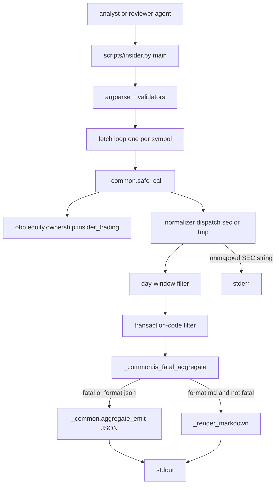
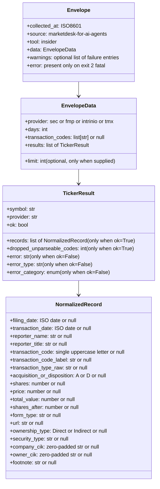

# Technical Design — insider-trading-skill

## Overview

**Purpose**: Upgrade the existing `scripts/insider.py` thin wrapper from a provider-passthrough Form 4 fetcher into a single-schema, code-filterable, dual-format (JSON + markdown) evidence surface so an analyst agent can pull "insider buying conviction" rows for a basket of tickers with one command and read them either programmatically or by pasting the markdown table directly into a draft proposal.

**Users**: The `investment-analyst` agent invokes the wrapper from daily holdings monitoring, watchlist sweeps, and multibagger / Piotroski candidate review; the `investment-reviewer` agent re-reads the same envelope under reviewer-side audit. Both consume `records[]` ad-hoc per session, so the canonical record schema (Requirement 6) eliminates per-provider parser branching.

**Impact**: Replaces the provider-native record-key contract (`securities_transacted`, `transaction_price`, `filing_url`, `form`, …) with a closed normalized schema (`shares`, `price`, `url`, `form_type`, …); adds two CLI flags (`--transaction-codes`, `--format`); introduces the repo's first non-JSON stdout path under `--format md`; and adds one public helper to `scripts/_common.py` (`is_fatal_aggregate`) so the markdown branch can peek at the fatal-exit gate before deciding the emitter. No new wrapper file, no new module, no new endpoint.

### Goals

- One CLI invocation returns Form 4 transaction records under a provider-invariant `records[]` schema (19 fields, identical key set across `--provider sec` and `--provider fmp`), bounded by a client-side `--days N` window and optionally narrowed by a `--transaction-codes <CSV>` filter operating on a normalized single-letter Form 4 code.
- `--format md` emits an analyst-pasteable markdown document (one section per ticker, fixed column order) without weakening the cross-wrapper strict-JSON invariant on the default invocation.
- The keyless `--provider sec` path remains the default and the CI baseline; FMP stays paid-plan opt-in; failure surface uses the closed five-value `ErrorCategory` taxonomy and the standard exit-code contract; the single-source-of-truth SKILL.md is rewritten to document the new flags and the normalized schema.

### Non-Goals

- Cross-ticker pattern detection (cluster buying, sustained insider buying, role rollups, buy-vs-sell ratios) — explicitly forbidden by Requirement 10 and tracked as future tasks in the input description.
- Persistence (cache files, log files, DB writes), Discord notifications, `portfolio.yaml` parsing — wrapper writes only to stdout and stderr.
- A second module file for the normalization functions (Requirement 10.7); a `scripts/_format.py` cross-cutting markdown helper (deferred until a second wrapper takes `--format md`); a `--side {buy,sell,all}` flag (Requirement 4.7).
- Backward-compatibility shim for the provider-native record-key paragraph; the schema cut is hard, with `transaction_type_raw` carrying the audit trail (see Decision 1 in `research.md`).

## Architecture

### Existing Architecture Analysis

The wrapper today (`scripts/insider.py`, 110 lines) is the canonical thin-wrapper shape: argparse → per-symbol `safe_call(obb.equity.ownership.insider_trading)` → `_filter_by_days` → `aggregate_emit(rows, tool="insider", query_meta=…)`. It already satisfies Requirements 1.1, 1.3, 1.5, 1.6, 2.1, 2.2, 3.1–3.4, 5.2, 7.1–7.6 (see `gap-analysis.md` §3.1 / §4). The integration suite registers the wrapper at `tests/integration/test_json_contract.py:358` (happy argv) and `:411` (invalid argv), and the cross-wrapper invariants (`test_json_contract.py`, `test_stdout_hygiene.py`) bind to the JSON-emitting default argv.

**Existing patterns preserved**:

- Flat `scripts/` directory; no submodule split.
- Single-direction import graph: `_env` → `_common` → wrapper → OpenBB.
- Closed `--provider` choice over `{sec, fmp, intrinio, tmx}`, key-free default (`sec`).
- `safe_call` wraps every OpenBB call; failures become `{ok:false, error, error_type, error_category}` rows; categories are drawn from the closed `ErrorCategory` enum.
- `aggregate_emit` owns the exit-code policy: exit 2 only when every row fails with the same fatal category (`credential` or `plan_insufficient`) or argparse rejects input; else exit 0 with per-failure entries under top-level `warnings[]`.
- NaN / Inf sanitization runs inside `_common.emit` via `sanitize_for_json`.

**Integration points that must be maintained**:

- Cross-wrapper envelope invariants in `tests/integration/test_json_contract.py` keep passing on the default argv (no `--format md`, no filter).
- The `WRAPPER_HAPPY_ARGV` / `WRAPPER_INVALID_ARGV` registration entries for `insider` are unchanged.

**Technical debt addressed**: The pre-spec wrapper exposed two divergent record-shapes depending on `--provider`, forcing analyst prompts to branch. This design replaces that with a single normalized schema (Requirement 6).

### Architecture Pattern & Boundary Map

Selected pattern: **Extend `scripts/insider.py` and rewrite `skills/insider/SKILL.md` in place** (Option A in `gap-analysis.md` §5; alternatives B/C are forbidden by Requirements 10.7 and 6.8 / deferred per Decision 5 + gap-analysis Option C).



**Architecture Integration**:

- Selected pattern: in-place wrapper extension. Matches Requirement 6.8 / 10.7 (single file) and reuses every `_common` helper.
- Domain / feature boundaries: argparse and validators stay in `main()`; per-symbol fetch + normalization + filtering stay in `fetch()`; the per-provider branch is one three-way dispatch site (`if provider == "sec": _normalize_sec_record(record); elif provider == "fmp": _normalize_fmp_record(record); else: _normalize_other_record(record)` for `intrinio` / `tmx`); the markdown emitter is a private helper called only from `main()`.
- Existing patterns preserved: thin-wrapper convention, closed provider choices, `safe_call` / `aggregate_emit` envelope contract, NaN sanitization, key-free default.
- New components rationale: each new helper is required by exactly one requirement and stays private. The single public addition is `_common.is_fatal_aggregate` (Decision 5 in `research.md`), justified by Requirement 5.8's "peek before render" need.
- Steering compliance: `docs/steering/structure.md` flat-directory rule (no new file), `docs/steering/tech.md` integration-only rule for OpenBB-call layer (pure helpers may be unit-tested), `docs/steering/structure.md` § Agent Skills (English-only, ~30–80 lines, one short output sample, no skill tests).

### Technology Stack & Alignment

| Layer | Choice / Version | Role in Feature | Notes |
|-------|------------------|-----------------|-------|
| CLI / Wrapper | Python 3.12 + `argparse` (stdlib) | Parses positional symbols, `--days`, `--limit`, `--provider`, `--transaction-codes`, `--format` | Reuse `entry_timing_scorer.py`-style `_positive_int` validators (Requirement 1.4 / 4.5) |
| Data fetch | `openbb` (already pinned in `shared/openbb/pyproject.toml`) — `obb.equity.ownership.insider_trading` | Form 4 retrieval per symbol | No new endpoint; provider parameter set unchanged |
| Helpers | `scripts/_common.py` (existing) — adds `is_fatal_aggregate(rows) -> ErrorCategory \| None` | JSON envelope, NaN sanitization, error classification, fatal-gate peek | Single new public free function, ~6 lines including docstring |
| Skill manual | `skills/insider/SKILL.md` (existing, 55 lines today) | Agent-facing manual, English-only, ~30–80 lines, one short markdown sample | Rewrite per Requirement 8 + Decision 8 in `research.md` |
| Tests — unit | `pytest` (existing) under `tests/unit/test_insider_normalize.py` (new) | Pure-helper unit coverage for SEC dict, FMP regex, role-prefix stripping, total-value computation, `is_fatal_aggregate` | stdlib-only; no OpenBB dependency |
| Tests — integration | `pytest -m integration` (existing) under `tests/integration/test_insider.py` (new) | Live SEC + skip-gated FMP coverage; cross-provider schema-consistency assertion; markdown invariants | Reuses `_sanity.py`, `run_wrapper_or_xfail`, `assert_stdout_is_single_json` |

**Deviations from the existing stack**: none. This is a pure in-place extension. No new dependency, no new file under `scripts/`, no new environment variable. The single public helper added to `_common.py` lives next to existing free functions (`safe_call`, `aggregate_emit`, `single_emit`).

## Requirements Traceability

| Requirement | Summary | Components | Interfaces | Flows |
|-------------|---------|------------|------------|-------|
| 1.1 | Multi-ticker `nargs="+"` | `main` argparse | `argparse.ArgumentParser.add_argument("symbols", nargs="+")` | Argparse ingest |
| 1.2 | Zero-ticker rejection | `main` argparse | argparse default behaviour (exit 2 with usage) | Argparse ingest |
| 1.3 | `--days` default 90 | `main` argparse | `add_argument("--days", type=_positive_int, default=90)` | Argparse ingest |
| 1.4 | `--days` ≤ 0 rejection | `main` argparse + `_positive_int` validator | `_positive_int(value: str) -> int` raises `argparse.ArgumentTypeError` | Argparse ingest |
| 1.5 | `--limit` passthrough | `main` argparse, `fetch` kwargs | `fetch(symbol, provider, days, limit, codes_filter)` | Fetch loop |
| 1.6 | `.T` suffix passthrough | `fetch` (no transformation) | implicit | Fetch loop |
| 2.1 | SEC default | `main` argparse | `default=DEFAULT_PROVIDER` | Argparse ingest |
| 2.2 | Closed provider choices | `main` argparse | `choices=PROVIDER_CHOICES` | Argparse ingest |
| 2.3 | FMP missing key → `credential` | `safe_call` + `aggregate_emit` fatal gate | `_common.classify_exception` | Fetch loop, Emit |
| 2.4 | FMP free-tier no entitlement → `plan_insufficient` | `safe_call` (`_PLAN_MESSAGE_RE`) | `_common.classify_exception` | Fetch loop, Emit |
| 2.5 | FMP not promoted to default | `main` argparse (`DEFAULT_PROVIDER = "sec"`) | constant | Argparse ingest |
| 2.6 | Schema invariant under every `--provider` | `_normalize_sec_record`, `_normalize_fmp_record`, `_normalize_other_record` (intrinio / tmx) | three-way dispatch in `fetch` | Normalize stage |
| 3.1–3.3 | Day-window on transaction_date / filing_date with unparseable kept | `_filter_by_days` (existing, unchanged) | `_filter_by_days(records: list[dict], days: int) -> list[dict]` | Day-window stage |
| 3.4 | Day-window across providers | sequencing only | n/a | Day-window stage |
| 3.5 | Day-window before code filter | `fetch` ordering | n/a | Fetch ordering |
| 4.1 | `--transaction-codes <CSV>` flag | `main` argparse, `_parse_codes_csv` validator | `_parse_codes_csv(value: str) -> list[str]` | Argparse ingest |
| 4.2 | Unfiltered when omitted | branch in `_apply_code_filter` | `_apply_code_filter(records, codes) -> tuple[list[dict], int]` | Code-filter stage |
| 4.3 | Case-insensitive match | uppercase normalization in `_parse_codes_csv` | n/a | Argparse ingest |
| 4.4 | Drop null-code rows + per-row `dropped_unparseable_codes` | `_apply_code_filter` returns dropped count | n/a | Code-filter stage, row builder |
| 4.5 | Regex `^[A-Za-z]$` validation | `_parse_codes_csv` | raises `argparse.ArgumentTypeError` | Argparse ingest |
| 4.6 | Echo `transaction_codes` under `data` | `main` `query_meta` extension | `query_meta["transaction_codes"] = list[str] \| None` | Emit |
| 4.7 | No `--side` flag | scope rule, no code | n/a | n/a |
| 5.1 | `--format {json,md}` choice | `main` argparse | `add_argument("--format", choices=["json","md"], default="json")` | Argparse ingest |
| 5.2 | Default JSON via `aggregate_emit` | `main` emit branch | `aggregate_emit(rows, tool="insider", query_meta=meta)` | Emit |
| 5.3 | Markdown per-ticker section + table | `_render_markdown` | `_render_markdown(rows: list[dict], meta: dict) -> str` | Emit (markdown) |
| 5.4 | Markdown error-line rendering | `_render_markdown` per-row branch | n/a | Emit (markdown) |
| 5.5 | Markdown empty-section line | `_render_markdown` per-row branch | n/a | Emit (markdown) |
| 5.6 | Closed column set + reading-order | `_render_markdown`, `_MD_COLUMNS` constant | n/a | Emit (markdown) |
| 5.7 | Pipe / newline escape | `_escape_md_cell` | `_escape_md_cell(value: Any) -> str` | Emit (markdown) |
| 5.8 | Markdown fatal fall-back to JSON | `is_fatal_aggregate` peek + `aggregate_emit` delegation | `_common.is_fatal_aggregate(rows) -> ErrorCategory \| None` | Emit branch |
| 5.9 | Single trailing newline | both emitters | `_common.emit` for JSON; explicit `+ "\n"` for markdown | Emit |
| 6.1 | Per-row shape with `dropped_unparseable_codes` | `fetch` row builder | `_build_row(symbol, provider, call_result, kept, dropped) -> dict` | Fetch loop |
| 6.2 | Normalized record schema (19 fields) | `_normalize_sec_record`, `_normalize_fmp_record`, `_normalize_other_record` | `_normalize_*(record: dict) -> dict` | Normalize stage |
| 6.3 | Per-provider code derivation rules | `_SEC_TYPE_TO_CODE` dict, `_FMP_CODE_RE`, `_normalize_other_record` default-null branch | `_lookup_sec_code(s: str) -> str \| None`; `_extract_fmp_code(s: str) -> str \| None` | Normalize stage |
| 6.4 | Echo `provider/days/transaction_codes/limit` | `main` `query_meta` | n/a | Emit |
| 6.5 | `ok=false` rows omit `records` / `dropped_unparseable_codes` | `_build_row` branch | n/a | Fetch loop |
| 6.6 | NaN / Inf sanitization | `_common.sanitize_for_json` (existing) | n/a | Emit |
| 6.7 | No `"source"` constant for FMP | rule, no code | n/a | n/a |
| 6.8 | Normalization stays in `scripts/insider.py` | rule, no code | n/a | n/a |
| 7.1 | `safe_call` guards every OpenBB call | `fetch` (existing) | n/a | Fetch loop |
| 7.2 | Closed `error_category` taxonomy | `_common.ErrorCategory` (existing) | n/a | Fetch loop |
| 7.3 | SEC_USER_AGENT unset → `credential` no retry | `safe_call` + classifier | n/a | Fetch loop |
| 7.4 | Empty upstream → `ok:true, records:[]` | `to_records` returns `[]` | n/a | Fetch loop |
| 7.5 | Exit-code contract | `aggregate_emit` (existing) | n/a | Emit |
| 7.6 | stdout single document; traceback to stderr | wrapper invariant | n/a | Emit |
| 8.1–8.6 | SKILL.md rewrite with normalized schema + code table | `skills/insider/SKILL.md` | n/a | Documentation |
| 9.1 | Pass `test_json_contract.py` under default argv | existing | n/a | Tests |
| 9.2–9.6 | New SEC + FMP integration cases incl. cross-provider consistency | `tests/integration/test_insider.py` (new) | n/a | Tests |
| 9.7 | Pure-normalizer unit tests | `tests/unit/test_insider_normalize.py` (new) | n/a | Tests |
| 10.1–10.7 | Scope boundaries | rules, no code | n/a | n/a |

## Components and Interfaces

| Component | Domain / Layer | Intent | Req Coverage | Key Dependencies (P0/P1) | Contracts |
|-----------|----------------|--------|--------------|--------------------------|-----------|
| `scripts/insider.py::main` | CLI / Wrapper | Argparse entry, validation, emit dispatch | 1, 2, 3, 4, 5, 6, 7 | `_common` (P0), `obb.equity.ownership.insider_trading` (P0) | Service, Batch |
| `scripts/insider.py::fetch` | CLI / Wrapper | Per-symbol orchestration: `safe_call` → normalize → day-filter → code-filter → row builder | 1.5, 1.6, 2.6, 3.5, 4.4, 6.1, 6.2, 6.5, 7.1 | `_common.safe_call` (P0) | Service |
| `scripts/insider.py::_normalize_sec_record` | CLI / Wrapper | SEC provider record → canonical schema | 6.2, 6.3 (sec) | `_SEC_TYPE_TO_CODE`, `_strip_role_prefix` | Service |
| `scripts/insider.py::_normalize_fmp_record` | CLI / Wrapper | FMP provider record → canonical schema | 6.2, 6.3 (fmp) | `_FMP_CODE_RE`, `_strip_role_prefix`, `_OWNERSHIP_TYPE_EXPAND` | Service |
| `scripts/insider.py::_normalize_other_record` | CLI / Wrapper | intrinio / tmx provider record → canonical schema (default-null `transaction_code`, all canonical keys present, values via `dict.get`) | 2.6, 6.2, 6.3 (intrinio / tmx) | none | Service |
| `scripts/insider.py::_apply_code_filter` | CLI / Wrapper | Filter records by normalized `transaction_code`, count drops | 4.2, 4.3, 4.4 | none (pure) | Service |
| `scripts/insider.py::_render_markdown` | CLI / Wrapper | Build markdown document from rows + meta | 5.3, 5.4, 5.5, 5.6, 5.7, 5.9 (md side) | `_escape_md_cell`, `_MD_COLUMNS` | Service |
| `scripts/_common.py::is_fatal_aggregate` (new) | Shared helpers | Peek the fatal-exit gate without emitting | 5.8 | existing private `_decide_exit_and_warnings` | Service |
| `skills/insider/SKILL.md` | Agent skills | Agent-facing manual rewrite | 8 | n/a | Documentation |
| `tests/integration/test_insider.py` (new) | Tests | New behaviour coverage | 9.2–9.6 | `_sanity`, `run_wrapper_or_xfail` | Batch |
| `tests/unit/test_insider_normalize.py` (new) | Tests | Pure-helper coverage | 9.7 | none (stdlib-only) | Batch |

Detail blocks below are provided for the components introducing new boundaries (normalizers, filters, markdown emitter, fatal-gate helper). `main` and `fetch` are documented through the requirements-traceability table above and the per-component blocks; no separate detail block is needed for them beyond the orchestration sequence already shown in the architecture diagram.

### Wrapper / Per-symbol orchestration

#### `scripts/insider.py::fetch`

| Field | Detail |
|-------|--------|
| Intent | Run one OpenBB call per symbol; transform the raw row list into a normalized + filtered + counted per-symbol row entry that `aggregate_emit` can consume. |
| Requirements | 1.5, 1.6, 2.6, 3.5, 4.4, 6.1, 6.2, 6.5, 7.1 |

**Responsibilities & Constraints**

- Issue exactly one `safe_call(obb.equity.ownership.insider_trading, symbol=…, provider=…, [limit=…])`.
- On `ok: True`: dispatch every record through `_normalize_sec_record`, `_normalize_fmp_record`, or `_normalize_other_record` (intrinio / tmx) via the single three-way site, apply `_filter_by_days`, then `_apply_code_filter`, then build the per-symbol row.
- On `ok: False`: build the failure row directly, omitting `records` and `dropped_unparseable_codes` per Requirement 6.5.
- Must not raise — every failure path returns through `safe_call`'s `{ok: False, …}` shape.
- Must not write to stdout / stderr (the `print(unmapped_string, file=sys.stderr)` for table-miss diagnostics in Decision 2 lives inside `_lookup_sec_code`, not here).

**Dependencies**

- Inbound: `main()` calls per `args.symbols` (P0).
- Outbound: `_common.safe_call` (P0); `_normalize_sec_record` / `_normalize_fmp_record` / `_normalize_other_record` (P0); `_filter_by_days` (P0, existing); `_apply_code_filter` (P0).
- External: `obb.equity.ownership.insider_trading` (P0 — the only OpenBB call site).

**Contracts**: Service [x]

##### Service Interface

```python
def fetch(
    symbol: str,
    provider: str,
    days: int,
    limit: int | None,
    codes_filter: list[str] | None,
) -> dict[str, Any]: ...
```

- Preconditions: `provider in PROVIDER_CHOICES`; `days >= 1`; if non-None, every element of `codes_filter` is a single uppercase ASCII letter.
- Postconditions:
  - On success: returns `{symbol, provider, ok: True, records: list[dict], dropped_unparseable_codes: int}`. `records[]` items match the normalized schema (Requirement 6.2). `dropped_unparseable_codes` is `0` when `codes_filter is None`, else the count of in-window rows whose `transaction_code` was `null`.
  - On failure: returns `{symbol, provider, ok: False, error: str, error_type: str, error_category: str}` (no `records`, no `dropped_unparseable_codes`).
- Invariants: never raises; the per-provider branch is a single three-way dispatch site `if provider == "sec": _normalize_sec_record(r); elif provider == "fmp": _normalize_fmp_record(r); else: _normalize_other_record(r)` (Requirement 6.8). The intrinio / tmx branch routes through `_normalize_other_record`, which emits the closed canonical key set with `transaction_code = null` per Requirement 6.3 and copies any verbatim-passing values via `dict.get` without applying FMP-specific field renames or role-prefix stripping.

**Implementation Notes**

- Integration: `fetch` replaces today's 9-line body; the new sequence is `safe_call → normalize-each → _filter_by_days → _apply_code_filter → _build_row` plus the existing failure-row pass-through.
- Validation: relies on `main`'s argparse validators for `days` and `codes_filter`; does not re-validate.
- Risks: a future SEC-side row that lacks both `transaction_date` and `filing_date` keeps flowing per Requirement 3.3 — the existing `_filter_by_days` already handles this and is unchanged.

### Normalization

#### `scripts/insider.py::_normalize_sec_record` and `_normalize_fmp_record`

| Field | Detail |
|-------|--------|
| Intent | Convert one provider-native record dict into the canonical 19-field schema (Requirement 6.2) with provider-invariant key names and value semantics. |
| Requirements | 6.2, 6.3 |

**Responsibilities & Constraints**

- Pure functions: same input → same output, no I/O, stdlib-only.
- `_normalize_sec_record` must:
  - Map `securities_transacted → shares`, `transaction_price → price`, `securities_owned → shares_after`, `form → form_type`, `filing_url → url`, `owner_name → reporter_name`, `owner_title → reporter_title` (no FMP prefix to strip on SEC; the field is already plain).
  - Compute `transaction_code` via `_lookup_sec_code(record.get("transaction_type"))`.
  - Preserve `transaction_type` verbatim under `transaction_type_raw` (audit, Requirement 6.2).
  - Collapse `acquisition_or_disposition` (`"Acquisition"` / `"Disposition"`) to first letter; pass through `null` if missing.
  - Pass `ownership_type` through verbatim (SEC already emits `"Direct"` / `"Indirect"`).
  - Compute `total_value = shares * price` when both are non-null and `price > 0`, else `null`.
  - Populate `transaction_code_label` via `_CODE_TO_LABEL[code]` when `code is not None`, else `null`.
- `_normalize_fmp_record` must:
  - Map `form_type → form_type` (identity), `url → url` (identity), `securities_transacted → shares`, etc.
  - Compute `transaction_code` via `_extract_fmp_code(record.get("transaction_type"))` (regex `^[A-Z]-`).
  - Preserve `transaction_type` verbatim under `transaction_type_raw`.
  - Pass through `acquisition_or_disposition` verbatim (FMP already emits the single letter).
  - Expand `ownership_type` via `_OWNERSHIP_TYPE_EXPAND = {"D": "Direct", "I": "Indirect"}`; unknown letter → `null`.
  - Strip role prefixes from `owner_title` via `_strip_role_prefix` (Decision 4 in `research.md`).
  - Compute `total_value` and `transaction_code_label` identically to the SEC path.
- Both must emit every Requirement 6.2 field even when the upstream value is missing — the field is `null`, never absent. (Schema-shape invariance is what Requirement 9.4 asserts.)

**Dependencies**

- Inbound: `fetch` (P0).
- Outbound: `_lookup_sec_code` (P0, sec only), `_extract_fmp_code` (P0, fmp only), `_strip_role_prefix` (P0, fmp only), `_compute_total_value` (P0), `_CODE_TO_LABEL` (P0).
- External: none.

**Contracts**: Service [x]

##### Service Interface

```python
_NormalizedRecord = dict[str, Any]  # closed key set per Requirement 6.2

def _normalize_sec_record(record: dict[str, Any]) -> _NormalizedRecord: ...
def _normalize_fmp_record(record: dict[str, Any]) -> _NormalizedRecord: ...
def _normalize_other_record(record: dict[str, Any]) -> _NormalizedRecord: ...
```

The closed key set:

```
{
  "filing_date", "transaction_date",
  "reporter_name", "reporter_title",
  "transaction_code", "transaction_code_label", "transaction_type_raw",
  "acquisition_or_disposition",
  "shares", "price", "total_value", "shares_after",
  "form_type", "url",
  "ownership_type", "security_type",
  "company_cik", "owner_cik",
  "footnote",
}
```

(19 keys total — the canonical surface enumerated in Requirement 6.2.)

- Preconditions: `record` is a `dict` (the upstream `to_records` shape). Missing keys are tolerated.
- Postconditions: every key in the closed set is present in the returned dict; values are either of the documented type or `None`. `_normalize_other_record` (intrinio / tmx) emits the same closed key set with `transaction_code = null`, no role-prefix stripping, and per-field `dict.get` for any verbatim-passing keys.
- Invariants: deterministic; idempotent; no exception path on shape variation.

**Implementation Notes**

- Integration: `fetch` calls one of the three functions per record; the call-site is a single `if provider == "sec": fn = _normalize_sec_record; elif provider == "fmp": fn = _normalize_fmp_record; else: fn = _normalize_other_record` site to keep Requirement 6.8 satisfied. `_normalize_other_record` is a thin function that emits the closed canonical key set with `transaction_code = null` and uses `dict.get` for any field whose upstream key happens to coincide with the canonical name; it does **not** apply the FMP-specific field renames (`form_type`, `url`, `securities_transacted`, etc.) or `_strip_role_prefix`, so an unsupported provider yields mostly-`null` records that are honest about the lack of mapping.
- Validation: unit tests in `tests/unit/test_insider_normalize.py` cover representative SEC and FMP fixtures; the cross-provider integration test in `tests/integration/test_insider.py` (Requirement 9.4) is the schema-shape invariant gate against live data.
- Risks: an unmapped SEC `transaction_type` long-English string emits `transaction_code: null` plus a one-time-per-session `print(unmapped, file=sys.stderr)` (Decision 2 + Decision 2 follow-up in `research.md`); the row is preserved with full audit via `transaction_type_raw`.

##### Constant — `_SEC_TYPE_TO_CODE` (frozen 10-key dict)

| Long-English `transaction_type` | Code |
|---------------------------------|------|
| `"Open market or private purchase of non-derivative or derivative security"` | `P` |
| `"Open market or private sale of non-derivative or derivative security"` | `S` |
| `"Grant, award or other acquisition pursuant to Rule 16b-3(d)"` | `A` |
| `"Payment of exercise price or tax liability by delivering or withholding securities incident to the receipt, exercise or vesting of a security issued in accordance with Rule 16b-3"` | `F` |
| `"Exercise or conversion of derivative security exempted pursuant to Rule 16b-3"` | `M` |
| `"Conversion of derivative security"` | `C` |
| `"Bona fide gift"` | `G` |
| `"Disposition to the issuer of issuer equity securities pursuant to Rule 16b-3(e)"` | `D` |
| `"Other acquisition or disposition (describe transaction)"` | `J` |
| `"Acquisition or disposition by will or the laws of descent and distribution"` | `W` |

Dispatch order: exact match (case-sensitive). Misses → `null` plus stderr log (one-time-per-session set). The set is module-level (`_SEEN_UNMAPPED_SEC_STRINGS: set[str] = set()`) so a long batch run does not spam stderr.

##### Constant — `_CODE_TO_LABEL` (closed 10-key dict)

| Code | `transaction_code_label` |
|------|--------------------------|
| `P` | `"Open Market Purchase"` |
| `S` | `"Open Market Sale"` |
| `A` | `"Grant or Award"` |
| `F` | `"Tax Withholding Payment"` |
| `M` | `"Exempt Exercise or Conversion"` |
| `C` | `"Derivative Conversion"` |
| `G` | `"Bona Fide Gift"` |
| `D` | `"Disposition to Issuer"` |
| `J` | `"Other (see footnote)"` |
| `W` | `"Will or Inheritance"` |

`null` `transaction_code` → `null` label. The label set is closed; the unit test asserts every non-null code in a live record yields a value from this dict.

##### Helper — `_strip_role_prefix(s: str | None) -> str | None`

Decision 4 in `research.md`. Pseudocode (target shape, not literal copy):

```python
_INFIX_MARKERS = (", officer: ", ", director: ", ", ten_percent_owner: ")
_PREFIX_MARKERS = ("officer: ", "director: ", "ten_percent_owner: ")
_BARE_ROLES = {"officer": "Officer", "director": "Director", "ten_percent_owner": "Ten Percent Owner"}

def _strip_role_prefix(s: str | None) -> str | None:
    if not s:
        return s
    for marker in _INFIX_MARKERS:
        idx = s.rfind(marker)
        if idx != -1:
            tail = s[idx + len(marker):].strip()
            return tail or None
    for prefix in _PREFIX_MARKERS:
        if s.startswith(prefix):
            tail = s[len(prefix):].strip()
            return tail or None
    if s in _BARE_ROLES:
        return _BARE_ROLES[s]
    return s
```

Used only on FMP records; SEC's `owner_title` is plain.

### Filtering

#### `scripts/insider.py::_apply_code_filter`

| Field | Detail |
|-------|--------|
| Intent | Filter normalized records by `transaction_code` and report the per-symbol unparseable-code drop count. |
| Requirements | 4.2, 4.3, 4.4 |

**Responsibilities & Constraints**

- When `codes is None`: return `(records, 0)` unchanged. This keeps `dropped_unparseable_codes = 0` per Requirement 4.4 last sentence.
- When `codes is not None`: walk records once. Keep records whose `transaction_code` (already uppercase) is in the input set; drop records whose `transaction_code` is `null` and increment a counter for those; rejection-by-non-matching-code does **not** count toward `dropped_unparseable_codes` (Decision 7 in `research.md`).
- Pure function; stdlib-only; no logging.

**Dependencies**

- Inbound: `fetch` (P0).
- Outbound: none.
- External: none.

**Contracts**: Service [x]

##### Service Interface

```python
def _apply_code_filter(
    records: list[dict[str, Any]],
    codes: list[str] | None,
) -> tuple[list[dict[str, Any]], int]: ...
```

- Preconditions: every element of `codes`, if non-None, is a single uppercase ASCII letter. Records carry the canonical `transaction_code` field already (an uppercase letter or `null`).
- Postconditions: returned tuple is `(kept_records, dropped_unparseable_count)` with `dropped_unparseable_count >= 0`. When `codes is None`, the count is `0` and `kept_records` is the same list reference as the input; the caller must not mutate either list afterwards (current call site, `fetch`, treats it as read-only).
- Invariants: deterministic; total over input.

**Implementation Notes**

- Integration: called from `fetch` after `_filter_by_days` (Requirement 3.5).
- Validation: unit test covers empty filter, all-kept filter, all-dropped filter, mixed-with-null filter.
- Risks: none beyond input-shape contract.

### Validators

#### `scripts/insider.py::_positive_int` and `_parse_codes_csv`

| Field | Detail |
|-------|--------|
| Intent | Argparse-side input validation that rejects bad invocations before any OpenBB call (Requirements 1.4, 4.5). |
| Requirements | 1.4, 4.5 |

**Responsibilities & Constraints**

- `_positive_int(value: str) -> int`: parses to `int`; raises `argparse.ArgumentTypeError` on non-integer, zero, or negative.
- `_parse_codes_csv(value: str) -> list[str]`: splits on `","`, strips per-element whitespace, validates every element matches `^[A-Za-z]$`, uppercases each, and returns the resulting list (deduplication is not required by Requirement 4 but is harmless and the implementation may apply `dict.fromkeys` ordering preservation).
- Both are pure; both are pointed at by argparse's `type=` parameter.
- Both raise `argparse.ArgumentTypeError` on rejection so argparse converts the failure to `error_category: validation` exit 2 per Requirement 4.5 / Requirement 1.4.

**Dependencies**

- Inbound: `main` argparse `add_argument(..., type=…)` (P0).
- Outbound: none.
- External: none.

**Contracts**: Service [x]

##### Service Interface

```python
def _positive_int(value: str) -> int: ...
def _parse_codes_csv(value: str) -> list[str]: ...
```

- Preconditions: `value` is a string (argparse always passes string).
- Postconditions: returns a valid value or raises `argparse.ArgumentTypeError`. The `list[str]` from `_parse_codes_csv` contains only single uppercase ASCII letters.
- Invariants: pure; no I/O.

### Markdown emission

#### `scripts/insider.py::_render_markdown` and `_escape_md_cell`

| Field | Detail |
|-------|--------|
| Intent | Produce a single markdown document — one section per ticker — directly from the `aggregate_emit`-shaped row list, applied only when the fatal-gate peek says no fatal exit is required. |
| Requirements | 5.3, 5.4, 5.5, 5.6, 5.7, 5.9 (md side) |

**Responsibilities & Constraints**

- `_render_markdown(rows: list[dict[str, Any]], meta: dict[str, Any]) -> str` returns the full markdown document (excluding the trailing newline; the caller appends `"\n"` per Requirement 5.9).
- For each row in input order:
  - Emit `## <SYMBOL>` heading.
  - If `row["ok"] is False`: emit a single line `_error_category_: <category> — <error>` (Requirement 5.4).
  - Else if `len(row["records"]) == 0`: emit `_no records in window_` (Requirement 5.5), with the optional ` (dropped <N> unparseable codes)` suffix when `meta["transaction_codes"] is not None and row["dropped_unparseable_codes"] > 0` (Decision 7 in `research.md`).
  - Else: emit a markdown table whose header is the closed `_MD_COLUMNS` constant (column order pinned by Decision 6 in `research.md`) and whose rows are the records' normalized field values rendered through `_escape_md_cell`. Cells whose value is `None` render as the empty string (Requirement 5.6); cells whose value is non-`None` render as `_escape_md_cell(str(value))`.
- `_escape_md_cell(value: Any) -> str` applies `str.translate({"|": "\\|", "\n": " ", "\r": ""})` (or equivalent) so cell content cannot break the table (Requirement 5.7). Numbers render with default `str(value)`; `None` is replaced with `""` upstream of the call.
- The markdown document ends with the last per-ticker section's last line (no trailing newline inside `_render_markdown`); the caller in `main` writes `_render_markdown(...) + "\n"` to stdout (Requirement 5.9).
- The function does not call `_common.emit` or `aggregate_emit`; the JSON envelope is not the success-path output here. The fatal-gate path (when `is_fatal_aggregate(rows) is not None`) bypasses `_render_markdown` entirely and goes through `aggregate_emit` (Requirement 5.8).

**Dependencies**

- Inbound: `main` (P0).
- Outbound: `_escape_md_cell` (P0).
- External: none.

**Contracts**: Service [x]

##### Constant — `_MD_COLUMNS` (column order pinned)

```
filing_date | transaction_date | reporter_name | reporter_title |
transaction_code | transaction_code_label | shares | price |
total_value | shares_after | url
```

Decision 6 in `research.md`. The integration test in Requirement 9.5 asserts the header line begins with `filing_date | transaction_date | …` exactly.

##### Service Interface

```python
def _render_markdown(rows: list[dict[str, Any]], meta: dict[str, Any]) -> str: ...
def _escape_md_cell(value: Any) -> str: ...
```

- Preconditions: every entry of `rows` either has `ok: True` with `records: list[dict]` and `dropped_unparseable_codes: int`, or `ok: False` with `error: str` and `error_category: str` (the `aggregate_emit` row shape). `meta` carries `transaction_codes: list[str] | None`.
- Postconditions: returns a string. Pipe and newline characters in cell values do not appear in the output other than through their escaped form (Requirement 5.7).
- Invariants: pure; deterministic; stdlib-only.

**Implementation Notes**

- Integration: called once from `main()` on the success branch of the markdown path. The fatal-gate fall-back delegates to `aggregate_emit` upstream.
- Validation: integration test (Requirement 9.5) asserts stdout is not valid JSON, contains a `## <SYMBOL>` heading per input ticker, and contains either a markdown table, the `_error_category_:` line, or the `_no records in window_` line (with optional suffix) for each ticker. Unit test on `_escape_md_cell` covers pipe / newline / mixed.
- Risks: SEC `footnote` cells regularly run multi-paragraph; the escape pass is the only thing keeping the markdown table intact and must run on every cell.

### Shared helpers

#### `scripts/_common.py::is_fatal_aggregate` (new)

| Field | Detail |
|-------|--------|
| Intent | Public peek into the existing private fatal-gate decision so wrappers with a non-JSON success path can branch before choosing the emitter. |
| Requirements | 5.8 |

**Responsibilities & Constraints**

- Returns the fatal `ErrorCategory` iff every row failed with the same `CREDENTIAL` or `PLAN_INSUFFICIENT` category, else `None`.
- Pure delegation: implementation calls the existing private `_decide_exit_and_warnings(rows)[0]`. No new policy.
- Lives next to `aggregate_emit`, `single_emit`, `wrap`, `emit`, `emit_error` in the existing `_common.py` public surface.

**Dependencies**

- Inbound: `scripts/insider.py::main` (P0); future wrappers may use it.
- Outbound: existing private `_decide_exit_and_warnings` (P0).
- External: none.

**Contracts**: Service [x]

##### Service Interface

```python
def is_fatal_aggregate(rows: list[dict[str, Any]]) -> ErrorCategory | None: ...
```

- Preconditions: `rows` is the list passed to `aggregate_emit` (each entry has `ok: bool` and, on failure, `error_category: str`).
- Postconditions: returns `ErrorCategory.CREDENTIAL`, `ErrorCategory.PLAN_INSUFFICIENT`, or `None`. Mixed fatal categories return `None` (matches the existing internal contract).
- Invariants: pure; idempotent; calling it before `aggregate_emit` does not change `aggregate_emit`'s subsequent behaviour.

**Implementation Notes**

- Integration: `scripts/insider.py::main` calls `is_fatal_aggregate(results)` once on the markdown branch. If non-None: `return aggregate_emit(results, tool="insider", query_meta=meta)`. Else: `sys.stdout.write(_render_markdown(results, meta) + "\n"); return 0`.
- Validation: a unit case under `tests/unit/test_insider_normalize.py` (or alongside the existing `_common` tests if they exist) covers the four cases: empty rows → `None`, all-success → `None`, mixed (success + credential failure) → `None`, all-credential → `ErrorCategory.CREDENTIAL`.
- Risks: minimal — the helper is 2 lines plus docstring and ships in the same PR as the insider implementation (Decision 5 follow-up in `research.md` justifies not splitting into a standalone PR).

### Documentation

#### `skills/insider/SKILL.md` rewrite

| Field | Detail |
|-------|--------|
| Intent | Single-source-of-truth agent manual: documents the new flags, the normalized record schema, and the 10-row transaction-code label table. |
| Requirements | 8.1, 8.2, 8.3, 8.4, 8.5, 8.6 |

**Responsibilities & Constraints**

- Stays English-only and within the AUTHORING budget (~30–80 lines). Today's file is 55 lines; the rewrite targets the same envelope.
- Sections: header (3–4 lines), `Quick start` (4 lines, one example), `Flags` (one bullet per flag — `--days`, `--transaction-codes`, `--limit`, `--provider`, `--format`), `Record schema` (one paragraph naming the 19 normalized fields, no per-field-bytes paragraph), `Transaction codes` (the 10-row table from Decision 3 in `research.md`), `Output sample` (one short markdown table from a live `--format md` run), `Errors` (1 line linking to the `_errors` policy skill).
- Authored from a live run after implementation freezes (Requirement 8.6 + Decision 8 in `research.md`). The recommended invocation is `uv run scripts/insider.py AAPL --days 90 --transaction-codes P,S --format md`.
- No test harness under `skills/`; the file is documentation, not tests (Requirement 8.5 + project memory `feedback_skill_authoring_no_tests.md`).

**Dependencies**

- Inbound: `skills/INDEX.md` row (P1) — check whether the existing row needs a "schema changed 2026-04-30" annotation per Decision 1 follow-up in `research.md`.
- Outbound: `skills/_envelope/SKILL.md`, `skills/_errors/SKILL.md`, `skills/_providers/SKILL.md` (referenced by 1-line links per the minimal-sufficient rule).
- External: none.

**Contracts**: Documentation only.

### Tests

#### `tests/integration/test_insider.py` (new file)

| Field | Detail |
|-------|--------|
| Intent | Per-wrapper integration coverage for the new behaviour: code filter, markdown format, normalized schema, cross-provider consistency. |
| Requirements | 9.2, 9.3, 9.4, 9.5, 9.6 |

**Responsibilities & Constraints**

- Live run only; uses `pytest -m integration`. No mocked-OpenBB-provider unit tests for the wrapper (Requirement 9.7 last sentence).
- SEC cases (default, no skip-gate): happy-path multi-symbol fetch with `--days`; `--transaction-codes` filter on a ticker known to have insider activity in the window; invalid `--days 0` → exit 2 with `error_category: validation`; invalid `--transaction-codes "PP"` → exit 2 with `error_category: validation`.
- FMP cases (skip-gated on `FMP_API_KEY` per the existing per-wrapper convention): happy-path single-symbol fetch (envelope shape); `--format md` invocation (markdown shape).
- Cross-provider schema-consistency case (Requirement 9.4): same single-symbol query (e.g. `AAPL`) under `--provider sec` and `--provider fmp`; assert the canonical 19-key normalized field set is present on every record from both providers; `transaction_code`, when non-null, is a single uppercase letter. The FMP half is skip-gated.
- Markdown invariants (Requirement 9.5): stdout is not valid JSON; contains `## <SYMBOL>` heading per input ticker; contains either a markdown table, the `_error_category_:` line, or the `_no records in window_` line.
- Echo invariants (Requirement 9.6): `data.transaction_codes` is uppercased list when filter is active and `null` when omitted; per-row `dropped_unparseable_codes` is `0` when no filter is active.
- Failure-row absence invariant (Risk row in `research.md`): a forced credential failure on FMP under `--provider fmp` with no key produces a row that has no `dropped_unparseable_codes` field.
- Markdown all-rows-fatal fall-back invariant (Decision 5 in `research.md`): `--provider fmp --format md` with `FMP_API_KEY` deliberately unset under a single-symbol input produces stdout that is valid JSON with exit 2.

**Dependencies**

- Inbound: `pytest -m integration` (P0).
- Outbound: `tests/integration/_sanity.py`, `tests/integration/conftest.py`, `tests/integration.run_wrapper_or_xfail`, `assert_stdout_is_single_json` (P0 reuse).
- External: SEC `SEC_USER_AGENT` env var (P0), FMP `FMP_API_KEY` env var (P1, skip-gate target).

**Contracts**: Batch [x].

#### `tests/unit/test_insider_normalize.py` (new file)

| Field | Detail |
|-------|--------|
| Intent | Pure-helper coverage that is fast, offline, and deterministic. |
| Requirements | 9.7 |

**Responsibilities & Constraints**

- Cases:
  - `_lookup_sec_code`: each of the 10 keys → expected single letter; an unmapped string → `None`; the empty string → `None`.
  - `_extract_fmp_code`: each of `S-Sale`, `M-Exempt`, `A-Award`, `F-InKind`, `G-Gift` → expected letter; the empty string → `None`; a malformed shape (`"sale"`) → `None`.
  - `_strip_role_prefix`: bare `"officer: Chief Executive Officer"` → `"Chief Executive Officer"`; bare `"director"` → `"Director"`; compound `"director, officer: Chief Executive Officer"` → `"Chief Executive Officer"`; no marker → identity.
  - `_compute_total_value`: `(100, 150.5) → 15050.0`; `(0, 150.5) → 0.0`; `(100, 0) → None` (price-zero short-circuit); `(100, None) → None`; `(None, 150.5) → None`.
  - `_apply_code_filter`: empty filter; all-kept; all-dropped (mix of mismatched codes and null codes); the dropped count is exactly the null-code count.
  - `_render_markdown` and `_escape_md_cell`: pipe-in-cell becomes `\|`; newline-in-cell becomes a single space; the heading `## AAPL` is emitted; the empty-section line carries the optional `(dropped <N> unparseable codes)` suffix only when the filter is active and the dropped count is positive.
  - `is_fatal_aggregate`: empty list → `None`; all-success rows → `None`; mixed success + credential → `None`; all-credential → `ErrorCategory.CREDENTIAL`; all-plan_insufficient → `ErrorCategory.PLAN_INSUFFICIENT`.
- stdlib-only; no `pytest.mark.integration`; no OpenBB import.

**Dependencies**

- Inbound: default `pytest` invocation (P0).
- Outbound: imports from `scripts/insider.py` and `scripts/_common.py` (P0).
- External: none.

**Contracts**: Batch [x].

## Data Models

### Logical Data Model — Normalized record schema

The wrapper exposes a single canonical record shape under `data.results[i].records[j]`, identical across `--provider sec` and `--provider fmp`. The wider envelope structure is unchanged from the cross-wrapper contract documented in `skills/_envelope/SKILL.md`.



**Consistency & Integrity**

- `transaction_code` and `transaction_code_label` co-vary: both `null` together, or both non-null together with `_CODE_TO_LABEL[code] == label`.
- `transaction_code`, when non-null, is always one of `{P, S, A, F, M, C, G, D, J, W}` for `--provider sec` and `{P, S, A, F, M, G, D, W}` for `--provider fmp` (subset; `C` and `J` have not been observed in the FMP corpus, but the schema permits them).
- `total_value`, when non-null, equals `shares * price` exactly to floating-point precision; when `price` is `0` or either operand is `null`, `total_value` is `null`.
- `transaction_type_raw` preserves the upstream provider value verbatim and is the audit replay key for the normalization.
- `acquisition_or_disposition` is single-letter (`"A"` / `"D"`) or `null`. SEC's full-word value is collapsed; FMP's single-letter value passes through.
- `ownership_type` is `"Direct"` / `"Indirect"` / `null`. FMP's `"D"` / `"I"` is expanded; SEC's full-word value passes through.

**Temporal aspects**: `transaction_date` and `filing_date` are pure dates (no timezones). The day-window filter (`_filter_by_days`) compares against `date.today()` from the local-machine clock at `main()` start; reproducibility is anchored by the envelope's `collected_at` (UTC ISO 8601, populated by `_common.wrap`).

### Data Contracts & Integration

**API Data Transfer**

- Request: positional CLI args + flags. No HTTP API surface.
- Response: one JSON document on stdout (default) or one markdown document on stdout (under `--format md`); strict-JSON shape on the JSON path; pure markdown on the md path with no JSON fragments.
- Fatal exit (exit 2): always JSON, even when `--format md` was requested (Requirement 5.8 + Decision 5 in `research.md`).

**Event Schemas**: not applicable (no events emitted).

**Cross-Service Data Management**: not applicable (single-process wrapper).

## Error Handling

### Error Strategy

Reuse the existing closed five-value `ErrorCategory` taxonomy and the standard exit-code contract. Add no new categories. Add no new exit paths beyond what `aggregate_emit` already provides.

### Error Categories and Responses

| Surface | Category | Mapping | Recovery hint |
|---------|----------|---------|---------------|
| Argparse rejects (`--days 0`, `--transaction-codes "PP"`, missing positional) | `validation` | argparse exits 2 directly (its built-in behaviour) before any OpenBB call | Caller fixes the invocation |
| `safe_call` raises with `Restricted Endpoint` / `402` (FMP free-tier) | `plan_insufficient` | `_PLAN_MESSAGE_RE` in `_common.classify_exception` | Caller upgrades plan |
| `safe_call` raises with `401`/`403` / missing `SEC_USER_AGENT` / missing `FMP_API_KEY` | `credential` | `_CREDENTIAL_MESSAGE_RE` and `_CREDENTIAL_EXC_NAMES` | Caller rotates credential |
| `safe_call` raises with `5xx` / `TimeoutError` / `ConnectionError` | `transient` | regex + class fallback | Caller retries |
| `safe_call` raises with `ValidationError`/`ValueError`/`KeyError` | `validation` | class fallback | Caller fixes input |
| Other | `other` | default | Inspect `error` |

The wrapper does not invent a new category or override `safe_call`'s classification. Requirements 7.1–7.6 are satisfied by reuse alone.

### Process Flow Visualization

Not needed: the error flow follows the existing wrapper convention, which is documented in `skills/_errors/SKILL.md`. The only new surface is the markdown fatal fall-back (already shown in the Architecture diagram and covered by Requirement 5.8).

### Monitoring

- A one-time-per-session stderr line for an unmapped SEC `transaction_type` long-English string (Decision 2 follow-up in `research.md`). The line's shape is human-readable and points at the unmapped raw string so triage is trivial. The `transaction_type_raw` field still carries the value into the envelope, so machine-readable replay is unaffected.
- All other observability is provided by the standard envelope (`error`, `error_category`, `error_type`, `warnings[]`).

## Testing Strategy

Default sections (adapted to feature):

### Unit Tests

- `_lookup_sec_code` table coverage (10 keys + miss + empty).
- `_extract_fmp_code` coverage (5 observed shapes + empty + malformed).
- `_strip_role_prefix` coverage (4 documented shapes).
- `_compute_total_value` coverage (5 cases including price-zero short-circuit).
- `_apply_code_filter` coverage (5 cases including dropped-count correctness).
- `_render_markdown` / `_escape_md_cell` coverage (heading, table, error-line, empty-section, optional dropped-suffix, pipe / newline escape).
- `is_fatal_aggregate` coverage (5 cases across categories).

### Integration Tests

- SEC happy-path multi-symbol fetch with `--days`.
- SEC `--transaction-codes` filter with non-empty subset on a ticker with known activity.
- SEC `--days 0` rejection (exit 2, `error_category: validation`).
- SEC `--transaction-codes "PP"` rejection (exit 2, `error_category: validation`).
- FMP happy-path single-symbol fetch (skip-gated on `FMP_API_KEY`).
- FMP `--format md` happy-path (skip-gated).
- Cross-provider schema-consistency on `AAPL` (FMP half skip-gated).
- Markdown invariants (heading present, table or fall-back line present, stdout-not-JSON).
- Echo invariants (`data.transaction_codes` shape, `dropped_unparseable_codes` zero when filter inactive).
- Failure-row absence invariant (`dropped_unparseable_codes` not present on `ok: False` rows).
- Markdown all-rows-fatal fall-back to JSON.

### Performance / Load

Not applicable. The wrapper is a per-invocation thin script; no concurrency, no batch performance target. The 365-day live pass on 10 symbols completed in seconds during research.

## Optional Sections

### Security Considerations

- Credentials: `SEC_USER_AGENT` (sec) and `FMP_API_KEY` (fmp) are read via `_env.apply_to_openbb`; the wrapper does not log credential values to stdout or stderr. The credential-failure error message inherits from the upstream OpenBB exception and is not modified by this design.
- No new external calls are introduced.
- No persistence: nothing written to disk; in-memory state is per-invocation.

### Performance & Scalability

Not applicable. The wrapper's per-invocation work is bounded by the user's basket size (typically 1–10 tickers) and the upstream `--limit` cap (default ~100). Normalization is O(n) over rows; the SEC dict lookup and the FMP regex are O(1) per row.

### Migration Strategy

The schema cut is a hard cut (Decision 1 in `research.md`). The migration path:

```mermaid
flowchart LR
    PR[Implementation PR]
    SkillRewrite[Rewrite skills/insider/SKILL.md]
    EnvelopeChange[records[] field-name change]
    AnalystUse[Analyst agent reads new envelope]
    ReviewerUse[Reviewer agent reads new envelope]

    PR --> SkillRewrite
    PR --> EnvelopeChange
    SkillRewrite --> AnalystUse
    SkillRewrite --> ReviewerUse
    EnvelopeChange --> AnalystUse
    EnvelopeChange --> ReviewerUse
```

- Phase: a single PR ships all three changes (wrapper extension, `_common` helper, SKILL.md rewrite, tests). The PR description calls out the schema break.
- Rollback trigger: a regression in `tests/integration/test_json_contract.py` on the default argv, or an unmapped SEC `transaction_type` string causing a downstream prompt-template failure that is not recoverable by reading `transaction_type_raw`.
- Validation checkpoints: integration suite passes (`uv run pytest -m integration`); the live `--format md` sample is captured for SKILL.md; the unmapped-SEC-string stderr log fires zero times on the verification-pass corpus.

## Supporting References

- `research.md` — full discovery findings, including the SEC keyword corpus (Topic 1), FMP shape confirmation (Topic 2), `_common` baseline (Topic 3), markdown structural-first analysis (Topic 4), and backward-compat posture (Topic 5). The 8 design decisions are recorded there in full and referenced here in summary form to keep this document scannable.
- `gap-analysis.md` — brownfield gap analysis: requirement-to-asset map (§4), implementation approach options (§5), effort and risk (§6), recommendations for the design phase (§7), out-of-scope confirmation (§8).
- `requirements.md` — the 10 numbered requirements that this design realizes.
- `docs/steering/structure.md` — flat-directory wrapper convention; `skills/` authoring rules; key-free-default rule.
- `docs/steering/tech.md` — JSON envelope contract; integration-only OpenBB-call testing; closed `error_category` taxonomy.
- `scripts/_common.py` — existing public surface (`safe_call`, `aggregate_emit`, `single_emit`, `wrap`, `emit`, `emit_error`, `silence_stdout`, `sanitize_for_json`, `ErrorCategory`, `classify_exception`); new addition documented above (`is_fatal_aggregate`).
- `tests/integration/test_json_contract.py` — registered insider argv at line 358 (happy) and 411 (invalid); cross-wrapper invariants apply unchanged.
