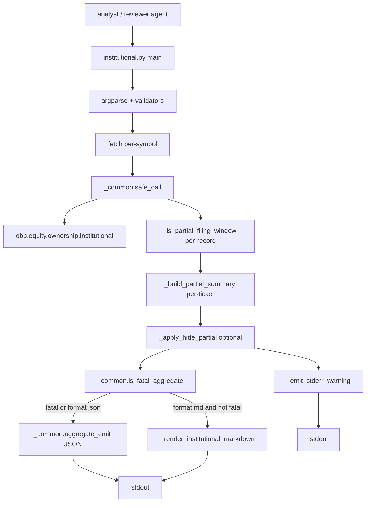
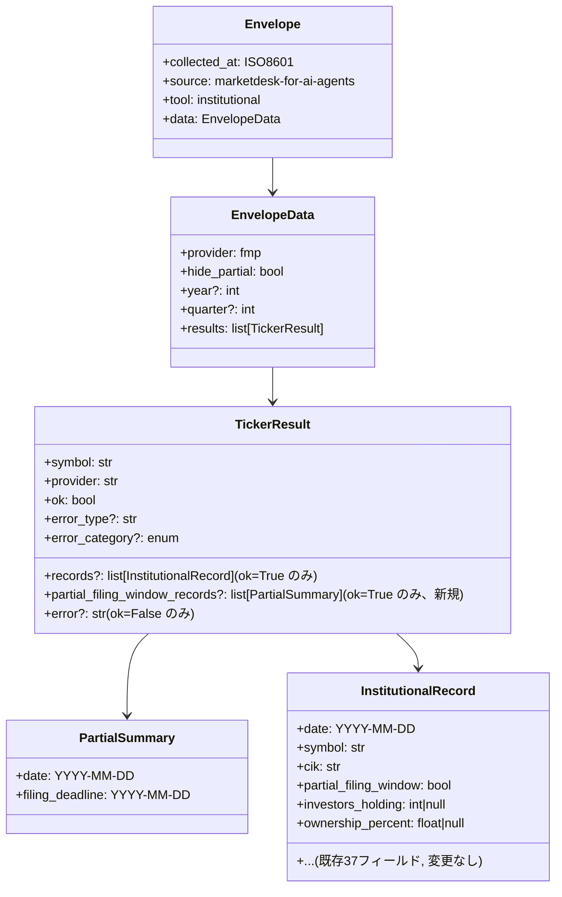

# 技術設計 — institutional-partial-filing-warning

## 概要

**目的**: `scripts/institutional.py` が既にレコード単位で付与している `partial_filing_window: true` を **analyst が見落とせない構造** に再設計する。具体的には (a) stderr への明示警告、(b) per-ticker サマリ `partial_filing_window_records[]` の追加、(c) `--format md` での `⚠` 行先頭マーカー + deadline 注記、(d) `--hide-partial` での数値マスキング、の 4 層を足す。現状は JSON 深部に `partial_filing_window: true` が埋もれており、2026-05-01 セッションで DXC `2026-03-31` の `ownership_percent: 3.21%`（前期 90.10% → 急落）を analyst が「institutional exodus」と誤解しかけた実例を reviewer が訂正した。本タスクはその**解釈リスク**を構造的に下げる。

**ユーザ**: `investment-analyst` / `investment-reviewer` の両 agent。両者とも `records[]` を ad-hoc に読むため、「raw 数値が正規データと比較可能に見える」性質は共通の誤解源。reviewer が常時並走しない自動バッチでも誤解が発生しない最低ラインを確保する。

**影響範囲**: `scripts/institutional.py` のみ。新ファイルなし。新モジュールなし。`_common.py` への新 API なし（`is_fatal_aggregate` は `insider-trading-skill` 実装時に既に公開済みで再利用する）。`skills/institutional/SKILL.md` の Inputs / Output / Failure Handling セクションを追記更新する。

### ゴール

- JSON 出力スキーマの後方互換を保ちつつ、partial レコードが 1 件以上あると `data.results[i]` に `partial_filing_window_records[]` が必ず現れる（空でも付与）
- stderr に `⚠ institutional: <TICKER> <YYYY-MM-DD> is in 13F filing window (deadline ≈ <YYYY-MM-DD>); ...` の一行警告が出る
- `--format md` が `insider.py` の md 出力と同契約の markdown を吐く。partial 行は行頭 `⚠` + 末尾注記列で視認可能
- `--hide-partial` 指定時、partial レコードの **現在期由来** 数値フィールドを `null` に置換。メタ情報 (`symbol`, `date`, `cik`, `partial_filing_window`) と**前期値** (`last_*`) は保持
- 単体テストで `_is_partial_filing_window` の境界値を担保

### ゴール外

- `partial_filing_window` 判定ロジック自体の変更（`record_date + 45 days > today` のまま）
- `institutional.py` 以外の wrapper への波及（`sector-stock-screener` など 13F 由来値を参照するダウンストリームは別タスク）
- persistence、Discord 通知、キャッシュ（stdin / stdout / stderr のみ）
- 新 `ErrorCategory` の追加。既存の 5 値タクソノミを再利用
- JSON スキーマの破壊的変更。追加のみで既存フィールドは触らない（要件 §受け入れ基準 5）

## アーキテクチャ

### 既存アーキテクチャ分析

`scripts/institutional.py` は canonical thin-wrapper 形状を既に満たしている: argparse → per-symbol `safe_call(obb.equity.ownership.institutional)` → per-record `_is_partial_filing_window` 付与 → `aggregate_emit`。`_is_partial_filing_window` 実装 (`institutional.py:37-50`) と per-record フラグ付与 (`:65-69`) は既に SEC §240.13f-1 の 45 日 window を反映しており、本タスクでは**触らない**。

**踏襲するパターン**:

- Flat `scripts/` レイアウト（新ファイル追加なし）
- `_common.safe_call` による例外 → `{ok, error, error_type, error_category}` 化
- `_common.aggregate_emit` による exit code 契約（`credential` / `plan_insufficient` 一致で exit 2、その他は exit 0 + `warnings[]`）
- `NaN / Inf` サニタイズ は `_common.emit` 内で完了
- `--format md` の契約は `insider.py` 先行実装と同一（`is_fatal_aggregate` peek → fatal なら `aggregate_emit` に委譲、非 fatal なら markdown を stdout）

**技術負債の解消**: 本タスクは債務解消というより、**data 解釈リスク**を構造化する新レイヤの追加。

### アーキテクチャ・パターン

`insider.py` と同じ **in-place wrapper extension**。per-record partial フラグは既にあるので、それを `main()` 層で 3 方向に消費する:



**新コンポーネント**:

- `_build_partial_summary(records: list[dict]) -> list[dict]` — 純関数
- `_apply_hide_partial(records: list[dict]) -> list[dict]` — 純関数（`--hide-partial` 指定時のみ呼ばれる）
- `_emit_stderr_warning(results: list[dict]) -> None` — stderr 副作用、`main()` からのみ呼び出し
- `_render_institutional_markdown(rows: list[dict], meta: dict) -> str` — 純関数
- `_escape_md_cell(value) -> str` — `insider.py` からコピーするか、共通化は見送り（Decision 3）

**踏襲**:

- `_common.is_fatal_aggregate`（`insider-trading-skill` 実装で新設済）を再利用
- `fetch()` のシグネチャは変更しない（per-record `partial_filing_window` 付与まで）。新規整形は `main()` で実施
- `DEFAULT_PROVIDER = "fmp"` / `PROVIDER_CHOICES = ["fmp"]` は据え置き

### 技術スタック

| レイヤ | 選択 | 役割 |
|---|---|---|
| CLI | Python 3.12 `argparse` | `--format`, `--hide-partial`, `--no-stderr-warn` の 3 フラグ追加 |
| データ取得 | `openbb.obb.equity.ownership.institutional` | 既存、無変更 |
| 共通ヘルパー | `scripts/_common.py` | `is_fatal_aggregate` / `aggregate_emit` / `emit` をそのまま利用 |
| Skill 文書 | `skills/institutional/SKILL.md` | 追記更新 |
| 単体テスト | `tests/unit/test_institutional_partial.py`（新規） | `_is_partial_filing_window` 境界値、`_build_partial_summary`, `_apply_hide_partial`, `_render_institutional_markdown` |
| 統合テスト | `tests/integration/test_institutional.py`（新規） | live FMP 叩きで stderr / md / `--hide-partial` の三路確認（`FMP_API_KEY` skip-gate）。README §1-1 institutional 行は `Verified` 列を持たず、gate (`test_verification_gate.py`) が参照するのは "Test evidence (sample)" ブロックのみ。institutional 固有テストはそのブロックに明示追記しないので README 改変不要 |

**新依存**: なし。stdlib のみ。

## 要件トレーサビリティ

| 要件 | 概要 | コンポーネント | フロー |
|---|---|---|---|
| §望ましい挙動 1 | stderr 警告 | `_emit_stderr_warning` | main → stderr |
| §望ましい挙動 2 | per-ticker `partial_filing_window_records[]` | `_build_partial_summary` → row 組立 | fetch or main |
| §望ましい挙動 3 | `--format md` + `⚠` マーカー + deadline 注記 | `_render_institutional_markdown`, `_escape_md_cell` | main → stdout (md branch) |
| §望ましい挙動 4 | `--hide-partial` で数値 null 化 | `_apply_hide_partial` | main 前処理 |
| §受け入れ基準 1 | DXC クエリで stderr に ⚠ | 統合テスト | integration |
| §受け入れ基準 2 | per-ticker サマリ JSON | `_build_partial_summary` | 単体 + 統合 |
| §受け入れ基準 3 | md で partial 行に `⚠ + 注記` | `_render_institutional_markdown` | 単体 + 統合 |
| §受け入れ基準 4 | `--hide-partial` で null 化 | `_apply_hide_partial` | 単体 + 統合 |
| §受け入れ基準 5 | 後方互換：追加フィールドのみ | 設計制約（既存キー不変） | 統合 |
| §受け入れ基準 6 | 境界値単体テスト | `_is_partial_filing_window` | 単体 |

## コンポーネント詳細

### `_build_partial_summary`

| 項目 | 内容 |
|---|---|
| 意図 | per-record の `partial_filing_window` を per-ticker で集約し、ダッシュボード用の短いサマリ配列を返す |
| 要件 | §望ましい挙動 2、§受け入れ基準 2 |
| 純度 | 純関数。stdlib のみ |

```python
def _build_partial_summary(records: list[dict[str, Any]]) -> list[dict[str, Any]]:
    """partial=true のレコードから {date, filing_deadline} のリストを返す。

    filing_deadline は record_date + 45 日。partial が 0 件なら空リスト。
    """
```

- **前提**: `records[i]["partial_filing_window"]` が bool、`records[i]["date"]` が ISO 文字列 または `date` / `datetime`
- **事後**: 返り値は `list[dict]`。各要素は `{"date": "YYYY-MM-DD", "filing_deadline": "YYYY-MM-DD"}`。空リスト許容
- **不変条件**: `_is_partial_filing_window` と同じ日付パース規則を踏む。パース失敗行は黙って skip（`_is_partial_filing_window` と同じ fail-open 挙動）
- **配置**: `fetch()` 内で `row["partial_filing_window_records"] = _build_partial_summary(records)` として付与。`ok: False` 行には**付与しない**（要件 §受け入れ基準 5 後方互換）

### `_apply_hide_partial`

| 項目 | 内容 |
|---|---|
| 意図 | `--hide-partial` 指定時、partial レコードの **現在期由来** 数値フィールドを `null` 化。前期値と `partial_filing_window` フラグは保持 |
| 要件 | §望ましい挙動 4、§受け入れ基準 4 |

```python
_MASKED_FIELDS: frozenset[str] = frozenset({
    "investors_holding", "investors_holding_change",
    "number_of_13f_shares", "number_of_13f_shares_change",
    "total_invested", "total_invested_change",
    "ownership_percent", "ownership_percent_change",
    "new_positions", "new_positions_change",
    "increased_positions", "increased_positions_change",
    "closed_positions", "closed_positions_change",
    "reduced_positions", "reduced_positions_change",
    "total_calls", "total_calls_change",
    "total_puts", "total_puts_change",
    "put_call_ratio", "put_call_ratio_change",
})

def _apply_hide_partial(records: list[dict[str, Any]]) -> list[dict[str, Any]]:
    """partial=true レコードの _MASKED_FIELDS を None に置換した新リストを返す。

    partial=false レコードは identity で通す。_MASKED_FIELDS に入らないキー
    (date, symbol, cik, last_*, partial_filing_window) は全て保持。
    """
```

- **保持するキー（= 誤読リスク低い）**:
  - `symbol`, `cik`, `date`: メタ情報
  - `partial_filing_window`: マスクされたことの識別子（true のまま残すと「null はマスク起因」が判別可能）
  - `last_investors_holding`, `last_ownership_percent`, ... (`last_*` 全て): 前期完全集計
- **null 化するキー**: `_MASKED_FIELDS` に列挙した 22 キー。現在期値 11 個 + 派生 `*_change` 11 個
- **`*_change` を null 化する理由**: `current - last` 形式で、current が不完全な時点で差分も不完全。ownership_percent_change = -86.88pp のような値は**誤読のメインソース**
- **副作用なし**: 入力リストは破壊せず dict 単位の浅いコピーで新リストを返す

### `_emit_stderr_warning`

| 項目 | 内容 |
|---|---|
| 意図 | partial レコードを 1 件以上含む ticker ごとに 1 ブロックの stderr 警告を出す |
| 要件 | §望ましい挙動 1、§受け入れ基準 1 |

```python
def _emit_stderr_warning(results: list[dict[str, Any]]) -> None:
    """全 ticker の partial_filing_window_records[] を走査し、stderr に警告を出す。

    各 partial レコード 1 件に対して 3 行を print する。`--no-stderr-warn`
    指定時は main() 側で本関数を呼ばない。

    反復パターン（symbol は外側の row から取り出す。`ok: False` 行は
    partial_filing_window_records が付与されないため skip される）:

        for row in results:
            for p in row.get("partial_filing_window_records", []):
                print(f"⚠ institutional: {row['symbol']} {p['date']} ...",
                      file=sys.stderr)
    """
```

フォーマット（要件 §望ましい挙動 1 に準拠）:

```
⚠ institutional: DXC 2026-03-31 is in 13F filing window
  (deadline ≈ 2026-05-15); ownership_percent / investors_holding may be
  materially understated. Treat as preliminary; refresh after deadline.
```

- 複数 ticker / 複数 partial レコードがあれば**各々について**このブロックを出す（`DXC` と `AAPL` の両方が partial → 2 ブロック）
- 同一 ticker 内で複数レコードが partial になる稀なケース（`--year` / `--quarter` 指定で複数返る）も各レコード 1 ブロック
- `_common.silence_stdout` の範疇外（stderr なので影響なし）

### `_render_institutional_markdown` / `_escape_md_cell`

| 項目 | 内容 |
|---|---|
| 意図 | per-ticker の markdown セクション + 表を返す。partial 行は行頭 `⚠` + 末尾注記列 |
| 要件 | §望ましい挙動 3、§受け入れ基準 3 |

列順（**固定**、JSON と値を一致させるため**生値表示**、パーセント変換もサフィックスも付けない）:

```
date | investors_holding | ownership_percent | number_of_13f_shares | total_invested | put_call_ratio | notes
```

- パーセント変換は入れない: `ownership_percent` は JSON と同じ `0.032143` を表示。md レイヤで `3.21%` 化すると JSON と md の値が乖離し、agent が照合するとき誤差を疑う
- k/M/B サフィックスも入れない: 同上
- `notes` 列は partial=true のとき `filing window: deadline YYYY-MM-DD`、それ以外は空文字列
- partial 行は行頭 `⚠ ` を付ける:
  ```
  ⚠ 2026-03-31 | 122 | 0.032143 | 5696015 | 71214207.0 | 0.0 | filing window: deadline 2026-05-15
    2025-12-31 | 415 | 0.900983 | 159663224 | 2339486933.0 | 0.9196 |
  ```
- `--hide-partial` 併用時: partial 行の数値列は `_escape_md_cell(None) → ""` で空 cell になる。これは意図通り（「比較不可能であること自体を明示」— 要件 §再現シナリオ）。出力例:
  ```
  ⚠ 2026-03-31 |  |  |  |  |  | filing window: deadline 2026-05-15
    2025-12-31 | 415 | 0.900983 | 159663224 | 2339486933.0 | 0.9196 |
  ```
- エラー行: `insider.py::_render_markdown` と同じく `_error_category_: <cat> — <error>`
- 空 records 行: `_no records in quarter_`
- `_escape_md_cell`: `insider.py` からそのままコピー（`|` エスケープ、改行 → 空白、`\r` 除去、None → ""）。共通化は Decision 3 で deferred

### `fetch` (既存拡張)

現行の `fetch()` (`institutional.py:53-69`) に **1 行追加** のみ:

```python
def fetch(symbol, provider, year=None, quarter=None):
    opt = {k: v for k, v in (("year", year), ("quarter", quarter)) if v is not None}
    call_result = safe_call(obb.equity.ownership.institutional, ...)
    if call_result.get("ok"):
        today = date.today()
        for rec in call_result["records"]:
            rec["partial_filing_window"] = _is_partial_filing_window(rec.get("date"), today)
        call_result["partial_filing_window_records"] = _build_partial_summary(call_result["records"])
    return {"symbol": symbol, "provider": provider, **call_result}
```

`partial_filing_window_records` は `call_result` 上に載せることで、`ok: False` 行では自動的に抜ける（要件 §受け入れ基準 5 後方互換）。`_build_partial_summary` が空リストを返しても付与する（スキーマ不変量）。

### `main` (既存拡張)

argparse 拡張（3 フラグ）:

```python
parser.add_argument("--format", choices=["json", "md"], default="json")
parser.add_argument("--hide-partial", action="store_true", default=False,
                    help="Replace numeric fields on partial_filing_window=true records with null")
parser.add_argument("--no-stderr-warn", action="store_true", default=False,
                    help="Suppress the stderr warning block (for batch/CI use)")
```

分岐ロジック（順序が重要）:

```python
results = [fetch(s, args.provider, year=args.year, quarter=args.quarter) for s in args.symbols]

if args.hide_partial:
    for row in results:
        if row.get("ok"):
            row["records"] = _apply_hide_partial(row["records"])

if not args.no_stderr_warn:
    _emit_stderr_warning(results)

query_meta = {"provider": args.provider, "hide_partial": args.hide_partial}
for k, v in (("year", args.year), ("quarter", args.quarter)):
    if v is not None:
        query_meta[k] = v

if args.format == "md":
    if is_fatal_aggregate(results) is None:
        sys.stdout.write(_render_institutional_markdown(results, query_meta) + "\n")
        return 0
return aggregate_emit(results, tool="institutional", query_meta=query_meta)
```

- `--hide-partial` を stderr 警告より**前**に適用: マスキング後も partial フラグは残るので警告は正しく出る
- `--no-stderr-warn` はテストと CI 向けの安全弁。analyst / reviewer の通常運用では**外さない**
- `query_meta` に `hide_partial` エコーを追加（agent が呼び出し文脈を再現可能に）

## データモデル

### 論理データモデル: envelope 追加フィールド



### 整合性

- `partial_filing_window_records[i].date` は対応する `records[j].date`（`records[j].partial_filing_window == True` を満たす j）と同一 ISO 文字列
- `partial_filing_window_records[i].filing_deadline` は同一 `date + 45日` の ISO 表現。ハードコード `_FILING_WINDOW_DAYS = 45` と同期
- `--hide-partial=True` のとき `records[j]` のうち partial=true 行の `_MASKED_FIELDS` 全キーは `None`（JSON では `null`）
- `--hide-partial=False`（デフォルト）のとき records 値は**完全に変更されない**（要件 §受け入れ基準 5）

## エラーハンドリング

既存 5 値タクソノミ (`ErrorCategory`) をそのまま踏襲。本タスクは新エラー path を作らない。

| 表面 | カテゴリ | 経路 |
|---|---|---|
| argparse reject（`--format bogus` 等） | `validation` | argparse 既定動作（exit 2） |
| `FMP_API_KEY` 未設定 | `credential` | `safe_call` → `_common.classify_exception` |
| FMP 403 / plan 402 | `credential` / `plan_insufficient` | 同上 |
| `--quarter` が 1-4 外 | `validation` | upstream (OpenBB provider) |
| OpenBB 5xx / timeout | `transient` | 同上 |

**既存契約維持**: `is_fatal_aggregate` が credential / plan_insufficient 一致を検知したら `--format md` でも JSON に fall-back（`insider.py` と同じ規約）。

**新規観測点**: partial warning の stderr 出力。これは**エラーではない**ため `error_category` を発行しない。stderr に書く理由:
- stdout はパース可能な JSON / md 契約で「汚染」を避けたい
- `_common.silence_stdout` が stdout のみ吸収。stderr は agent が観測可能
- `insider.py::_lookup_sec_code` の unmapped-SEC-string stderr print と同パターン

## テスト戦略

### 単体テスト (`tests/unit/test_institutional_partial.py`, 新規)

1. **`_is_partial_filing_window` 境界値**（要件 §受け入れ基準 6）
   - `record_date = today - 45日` → `record_date + 45 > today` が `False`（境界: deadline ちょうど）
   - `record_date = today - 44日` → `True`（deadline 手前）
   - `record_date = today - 46日` → `False`（deadline 超過）
   - `record_date = today` → `True`
   - 非 str / 非 date 入力 → `False` (fail-open)
   - 不正な ISO 文字列 → `False`

2. **`_build_partial_summary`**
   - 全 partial → 全要素に `date` / `filing_deadline` があり、`filing_deadline = date + 45日`
   - 全 non-partial → `[]`
   - 混在 → partial 件数 == 要素数
   - `records[]` が空 → `[]`

3. **`_apply_hide_partial`**
   - partial=true レコードで `_MASKED_FIELDS` が全て `None`
   - partial=true レコードで `last_*` / `date` / `symbol` / `cik` / `partial_filing_window` は保持
   - partial=false レコードは identity（値変更なし）
   - 入力リストが破壊されない（新リストが返る）

4. **`_render_institutional_markdown`**
   - partial=true 行に `⚠ ` プレフィックス
   - partial=true 行の notes 列に `filing window: deadline YYYY-MM-DD`
   - partial=false 行に `⚠ ` なし、notes 空
   - 列順が `date | investors_holding | ownership_percent | number_of_13f_shares | total_invested | put_call_ratio | notes`
   - `ok: False` 行は `_error_category_: <cat> — <error>`
   - 空 records は `_no records in quarter_`

5. **`_escape_md_cell`**（`insider.py` コピー）: pipe、改行、None、整数、浮動小数点

### 統合テスト (`tests/integration/test_institutional.py`, 新規)

live FMP API を叩く。`FMP_API_KEY` skip-gate 付き。

1. **DXC 現行クエリで stderr に `⚠ institutional` を含む**（要件 §受け入れ基準 1、§再現シナリオ）
   - 既定 `--provider fmp` 最新クエリは 2026-05-15 前なら DXC `2026-03-31` が partial 化する
   - `subprocess.run(..., capture_output=True)` で `result.stderr` に `⚠ institutional:` を assert
   - 付随: `--no-stderr-warn` 指定時は stderr が空

2. **JSON 出力に `partial_filing_window_records[]`**（要件 §受け入れ基準 2）
   - `data.results[0].partial_filing_window_records` が list
   - partial が発生している場合 `[0].date` / `[0].filing_deadline` が ISO 文字列

3. **`--format md` で ⚠ + deadline**（要件 §受け入れ基準 3）
   - stdout が JSON パース不可（markdown）
   - 行頭 `⚠ ` を含む行が 1 つ以上
   - `filing window: deadline 2026-` を含む

4. **`--hide-partial` で数値 null 化**（要件 §受け入れ基準 4）
   - partial=true レコードの `ownership_percent is None`
   - partial=true レコードの `last_ownership_percent is not None`（保持）
   - partial=true レコードの `partial_filing_window is True`（保持）

5. **後方互換**（要件 §受け入れ基準 5）
   - 既存 `test_json_contract.py` の institutional happy argv が無変更でパスする
   - `records[0]` の既存キー（37 フィールド）は全て存在

6. **`is_fatal_aggregate` fall-back**
   - `FMP_API_KEY` 未設定 + `--format md` → stdout が JSON (exit 2)、stderr に警告なし

### パフォーマンス / ロード

該当なし。stderr print は partial レコード数に線形、通常 1-5 件。markdown render は records 数に線形、通常 1-8 行。

## 重要判断

### Decision 1: `_MASKED_FIELDS` の範囲選択

**選択肢**:

- (A) 現在期由来のみ null 化（本設計）
- (B) 全フィールド null 化（`last_*` も含む）
- (C) `ownership_percent` のみ null 化（最小限）

**採用 (A)**: `last_*` は前期完全集計で誤読リスクなし。これを null 化すると **正当な比較対象まで失う** → analyst が「数値がないから提案根拠にしない」 → accuracy-first の逆行（正確な情報まで取れなくなる）。`*_change` のみ派生マスク。

**反証ケース**: 前期値を意図的に隠すことで「partial 期は比較自体を禁じる」強い方針もあるが、reviewer の独立検証は `last_ownership_percent = 90.10%` の観測で成立した（要件 §再現シナリオ）。前期値は保持する方が分析の質が上がる。

### Decision 2: `--hide-partial` 既定値

**選択肢**:

- (A) 既定 OFF（本設計）
- (B) 既定 ON

**採用 (A)**: stderr ⚠ + md `⚠` + `partial_filing_window_records[]` の**三重警告**で誤解を防げる。既定 ON にすると既存スキーマを破壊し、analyst が「数値が null なら取れなかったデータ」と誤認するリスクが発生する（要件 §受け入れ基準 5 後方互換）。`--hide-partial` は明示選択の escape hatch。

**補強**: 既定 OFF でも stderr 警告は常時 ON（`--no-stderr-warn` を明示指定した場合のみ OFF）。CI / 自動バッチでは `--hide-partial` を明示するか、stderr を監視する運用を SKILL.md で推奨。

### Decision 3: markdown 数値の表示形式

**選択肢**:

- (A) 生値（本設計）: `0.032143`, `5696015`, `71214207.0`
- (B) 人間可読: `3.21%`, `5.70M`, `$71.21M`

**採用 (A)**: md と JSON の値が一致 → agent の verification 用途に有利。`insider.py` の先行実装も生値。partial 行は行頭 `⚠` と注記列で視認性は確保済み。形式変換を md 層に持ち込むと「md と JSON で値が違う」混乱源を生む。

**トレードオフ**: 人間が生値を読むとき `0.032143` を 3.21% と脳内変換する手間が出る。しかし本タスクの第一目的は **誤解の構造的防止**であり、生値は verification を容易にする方向に働く（agent が JSON と md を照合する際の摩擦を減らす）。

### Decision 4: `_escape_md_cell` の共通化

**選択肢**:

- (A) `institutional.py` に `insider.py` と同名同実装でコピー（本設計）
- (B) `_common.py` に `escape_md_cell` を公開し両者から参照
- (C) 新 `scripts/_format.py` モジュールを切る

**採用 (A)**: `insider-trading-skill` Decision 6 でも「第二の `--format md` wrapper 出現まで deferred」を選択している。本タスクで 2 個目の md wrapper が出現するので共通化する正当性は生じるが、本タスクのスコープは「解釈リスク低減」であり、横断リファクタは別 PR が筋。コピーは 15 行程度で小さい。将来 3 個目の md wrapper が出た時点で共通化を別タスクで提起する。

### Decision 5: `partial_filing_window_records[]` の配置場所

**選択肢**:

- (A) per-ticker `data.results[i].partial_filing_window_records[]`（本設計）
- (B) envelope top-level `data.partial_filing_window_records[]`（全 ticker 横断）
- (C) 両方

**採用 (A)**: ticker 単位での扱いが自然。`data.results` の要素は ticker 単位で ok/失敗が混在するので、partial サマリも ticker 単位が直感的。envelope 横断で必要なら agent が `sum(r["partial_filing_window_records"] for r in data.results, [])` で組み立てられる。

### Decision 6: stderr 警告の多重出力抑止

**選択肢**:

- (A) partial レコード 1 件につき 1 ブロック出力（本設計）
- (B) ticker 1 つにつき 1 ブロック（複数レコードでも集約）
- (C) セッション内初回のみ（`insider._lookup_sec_code` と同様）

**採用 (A)**: 要件 §望ましい挙動 1 の例文が「`<TICKER> <YYYY-MM-DD>` が出る」形式であり、レコード単位指定と読める。複数レコード partial の稀なケース（`--year/--quarter` 明示指定で複数返る）で**どのレコードが partial か**を stderr で明示できる方が analyst に親切。

## 参考

- `requirements.md` — 本設計が実現する要件（10 節構成）
- `scripts/institutional.py` — 既存実装（103 行、未改修）
- `scripts/insider.py` — `--format md` / `is_fatal_aggregate` / `_escape_md_cell` の先行実装（コピー元）
- `scripts/_common.py` — `is_fatal_aggregate`, `aggregate_emit`, `ErrorCategory`（再利用のみ、改修なし）
- `skills/institutional/SKILL.md` — 更新対象（Inputs / Output / Failure Handling セクション）
- `docs/tasks/done/insider-trading-skill/design.md` — 同パターンの先行設計書
- `docs/tasks/done/insider-fmp-strip-role-prefix-fix/` — 同日起票の analyst 誤解防止系列
