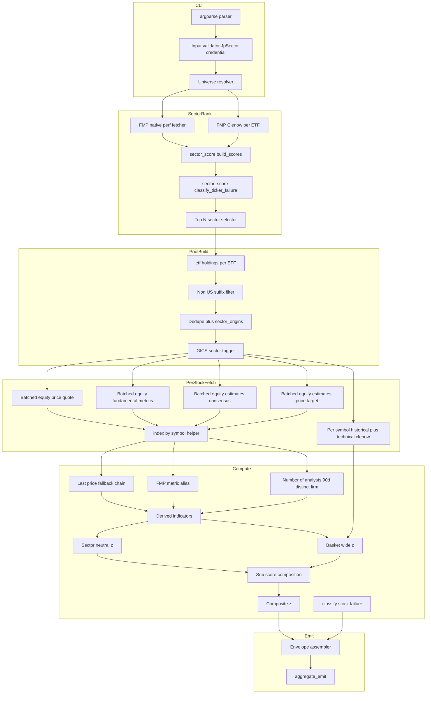
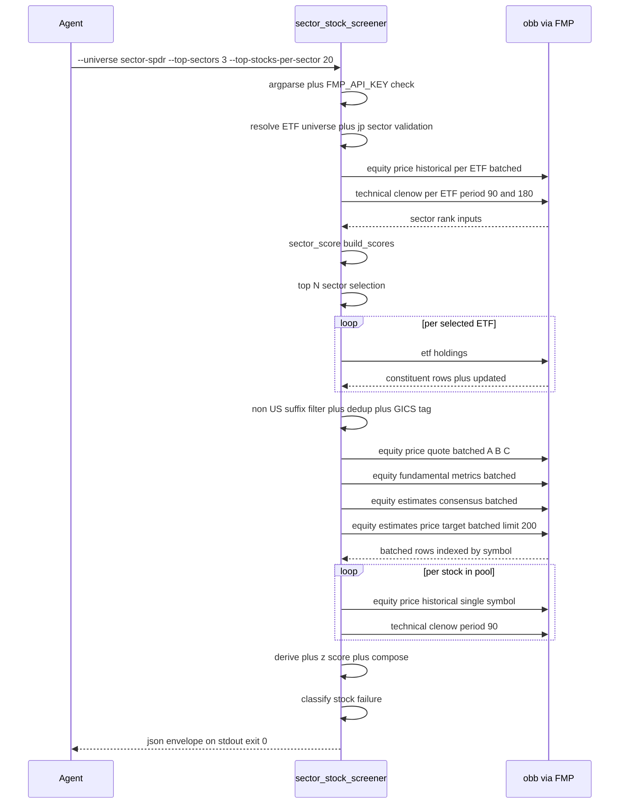

# Technical Design — sector-stock-screener

---
**Purpose**: Translate the fifteen requirements in `requirements.md` into the architectural contract that `scripts/sector_stock_screener.py` plus `skills/sector-stock-screener/SKILL.md` must satisfy. Research findings (including live FMP probes executed 2026-05-01) live in `research.md`; this document is the self-contained build-ready artifact.
---

## Overview

**Purpose**: Deliver a thin CLI wrapper that takes a sector / theme / factor ETF universe, selects the top-ranked sectors using `scripts/sector_score.py`'s pure composite helpers, expands each top sector ETF into its FMP-provided constituent list, and emits a ranked multi-factor stock table (momentum × value × quality × forward-looking consensus). Value and quality are z-scored **within GICS sector**; momentum, trend, range position, and analyst upside stay **cross-sectional** across the whole resolved basket. Every OpenBB call is pinned to `provider="fmp"` (Starter+ tier), closing the gap between `sector_score.py` (ETF-level) and the individual-name selection mandated by `policy.md` §3 mid-term strategy.

**Users**: The AI analyst agent running the quarterly mid-term watchlist draft, and any agent invoking the wrapper for ad-hoc sector probes. Both reach the tool through `uv run scripts/sector_stock_screener.py …` and consume the JSON envelope programmatically.

**Impact**: Adds one new wrapper (`scripts/sector_stock_screener.py`), one new `skills/sector-stock-screener/SKILL.md`, one new integration-test file, a row in `skills/INDEX.md` and `README.md` §1-1. No changes to `scripts/sector_score.py` or any other existing wrapper, no new provider, no new OpenBB endpoint, no envelope-contract deviation.

### Goals

- Expose one CLI invocation that delivers the ranked mid-term stock basket the analyst currently assembles by hand (SM Energy / FLXS-type discovery).
- Keep value / quality factors sector-neutral (Damodaran EV/EBITDA dispersion: Software ~30× vs Energy ~5×) and momentum / forward-looking factors cross-sectional — mixed scope is the default failure mode this design guards against.
- Gate `target_upside` on `number_of_analysts ≥ 5` so sparsely-covered names surface as `null` rather than noise, and derive `number_of_analysts` from the FMP `equity.estimates.price_target` revision log (the `consensus` endpoint under FMP does not expose the field — research R1 / N2).
- Pin every OpenBB call to FMP; remove provider-dispatch scaffolding entirely (no `--provider` flag, no provider router, no `_QUOTE_FIELD_MAP`).
- Pass the repo-wide `tests/integration/test_json_contract.py` and `tests/integration/test_verification_gate.py` invariants on first landing, and remain a thin composition wrapper (reuse `sector_score.py`'s pure scoring helpers verbatim; pattern-reuse `entry_timing_scorer.py`'s dataclass-layered pipeline).

### Non-Goals

- JP sector coverage in MVP (1.5). FMP Starter+ does not cover TSE-listed ETFs cleanly.
- Trading signal synthesis, backtesting, portfolio optimization (11.1, 11.2, 11.4).
- Macro-quadrant blending; macro integration stays the analyst agent's responsibility (11.3).
- Analyst-**revision** momentum sub-score (aggregated direction/magnitude of price-target changes). Only the `target_upside` **level** gated on `number_of_analysts ≥ 5` enters the composite (11.5).
- Persistence / state between runs; stdout-only wrapper (11.4).

## Architecture

### Existing Architecture Analysis

The wrapper slots into an existing, tested thin-wrapper surface. Three architectural precedents are load-bearing and re-used unchanged:

- **`scripts/sector_score.py`** — direct architectural precedent for every scoring layer. `UNIVERSES`, `zscore`, `rank_desc`, `build_scores`, and `_classify_ticker_failure` are imported verbatim (flat `sys.path`-root import). `sector_score.fetch_performance` / `fetch_clenow` are **not** imported — they hard-code finviz + yfinance, which would break the Req 2.1 FMP-only contract. This wrapper writes its own FMP-native performance + Clenow fetchers.
- **`scripts/entry_timing_scorer.py`** — pattern precedent for dataclass-layered pipeline, `_zscore_min_basket` inline helper (`scripts/entry_timing_scorer.py:1250-1267`), closed `DATA_QUALITY_FLAGS` frozenset + `append_quality_flag` validation, `ANALYTICAL_CAVEATS` module-scope constant, `LastPriceResolution` fallback chain. Adopted in shape; not imported (single-wrapper helpers stay inside their wrapper file per `structure.md`).
- **`scripts/_common.py`** — `safe_call`, `ErrorCategory`, `aggregate_emit`, `sanitize_for_json`, `emit_error` are consumed on the unchanged public surface. No helper is added to `_common.py`.

Existing envelope, exit-code, stdout-hygiene, and per-row-failure invariants in `docs/steering/tech.md` "JSON output contract" are respected without deviation; they are mechanically enforced by `tests/integration/test_json_contract.py`.

### Architecture Pattern & Boundary Map

Selected pattern: **new thin wrapper `scripts/sector_stock_screener.py` modeled on `scripts/sector_score.py` + `scripts/entry_timing_scorer.py`** (research §"Architecture Pattern Evaluation" Option A). Rejected alternatives: extract `sector_score` primitives into `scripts/_sector_scoring.py` first (Option B — pure structural refactor, adds a third touch point for zero functional gain), and inline-copy all helpers (Option C — two sources of truth for the composite formula, forbidden by `structure.md`).



**Domain/feature boundaries**: one wrapper file partitioned at function granularity: (a) CLI + validation, (b) sector rank, (c) pool build, (d) per-stock fetch, (e) derive / z-score / compose, (f) emit. Each boundary is a pure-function interface with typed Python signatures; nothing crosses into another wrapper beyond the already-published `sector_score` pure helpers and `_common` envelope.

**Existing patterns preserved**: `safe_call` guards every OpenBB call; `aggregate_emit` emits the envelope; `silence_stdout` is entered transitively through `safe_call`; `from __future__ import annotations` header; `apply_to_openbb()` is called once at module import. `sector_stock_screener.py` does not shadow any stdlib module.

**New components rationale**: only the ones delivering contractual deltas — FMP-native sector-rank fetcher (3.1), GICS sector tagger (5.7), non-US suffix filter (4.8), `_index_by_symbol` batch helper (5.5), `_zscore_min_basket` + `_zscore_min_basket_sector_neutral` (7.1 / 7.2 / 7.7 / 7.8), analyst-count derivation from `price_target` (5.4), FMP metric alias map (5.2), closed `DATA_QUALITY_FLAGS` catalog (10.7), `ANALYTICAL_CAVEATS` tuple (10.6), `_classify_stock_failure` (15.1).

**Steering compliance**: flat-wrapper convention (`structure.md`), English-only `SKILL.md` (`structure.md`), envelope invariants (`tech.md`), ChangeBundleRule (`structure.md`: `scripts/<name>.py` requires matching `skills/<name>/SKILL.md` in the same commit).

### Technology Stack

| Layer | Choice / Version | Role in Feature | Notes |
|-------|------------------|-----------------|-------|
| CLI runtime | Python 3.12 (`>=3.12,<3.13`) + `uv` | Entry point, argparse, subprocess under `uv run` | No deviation from repo baseline |
| Data SDK | `openbb>=4.4.0` | `equity.price.{historical,quote}`, `equity.fundamental.metrics`, `equity.estimates.{consensus,price_target}`, `etf.holdings`, `technical.clenow` | No new endpoints; live-verified 2026-05-01 |
| Provider | FMP Starter+ (single provider, pinned at every call site) | Sector-ETF perf + Clenow, ETF holdings, per-stock quote / metrics / consensus / price_target / historical | No `--provider` CLI flag; `FMP_API_KEY` required. Credential gated; HTTP 402 on non-US listings (`0700.HK` etc.) is handled by Req 4.8 pool-build filter |
| Shared envelope | `scripts/_common.py::{safe_call, aggregate_emit, ErrorCategory, sanitize_for_json, emit_error}` | Envelope, per-row failure, NaN→null sanitisation | Re-used unchanged |
| Imported helpers | `sector_score::{UNIVERSES, zscore, rank_desc, build_scores, _classify_ticker_failure}` | Sector-rank composite identical to `sector_score.py` | Flat-root import; no churn to `sector_score.py` |
| Skill documentation | `skills/sector-stock-screener/SKILL.md` (English, 30–80 lines) | Agent-facing CLI manual with one real output sample | ChangeBundleRule mandatory pair |
| Integration tests | `pytest -m integration` subprocess via `tests/integration/conftest.py::run_wrapper_or_xfail` | Envelope-shape + per-Req contract assertions | Auto-skipped when `FMP_API_KEY` absent (mirrors `test_etf.py`) |

## System Flows

### Per-invocation sequence



Flow-level decisions:

- **Clenow is per-symbol** (14.4; research G1): `obb.technical.clenow` rejects stacked-index DataFrames from a batched historical call. One `equity.price.historical` + one or more `technical.clenow` reductions over the fetched bar series is the only supported shape. `technical.clenow` operates on locally-held data (`data=hist.results`), so issuing both the 90- and 180-day reductions against a single historical fetch costs one HTTP call and two pure-Python computes.
- **Every other per-stock primitive batches** (14.1, 14.2, 14.3; research R1 / G2): `quote`, `fundamental.metrics`, `estimates.consensus`, `estimates.price_target` each resolve in exactly one batched call per run. Row-to-symbol mapping goes through `_index_by_symbol` — no positional lookup (5.5; research G6).
- **Default-run HTTP-call budget**: ≈139 FMP HTTP calls — 1 batched sector-ETF historical (for returns/vol) + 11 sector-ETF historical calls (shared across the `period=90` and `period=180` Clenow reductions, one per SPDR ETF) + 3 `etf.holdings` + 60 stock-level historical + 60 stock-level historical-backed `clenow` reductions (one HTTP call per stock since `technical.clenow` reuses the same fetched bars) + 4 batched per-stock fetches — well inside FMP Starter 300/min (14.5). Local-only `technical.clenow` reductions (22 at the sector level, 60 at the stock level) do not consume the per-minute budget.
- **Non-US tickers are filtered at pool-build time** (4.8; research G3), not surfaced as per-stock `plan_insufficient` failures. Keeps the warnings channel focused on real provider issues.
- **Cross-sectional + sector-neutral z-scoring runs after every fetch completes**, so a late-arriving ticker never perturbs another ticker's score (7.10).

## Requirements Traceability

Numeric IDs match `requirements.md` verbatim. Columns reference the domain/layer sections under *Components and Interfaces* and the flow above.

| Requirement | Summary | Components | Interfaces | Flows |
|-------------|---------|------------|------------|-------|
| 1.1 | `--universe <key>` resolves through `UNIVERSES` map | CLI / Input Resolver | `parse_universe_argument` | Sequence init |
| 1.2 | `--tickers <CSV>` preserves order + dedupes | CLI / Input Resolver | `parse_tickers_argument` | Sequence init |
| 1.3 | Mutex `--universe` + `--tickers` → validation error | CLI / Input Validator | argparse mutex group | Pre-call |
| 1.4 | Neither supplied → validation error | CLI / Input Validator | argparse group required | Pre-call |
| 1.5 | `--universe jp-sector` → validation rejection | CLI / Input Validator | `validate_universe_argument` | Pre-call |
| 1.6 | Empty deduped ETF list → validation error | CLI / Input Validator | `validate_resolved_etfs` | Pre-call |
| 2.1 | Every OpenBB call pinned to `provider="fmp"` | All fetch layers | constant `_FMP = "fmp"` | All calls |
| 2.2 | Missing `FMP_API_KEY` → exit 2 before any OpenBB call | CLI / Credential Gate | `check_fmp_credential` | Pre-call |
| 2.3 | All-fatal-category batch → exit 2 via `aggregate_emit` | Envelope Assembler | `aggregate_emit` | Emit |
| 3.1 | Reuse `sector_score` pure helpers; FMP-native perf + Clenow for sector rank | Sector Rank | `fetch_sector_performance_fmp` + `fetch_sector_clenow_fmp` + `build_scores` | SectorRank |
| 3.2 | `--top-sectors <N>` default 3, bounded `[1,11]` | CLI / Input Validator + Top-N Selector | argparse `type=int` + custom bounds | SectorRank |
| 3.3 | Shortfall note when fewer sectors rank | Top-N Selector | `select_top_sectors` | SectorRank |
| 3.4 | `data.sector_ranks[]` envelope echo | Envelope Assembler | `build_query_meta` | Emit |
| 3.5 | `--weight-sector-*` flags identical to `sector_score.py` | CLI + Sector Rank | argparse | SectorRank |
| 4.1 | `etf.holdings(provider="fmp")` per top sector | ETF Holdings Fetcher | `fetch_etf_holdings` | PoolBuild |
| 4.2 | `--top-stocks-per-sector <M>` default 20, bounded `[1,100]` | CLI / Input Validator + Pool Builder | argparse `type=int` + custom bounds | PoolBuild |
| 4.3 | Top M by ETF `weight` for universe definition only | Pool Builder | `take_top_m_by_weight` | PoolBuild |
| 4.4 | Dedup on `symbol` + `sector_origins[]` + `stock_appears_in_multiple_top_sectors` flag | Pool Builder + Quality Flag Emitter | `dedupe_constituents` | PoolBuild |
| 4.5 | Per-sector `plan_insufficient` propagates to `provider_diagnostics` | ETF Holdings Fetcher + Envelope Assembler | `fetch_etf_holdings` + `aggregate_emit` | PoolBuild + Emit |
| 4.6 | `etf_holdings_updated_max_age_days` at `data` level | Pool Builder + Envelope Assembler | `compute_holdings_max_age_days` | Emit |
| 4.7 | Fewer than 3 deduped tickers → null z + top-level warning | Cross-Sectional Scorer + Envelope Assembler | `compose_subscores` + `aggregate_emit` | Emit |
| 4.8 | Non-US exchange-suffix filter + `non_us_tickers_filtered_from_pool` caveat | Pool Builder | `filter_non_us_tickers` | PoolBuild |
| 5.1 | Batched quote + FMP-native `ma200` / `ma50` emitted under logical names + `_index_by_symbol` | Per-Stock Fetcher + Quote Resolver | `fetch_quotes_batched` + `_index_by_symbol` | PerStockFetch |
| 5.2 | Batched metrics + FMP alias to logical names; `pe_ratio`/`gross_margin` omitted | Per-Stock Fetcher + Metric Aliaser | `fetch_metrics_batched` + `_FMP_METRIC_ALIASES` | PerStockFetch |
| 5.3 | Per-symbol `historical(start=TODAY-180d)` + `technical.clenow(period=90)` | Per-Stock Fetcher / Clenow | `fetch_clenow_fmp` | PerStockFetch |
| 5.4 | Batched consensus + analyst count from `price_target` 90-day distinct firm | Per-Stock Fetcher + Analyst Count Deriver | `fetch_consensus_batched` + `derive_number_of_analysts` | PerStockFetch + Compute |
| 5.5 | `_index_by_symbol` is sole entry point; never `results[i]` | Per-Stock Fetcher | `_index_by_symbol` | PerStockFetch |
| 5.6 | Last-price fallback `quote.last_price → prev_close → null` with flag | Last-Price Fallback | `resolve_last_price` | Compute |
| 5.7 | `gics_sector` tagging via `sector_origins[0]` + SPDR map; null for theme/factor | GICS Tagger | `tag_gics_sector` | PoolBuild |
| 6.1 | `range_pct_52w` computation | Derived Indicators | `compute_range_pct_52w` | Compute |
| 6.2 | `ma200_distance` computation | Derived Indicators | `compute_ma200_distance` | Compute |
| 6.3 | `ev_ebitda_yield = 1 / enterprise_to_ebitda` + `ev_ebitda_non_positive` flag | Derived Indicators + Quality Flag Emitter | `compute_ev_ebitda_yield` | Compute |
| 6.4 | `target_upside` gated on `number_of_analysts ≥ 5` | Derived Indicators | `compute_target_upside` | Compute |
| 6.5 | `analyst_coverage_too_thin` flag when coverage gate fails | Quality Flag Emitter | `append_quality_flag` | Compute |
| 7.1 | Sector-neutral z on `ev_ebitda_yield` + `roe` | Cross-Sectional Scorer | `_zscore_min_basket_sector_neutral` | Compute |
| 7.2 | Basket-wide z on `clenow_90`, `(1 - range_pct_52w)`, `ma200_distance`, `target_upside` | Cross-Sectional Scorer | `_zscore_min_basket` | Compute |
| 7.3 | Sub-score composition (`momentum_z`, `value_z`, `quality_z`, `forward_z`) with sum-of-available-weights | Cross-Sectional Scorer | `compose_subscore` | Compute |
| 7.4 | Fixed literature-anchored sub-score internal weights echoed under `data.weights` | Cross-Sectional Scorer + Envelope Assembler | `_SUBSCORE_INTERNAL_WEIGHTS` | Compute + Emit |
| 7.5 | `clip(50 + z*25, 0, 100)` transform → four `*_score_0_100` fields | Cross-Sectional Scorer | `to_100` | Compute |
| 7.6 | Top-level sub-score weights CLI-tunable → `composite_z` + `composite_score_0_100` | CLI + Cross-Sectional Scorer | argparse + `compose_composite` | Compute |
| 7.7 | Sector group <3 → fallback to basket-wide z + `sector_group_too_small_for_neutral_z(<factor>)` | Cross-Sectional Scorer + Quality Flag Emitter | `_zscore_min_basket_sector_neutral` | Compute |
| 7.8 | Basket <3 on a basket-wide factor → null z + `basket_too_small_for_z(<factor>)` | Cross-Sectional Scorer + Quality Flag Emitter | `_zscore_min_basket` | Compute |
| 7.9 | `z_scores` block with `_sector_neutral` / `_basket` suffix tags | Envelope Assembler | `build_z_scores_block` | Emit |
| 7.10 | Per-row `basket_size`, `sector_group_size`, `basket_size_sufficient` | Cross-Sectional Scorer | `compute_basket_metrics` | Compute |
| 8.1 | Sort `data.results[]` by `composite_score_0_100` desc, nulls sink | Envelope Assembler | `sort_results` | Emit |
| 8.2 | 1-indexed `rank` field | Envelope Assembler | `assign_ranks` | Emit |
| 8.3 | No truncation; emit every resolved ticker | Envelope Assembler | `build_results_rows` | Emit |
| 9.1 | `aggregate_emit(tool="sector_stock_screener")` | Envelope Assembler | `aggregate_emit` | Emit |
| 9.2 | `data` namespace siblings (universe, tickers, weights, sector_ranks, top_sectors_requested, top_stocks_per_sector_requested, etf_holdings_updated_max_age_days, missing_tickers, provider_diagnostics, analytical_caveats, notes) | Envelope Assembler | `build_query_meta` | Emit |
| 9.3 | Per-row failure shape `{symbol, ok:false, error, error_type, error_category, sector_origins}` + top-level warning mirror | Envelope Assembler | `build_failure_row` + `aggregate_emit` | Emit |
| 10.1 | Per-row minimum field set on every resolved stock | Envelope Assembler | `build_ok_row` | Emit |
| 10.2 | `signals` block with 17 named fields (no `pe_ratio` / `gross_margin` / `recommendation_mean`) | Envelope Assembler | `build_signals_block` | Emit |
| 10.3 | `interpretation` block with five structural keys | Interpretation Builder | `build_interpretation` | Emit |
| 10.4 | No `buy_signal` / `recommendation` field anywhere (negative invariant) | Envelope Assembler | absence of emitter | Emit |
| 10.5 | `ok: false` row omits score + z-score blocks | Envelope Assembler | `build_failure_row` | Emit |
| 10.6 | `data.analytical_caveats` constant (seven entries, with `non_us_tickers_filtered_from_pool` conditional) | Envelope Assembler | `ANALYTICAL_CAVEATS` + `build_query_meta` | Emit |
| 10.7 | Closed `DATA_QUALITY_FLAGS` catalog | Quality Flag Emitter | `DATA_QUALITY_FLAGS` + `append_quality_flag` | Compute |
| 11.1 | No buy/sell/hold output | Envelope Assembler | absence | — |
| 11.2 | No backtesting | — | — | — |
| 11.3 | No macro-quadrant integration | — | — | — |
| 11.4 | stdout-only; no files / cache / DB / logs | Envelope Assembler | `_common.emit` | — |
| 11.5 | No analyst-revision momentum sub-score | Envelope Assembler | absence + `SUBSCORE_SIGNAL_KEYS` | — |
| 12.1 | ChangeBundleRule: wrapper + SKILL.md + INDEX row + README row + test in same commit | Release Bundle | — | — |
| 12.2 | SKILL.md English, 30–80 lines, references `_envelope` / `_errors` / `_providers` | SKILL.md | — | — |
| 12.3 | SKILL.md documents every CLI flag with default | SKILL.md | — | — |
| 12.4 | One short real-run example + truncated output sample | SKILL.md | — | — |
| 12.5 | Scope boundaries documented | SKILL.md | — | — |
| 12.6 | Interpretation section echoes three caveats | SKILL.md | — | — |
| 12.7 | Provider subsection: FMP Starter+ required, fail-fast on missing key | SKILL.md | — | — |
| 13.1 | `pytest -m integration` subprocess test with `FMP_API_KEY` skip | Integration Test | `run_wrapper_or_xfail` | — |
| 13.2 | Sort assertion: `composite_score_0_100` desc, nulls sink | Integration Test | sort assertion | — |
| 13.3 | `analytical_caveats` contains all five required strings; negative invariant on `buy_signal` / `recommendation` | Integration Test | membership + field-absence assertion | — |
| 13.4 | Every `ok: true` row carries `gics_sector` + `sector_origins[]` + all four `*_score_0_100` fields (forward may be null) | Integration Test | row-shape assertion | — |
| 13.5 | `data.top_sectors_requested` / `top_stocks_per_sector_requested` / `etf_holdings_updated_max_age_days` emitted and correct | Integration Test | field-value assertion | — |
| 13.6 | At least one `z_scores` field tagged `_sector_neutral` and `_basket` | Integration Test | field-name assertion | — |
| 13.7 | `analytical_caveats` contains `number_of_analysts_is_90d_distinct_firm_count_from_price_target_revisions` | Integration Test | membership assertion | — |
| 13.8 | Source-text check: no `results[<int>]` positional lookup in `scripts/sector_stock_screener.py` | Integration Test | grep / ast check | — |
| 14.1 | Exactly one batched `estimates.consensus` call per run | Per-Stock Fetcher | `fetch_consensus_batched` | PerStockFetch |
| 14.2 | Exactly one batched `price.quote` + one batched `fundamental.metrics` per run | Per-Stock Fetcher | `fetch_quotes_batched` + `fetch_metrics_batched` | PerStockFetch |
| 14.3 | Exactly one batched `estimates.price_target(limit=200)` per run | Per-Stock Fetcher | `fetch_price_target_batched` | PerStockFetch |
| 14.4 | Per-symbol `historical` + `technical.clenow` | Per-Stock Fetcher / Clenow | `fetch_clenow_fmp` | PerStockFetch |
| 14.5 | Default-run call count ≈138, inside FMP Starter 300/min | Release Budget | constant accounting | — |
| 15.1 | `_classify_stock_failure(symbol, fetches)` over five axes | Stock Failure Classifier | `_classify_stock_failure` | Emit |
| 15.2 | Fatal-category promotion (all-credential / all-plan_insufficient) | Stock Failure Classifier | `_classify_stock_failure` | Emit |
| 15.3 | Sector-rank step keeps using `sector_score._classify_ticker_failure` | Sector Rank | `_classify_ticker_failure` | SectorRank |

## Components and Interfaces

Summary table (full blocks follow for components introducing new boundaries; lightweight entries carry a short Implementation Note).

| Component | Domain/Layer | Intent | Req Coverage | Key Dependencies (P0/P1) | Contracts |
|-----------|--------------|--------|--------------|--------------------------|-----------|
| CLI Entry / Input Resolver | CLI | Parse argv, resolve ETF universe, build `ScreenerConfig` | 1.1–1.6, 3.2, 3.5, 4.2, 7.6 | argparse (P0) | Service |
| Credential Gate | CLI | Fail-fast if `FMP_API_KEY` unset | 2.1, 2.2 | `os.environ` (P0), `_common.emit_error` (P0) | Service |
| Sector Rank | Compute | FMP-native perf + Clenow → `sector_score.build_scores` | 3.1, 3.2, 3.3, 3.4, 3.5, 15.3 | `sector_score.*` (P0), `safe_call` (P0), `obb.equity.price.historical` (P0), `obb.technical.clenow` (P0) | Service |
| Top-N Selector | Compute | Shortfall-tolerant top-N sector picker | 3.2, 3.3 | Sector Rank (P0) | Service |
| ETF Holdings Fetcher | Fetch | `obb.etf.holdings` per selected ETF; propagate per-sector failure | 4.1, 4.5, 4.6 | `obb.etf.holdings` (P0), `safe_call` (P0) | Service, Batch |
| Pool Builder | Compute | Top-M weight slice, non-US filter, dedup, `sector_origins[]` | 4.3, 4.4, 4.7, 4.8, 4.6 | ETF Holdings Fetcher (P0) | Service |
| GICS Tagger | Compute | `sector_origins[0]` → SPDR GICS sector map | 5.7 | Pool Builder (P0) | Service |
| Per-Stock Fetcher | Fetch | Four batched calls + per-symbol Clenow via `_index_by_symbol` | 5.1, 5.2, 5.3, 5.4, 5.5, 14.1, 14.2, 14.3, 14.4, 14.5 | `obb.*` (P0), `safe_call` (P0), `_index_by_symbol` (P0) | Service, Batch |
| Metric Aliaser | Compute | FMP-native → logical metric-name map | 5.2 | Per-Stock Fetcher (P0) | Service |
| Last-Price Fallback | Compute | Two-rung `quote.last_price → prev_close → null` with flag | 5.6 | Per-Stock Fetcher (P0) | Service |
| Analyst Count Deriver | Compute | `price_target` 90-day distinct firm count with empty/whitespace filter | 5.4, 6.4, 6.5 | Per-Stock Fetcher (P0) | Service |
| Derived Indicators | Compute | `range_pct_52w`, `ma200_distance`, `ev_ebitda_yield`, `target_upside` | 6.1, 6.2, 6.3, 6.4 | Last-Price Fallback (P0), Analyst Count Deriver (P0), Metric Aliaser (P0) | Service |
| Cross-Sectional Scorer | Compute | Per-factor sector-neutral / basket-wide z, sub-score composition, composite | 7.1–7.10, 4.7 | Derived Indicators (P0), GICS Tagger (P0) | Service |
| Stock Failure Classifier | Compute | Per-stock five-axis failure roll-up + fatal-category promotion | 15.1, 15.2 | Per-Stock Fetcher (P0) | Service |
| Interpretation Builder | Compute | `interpretation` block with five structural keys | 10.3, 10.4 | — | Service |
| Quality Flag Emitter | Compute | Closed `DATA_QUALITY_FLAGS` enforcement | 4.4, 4.8, 5.6, 6.3, 6.5, 7.7, 7.8, 10.7 | — | Service |
| Envelope Assembler | Emit | `data` namespace + per-row rows; delegate to `aggregate_emit` | 3.4, 4.5, 4.6, 4.7, 8.1–8.3, 9.1, 9.2, 9.3, 10.1, 10.2, 10.5, 10.6 | `_common.aggregate_emit` (P0), `_common.sanitize_for_json` (P0) | Service, API |
| SKILL.md (companion) | Docs | English 30–80-line agent manual | 12.1–12.7 | — | — |
| Integration Test | Test | Subprocess contract assertions + source-text grep | 13.1–13.8 | `pytest` (P0), `run_wrapper_or_xfail` (P0) | Batch |

### CLI Layer

#### CLI Entry / Input Resolver

| Field | Detail |
|-------|--------|
| Intent | Parse argv into a typed `ScreenerConfig`; resolve ETF universe |
| Requirements | 1.1, 1.2, 1.3, 1.4, 1.5, 1.6, 3.2, 3.5, 4.2, 7.6 |

**Responsibilities & Constraints**
- Sole owner of argv-to-config translation; no OpenBB call occurs before validation completes.
- Validates argument combinations (mutex of `--universe` / `--tickers`, bounds on integer flags, `jp-sector` rejection) and exits with `error_category: "validation"` before issuing any OpenBB call (1.3, 1.4, 1.5, 1.6).
- For `--universe`, resolves via `sector_score.UNIVERSES`. For `--tickers`, preserves input order after deduplication.
- Does not expose `--provider` (2.1).

**Dependencies**
- Inbound: argv (External, P0)
- Outbound: Credential Gate, Sector Rank, Pool Builder, Cross-Sectional Scorer, Envelope Assembler (Internal, P0)
- External: argparse (stdlib, P0), `sector_score.UNIVERSES` (P0)

**Contracts**: Service [x]

##### Service Interface

```python
@dataclass(frozen=True)
class TopLevelWeights:
    momentum: float
    value: float
    quality: float
    forward: float

@dataclass(frozen=True)
class SectorRankWeights:
    clenow_90: float
    clenow_180: float
    return_6m: float
    return_3m: float
    return_12m: float
    risk_adj: float

@dataclass(frozen=True)
class ScreenerConfig:
    universe_key: str                      # "sector-spdr" | "theme-ark" | "global-factor" | "custom"
    etfs: list[str]                        # resolved ETF tickers, input order preserved
    top_sectors: int                       # [1, 11]; default 3
    top_stocks_per_sector: int             # [1, 100]; default 20
    sector_weights: SectorRankWeights      # defaults match sector_score.py
    subscore_weights: TopLevelWeights      # 0.25 each; sum normalizes at composition

def build_config(argv: list[str]) -> ScreenerConfig: ...
```

- Preconditions: `argv` is the process argv tail.
- Postconditions: returns a validated `ScreenerConfig`, or raises `SystemExit(2)` with a validation-category error envelope on stdout.
- Invariants: `len(etfs) >= 1`; `etfs` are unique; `top_sectors ∈ [1, 11]`; `top_stocks_per_sector ∈ [1, 100]`; `universe_key != "jp-sector"`.

**Implementation Notes**
- `--universe` and `--tickers` occupy a `parser.add_mutually_exclusive_group(required=True)` enforcing 1.3 + 1.4 at argparse time.
- `--top-sectors` and `--top-stocks-per-sector` use `type=int` plus a post-parse bounds check emitting `error_category: "validation"`.
- JP-sector rejection (1.5) runs immediately after `--universe` resolution.

#### Credential Gate

| Field | Detail |
|-------|--------|
| Intent | Fail-fast before any OpenBB call if `FMP_API_KEY` is unset |
| Requirements | 2.1, 2.2 |

**Responsibilities & Constraints**
- Reads `os.environ.get("FMP_API_KEY")` immediately after `build_config` returns.
- Absent / empty → `_common.emit_error("FMP_API_KEY is required for sector-stock-screener (FMP Starter+)", tool="sector_stock_screener", error_category="credential")`, exit 2. Mirrors the `entry_timing_scorer.build_config` fail-fast pattern.

**Contracts**: Service [x]

### Sector Rank Layer

#### Sector Rank

| Field | Detail |
|-------|--------|
| Intent | Reproduce `sector_score.py`'s ETF-level rank internally using FMP-native fetchers |
| Requirements | 3.1, 3.2, 3.3, 3.4, 3.5, 15.3 |

**Responsibilities & Constraints**
- Uses imported `sector_score.{zscore, rank_desc, build_scores, _classify_ticker_failure}` verbatim; never re-implements the composite formula.
- Replaces `sector_score.fetch_performance` / `fetch_clenow` with FMP-native equivalents because those functions hard-code finviz + yfinance.
- `fetch_sector_performance_fmp`: one batched `obb.equity.price.historical(symbol="XLK,XLF,...", provider="fmp", start_date=TODAY-420d)` call; splits the stacked frame by `row["symbol"]` via `_split_history_by_symbol`; computes `one_month`, `three_month`, `six_month`, `one_year`, `volatility_month` in-wrapper (mirroring `sector_score._compute_performance_from_history`'s shape).
- `fetch_sector_clenow_fmp`: per-symbol loop (11 SPDR ETFs at default). For each ETF one `equity.price.historical` HTTP call is issued (with a 420-day lookback so both the 90- and 180-day windows are covered); `obb.technical.clenow` is then invoked twice against the same fetched `results` — once with `period=90` and once with `period=180` — to produce both factors without a second HTTP call (research G1; `technical.clenow` is a pure-Python compute over already-held data). Signature returns both windows per call.
- Failure classification reuses `sector_score._classify_ticker_failure` unchanged (15.3). The per-stock classifier is separate (Req 15.1).

**Dependencies**
- Inbound: CLI Entry (P0)
- Outbound: Top-N Selector (P0), Envelope Assembler (P0 — `data.sector_ranks[]`)
- External: `obb.equity.price.historical` (P0), `obb.technical.clenow` (P0), `sector_score.*` (P0), `safe_call` (P0)

**Contracts**: Service [x]

##### Service Interface

```python
def fetch_sector_performance_fmp(
    etfs: list[str],
) -> tuple[dict[str, dict[str, Any]], list[dict[str, Any]]]: ...
    # (perf_by_symbol, provider_diagnostics)

def fetch_sector_clenow_fmp(
    etf: str, *, lookback_days: int = 420,
) -> dict[str, Any]:
    # {ok, clenow_90, clenow_180} | {ok: False, error, error_type, error_category}
    # One HTTP call (historical) + two local technical.clenow reductions (period=90, period=180)

@dataclass(frozen=True)
class SectorRankRow:
    ticker: str
    rank: int | None
    composite_score_0_100: float | None
    composite_z: float | None
    ok: bool
    error: str | None = None
    error_type: str | None = None
    error_category: str | None = None

def run_sector_rank(
    cfg: ScreenerConfig,
) -> tuple[list[SectorRankRow], list[dict[str, Any]]]: ...
    # (ranked_rows, provider_diagnostics)
```

- Postconditions: `len(ranked_rows) == len(cfg.etfs)`; rows are sorted by `rank` ascending with null ranks sinking. `provider_diagnostics` carries stage-level failures (`stage ∈ {"sector_historical_fmp", "sector_clenow_historical"}` — the single historical HTTP call per ETF is the only failure surface; the two local `technical.clenow` reductions over its result do not issue HTTP and fail only via computation).

**Implementation Notes**
- `build_scores` is called with the FMP-native `perf` dict and both Clenow dicts; sector weights come from `cfg.sector_weights` (3.5).
- Logic identity with `sector_score.py` is enforced; numerical identity is explicitly not required (requirements body 3.1: FMP-native vs finviz+yfinance inputs will differ).

#### Top-N Selector

| Field | Detail |
|-------|--------|
| Intent | Pick top-N by rank; degrade gracefully when fewer sectors succeed |
| Requirements | 3.2, 3.3 |

**Responsibilities & Constraints**
- Filters `SectorRankRow` to `ok: True` and non-null `rank`; picks the top `cfg.top_sectors`.
- If `len(available) < cfg.top_sectors`, proceeds with the available subset and appends `"top_sectors_shortfall: requested=<N>, resolved=<M>"` to `data.notes[]`.

### Pool Build Layer

#### ETF Holdings Fetcher

| Field | Detail |
|-------|--------|
| Intent | One `obb.etf.holdings(provider="fmp")` call per selected ETF with per-sector failure isolation |
| Requirements | 4.1, 4.5, 4.6 |

**Responsibilities & Constraints**
- One call per selected ETF; each call guarded by `safe_call`.
- Returns `{symbol, name, weight, shares, value, updated}` rows where `updated` is a Python `datetime` (research R5).
- Per-sector failures surface as `{provider: "fmp", stage: "etf_holdings", symbol: <etf_ticker>, error, error_category}` entries in `data.provider_diagnostics` (4.5). If **every** selected sector's holdings call fails, downstream `aggregate_emit`'s fatal-category gate promotes to exit 2 (2.3).

**Contracts**: Service [x], Batch [x]

##### Service Interface

```python
@dataclass(frozen=True)
class HoldingsRow:
    etf_ticker: str
    symbol: str
    name: str | None
    weight: float | None
    shares: float | None
    value: float | None
    updated: date | None

def fetch_etf_holdings(
    etf_tickers: list[str],
) -> tuple[list[HoldingsRow], list[dict[str, Any]]]: ...
    # (rows_flat_across_etfs, provider_diagnostics)
```

- Postconditions: exactly `len(etf_tickers)` `obb.etf.holdings` calls through `safe_call`; no retry.

#### Pool Builder

| Field | Detail |
|-------|--------|
| Intent | Apply non-US filter, top-M weight slice, dedup into `sector_origins[]`; compute `etf_holdings_updated_max_age_days` |
| Requirements | 4.3, 4.4, 4.6, 4.7, 4.8 |

**Responsibilities & Constraints**
- **Non-US suffix filter (4.8)**: drops any row whose `symbol` matches `r"\.[A-Z]{1,3}$"` (e.g. `0700.HK`, `9988.HK`). Filtered symbols accumulate under `data.non_us_tickers_filtered[]` as `{symbol, etf_ticker}` and — when any row is dropped — the `"non_us_tickers_filtered_from_pool"` caveat is added to `data.analytical_caveats` (10.6 extension).
- **Top-M by `weight` (4.3)**: after the non-US filter, take the top `cfg.top_stocks_per_sector` constituents per ETF by `weight` descending. Universe definition only — the composite z-score alone defines the ranking.
- **Dedup on `symbol` (4.4)**: retain the first-seen `HoldingsRow`; append every subsequent ETF origin to a per-stock `sector_origins[]` list of `{etf_ticker, weight_in_etf, updated}`. When `len(sector_origins) >= 2`, append `"stock_appears_in_multiple_top_sectors"` to the per-row `data_quality_flags[]` (member of the 10.7 enumeration).
- **`etf_holdings_updated_max_age_days` (4.6)**: `max((today - row.updated).days for row in all_holdings if row.updated is not None)`. Null if every `updated` is null.
- **Sparse-pool fallback (4.7)**: when the resolved stock pool after dedup has `< 3` tickers, every basket-wide z-score is null on every row and `aggregate_emit`'s `extra_warnings` receives `{symbol: null, error: "insufficient stock pool size for cross-sectional z-score", error_category: "validation"}`. Per-row rows still emit.

**Dependencies**
- Inbound: ETF Holdings Fetcher (P0)
- Outbound: GICS Tagger (P0), Per-Stock Fetcher (P0), Envelope Assembler (P0 — `etf_holdings_updated_max_age_days`, `non_us_tickers_filtered`)

**Contracts**: Service [x]

##### Service Interface

```python
@dataclass(frozen=True)
class StockPoolEntry:
    symbol: str
    sector_origins: list[dict[str, Any]]    # [{etf_ticker, weight_in_etf, updated}, ...]
    quality_flags: list[str]                # may include "stock_appears_in_multiple_top_sectors"

@dataclass(frozen=True)
class PoolBuildOutcome:
    pool: list[StockPoolEntry]
    etf_holdings_updated_max_age_days: int | None
    non_us_tickers_filtered: list[dict[str, str]]

def build_pool(
    holdings: list[HoldingsRow],
    cfg: ScreenerConfig,
    today: date,
) -> PoolBuildOutcome: ...
```

- Invariants: every symbol in `pool` matches the US-listing pattern (no exchange suffix); `sector_origins` ordered by first-seen ETF.

#### GICS Tagger

| Field | Detail |
|-------|--------|
| Intent | Tag each pool entry with a GICS sector via `sector_origins[0].etf_ticker` |
| Requirements | 5.7 |

**Responsibilities & Constraints**
- Hard-coded SPDR map (research §"GICS sector mapping for non-sector universes"):

```python
_SPDR_GICS_SECTOR: dict[str, str] = {
    "XLK":  "Information Technology",
    "XLF":  "Financials",
    "XLE":  "Energy",
    "XLV":  "Health Care",
    "XLI":  "Industrials",
    "XLP":  "Consumer Staples",
    "XLY":  "Consumer Discretionary",
    "XLU":  "Utilities",
    "XLB":  "Materials",
    "XLRE": "Real Estate",
    "XLC":  "Communication Services",
}
```

- Any ETF not in the map (theme-ark, global-factor) → `gics_sector = None`. Req 7.7's fallback (basket-wide z with a `sector_group_too_small_for_neutral_z(<factor>)` flag) then applies row-wise.

**Contracts**: Service [x]

### Per-Stock Fetch Layer

#### Per-Stock Fetcher

| Field | Detail |
|-------|--------|
| Intent | Execute the four batched per-stock calls + per-symbol Clenow loop with a single symbol-indexing entry point |
| Requirements | 5.1, 5.2, 5.3, 5.4, 5.5, 14.1, 14.2, 14.3, 14.4, 14.5 |

**Responsibilities & Constraints**
- Exactly one batched call per run for each of: `obb.equity.price.quote`, `obb.equity.fundamental.metrics`, `obb.equity.estimates.consensus`, `obb.equity.estimates.price_target(limit=200)`. All take `symbol="A,B,C,..."` (research G2) and resolve the full pool in one request each.
- Per-symbol loop for Clenow: one `obb.equity.price.historical(provider="fmp", symbol=<sym>, start_date=TODAY-180d)` + one `obb.technical.clenow(data=hist.results, target="close", period=90)` per stock (research G1 — `clenow` rejects stacked-index DataFrames).
- **`_index_by_symbol` is the sole entry point for batched-response row-to-symbol mapping** (5.5; research G6). Single-row-per-symbol endpoints (`quote`, `metrics`, `consensus`) yield `dict[symbol, row]`; multi-row-per-symbol endpoints (`price_target`) yield `dict[symbol, list[row]]`. Rows whose `symbol` is missing are dropped defensively.
- Every call passes through `safe_call`; failures become `{ok: false, error, error_type, error_category}` records per axis.

**Dependencies**
- Inbound: Pool Builder (P0), GICS Tagger (P0)
- Outbound: Metric Aliaser (P0), Last-Price Fallback (P0), Analyst Count Deriver (P0), Derived Indicators (P0), Cross-Sectional Scorer (P0), Stock Failure Classifier (P0)
- External: `obb.equity.price.{quote,historical}`, `obb.equity.fundamental.metrics`, `obb.equity.estimates.{consensus,price_target}`, `obb.technical.clenow` (P0), `safe_call` (P0)

**Contracts**: Service [x], Batch [x]

##### Service Interface

```python
def _index_by_symbol(
    rows: list[dict[str, Any]],
    *,
    multi: bool = False,
) -> dict[str, dict[str, Any]] | dict[str, list[dict[str, Any]]]: ...

@dataclass(frozen=True)
class StockFetches:
    symbol: str
    quote: dict[str, Any]          # {ok, row | error, error_type, error_category}
    metrics: dict[str, Any]
    consensus: dict[str, Any]
    price_target: dict[str, Any]   # row key carries list[dict[str, Any]] when ok
    historical: dict[str, Any]
    clenow: dict[str, Any]         # {ok, factor | error, ...}

def fetch_stock_pool_bundles(
    pool: list[StockPoolEntry],
) -> list[StockFetches]: ...
```

- Postconditions: exactly 4 batched calls + 2 × `len(pool)` per-symbol calls per invocation (14.5).
- Invariants: every row consumed via `_index_by_symbol`. A source-text grep in the integration suite (13.8) enforces "no `results[<int>]` positional lookup".

##### Batch / Job Contract

- Trigger: once per invocation after Pool Builder returns.
- Output / destination: list of `StockFetches`; consumed by Derived Indicators and Stock Failure Classifier.
- Idempotency & recovery: no retry; a batched-call failure collapses that axis for every stock, but remaining axes proceed (partial-data survival mirrors `sector_score` behavior).

#### Metric Aliaser

| Field | Detail |
|-------|--------|
| Intent | Translate FMP-native metric names into logical names expected by downstream scoring |
| Requirements | 5.2 |

**Responsibilities & Constraints**
- Module-scope alias map (research N1):

```python
_FMP_METRIC_ALIASES: dict[str, str] = {
    "ev_to_ebitda":         "enterprise_to_ebitda",
    "return_on_equity":     "roe",
    "free_cash_flow_yield": "fcf_yield",
}
```

- Applied at row-extraction time; `pe_ratio` / `gross_margin` are **not** emitted (FMP's `metrics` endpoint does not expose them and no scoring path consumes them — research N1).
- `market_cap` is passed through as-is.

#### Last-Price Fallback

| Field | Detail |
|-------|--------|
| Intent | Resolve `last_price` via the two-rung chain `quote.last_price → quote.prev_close → null` |
| Requirements | 5.6 |

**Responsibilities & Constraints**
- Rung 2 success ⇒ append `"last_price_from_prev_close"` to `data_quality_flags[]`.
- Both rungs null ⇒ append `"last_price_unavailable"` and `last_price = None`.

##### Service Interface

```python
@dataclass(frozen=True)
class LastPriceResolution:
    value: float | None
    flag: Literal[None, "last_price_from_prev_close", "last_price_unavailable"]

def resolve_last_price(quote_row: dict[str, Any] | None) -> LastPriceResolution: ...
```

#### Analyst Count Deriver

| Field | Detail |
|-------|--------|
| Intent | Derive `number_of_analysts` from the `price_target` 90-day distinct-firm count |
| Requirements | 5.4, 6.4, 6.5 |

**Responsibilities & Constraints**
- Input: the `price_target` rows for a symbol (from `_index_by_symbol(..., multi=True)`).
- Filter: rows whose `published_date` falls in `[TODAY - 90 days, TODAY]`. Exclude rows where `analyst_firm` is `None`, empty, or whitespace-only (research G5 — prevents empty-string inflation).
- Output: `len({f.strip() for f in remaining_rows})`; `None` if the `price_target` fetch failed.
- Window (90 days) and threshold (`≥ 5`) are fixed constants; revisiting either is a requirements change.

##### Service Interface

```python
_ANALYST_COUNT_WINDOW_DAYS = 90
_ANALYST_COVERAGE_THRESHOLD = 5

def derive_number_of_analysts(
    price_target_rows: list[dict[str, Any]] | None,
    today: date,
) -> int | None: ...
```

### Compute Layer

#### Derived Indicators

| Field | Detail |
|-------|--------|
| Intent | Compute `range_pct_52w`, `ma200_distance`, `ev_ebitda_yield`, `target_upside` |
| Requirements | 6.1, 6.2, 6.3, 6.4, 6.5 |

**Responsibilities & Constraints**
- `range_pct_52w = (last_price - year_low) / (year_high - year_low)` when all three inputs are non-null and the denominator is non-zero (6.1).
- `ma200_distance = (last_price - ma_200d) / ma_200d` when both inputs are non-null and `ma_200d != 0` (6.2).
- `ev_ebitda_yield = 1 / enterprise_to_ebitda` when `enterprise_to_ebitda > 0`. Negative / zero / missing ⇒ `ev_ebitda_yield = None` + `"ev_ebitda_non_positive"` flag (6.3).
- `target_upside = (target_consensus - last_price) / last_price` when `target_consensus`, `last_price`, and `number_of_analysts` are all present **and** `number_of_analysts >= 5` (6.4).
- `number_of_analysts < 5` ⇒ `target_upside = None` + `"analyst_coverage_too_thin"` flag (6.5).

##### Service Interface

```python
@dataclass(frozen=True)
class DerivedIndicators:
    range_pct_52w: float | None
    ma200_distance: float | None
    ev_ebitda_yield: float | None
    target_upside: float | None
    extra_flags: list[str]    # subset of DATA_QUALITY_FLAGS

def compute_derived_indicators(
    *,
    last_price: float | None,
    year_high: float | None,
    year_low: float | None,
    ma_200d: float | None,
    enterprise_to_ebitda: float | None,
    target_consensus: float | None,
    number_of_analysts: int | None,
) -> DerivedIndicators: ...
```

#### Cross-Sectional Scorer

| Field | Detail |
|-------|--------|
| Intent | Compute sector-neutral + basket-wide z-scores, sub-scores, and the composite |
| Requirements | 7.1–7.10, 4.7 |

**Responsibilities & Constraints**
- **`SUBSCORE_SIGNAL_KEYS`** (module-scope constant; 11.5 structural guard):

```python
SUBSCORE_SIGNAL_KEYS: dict[str, tuple[str, ...]] = {
    "momentum_z": ("clenow_90", "ma200_distance"),                       # basket-wide
    "value_z":    ("ev_ebitda_yield", "inv_range_pct_52w"),              # mixed: EV/EBITDA sector-neutral, (1-range) basket-wide
    "quality_z":  ("roe",),                                              # sector-neutral
    "forward_z":  ("target_upside",),                                    # basket-wide
}
```

No analyst-revision-momentum key appears — structurally prevents 11.5 violation.
- **`_NORMALIZATION_SCOPE`** (module-scope; determines z-score scope per factor, 7.1 / 7.2):

```python
_NORMALIZATION_SCOPE: dict[str, Literal["sector_neutral", "basket"]] = {
    "ev_ebitda_yield":   "sector_neutral",
    "roe":               "sector_neutral",
    "clenow_90":         "basket",
    "inv_range_pct_52w": "basket",
    "ma200_distance":    "basket",
    "target_upside":     "basket",
}
```

- `_zscore_min_basket(values, min_basket=3)`: inline helper mirroring `entry_timing_scorer._zscore_min_basket` (research R2). `sector_score.zscore` is **not** mutated; its n≥2 threshold is correct for sector-ETF scoring (11 SPDRs is never an issue).
- `_zscore_min_basket_sector_neutral(values, sector_tags, factor_name)`: groups by `sector_tags`, applies `_zscore_min_basket` within each group; rows in a group of size <3 fall back to basket-wide z (computed once across the full basket) and receive `"sector_group_too_small_for_neutral_z(<factor>)"` flag (7.7). Rows with `sector_tags[i] is None` always fall back to basket-wide with the same flag. The function returns a per-row `(z_sector_neutral, z_basket)` pair so the envelope assembler can populate both keys in the fixed `z_scores` schema: the populated slot matches the branch that produced the score, the other slot is `null` on that row.
- Sub-score composition: sum-of-available-weights normalization from `sector_score.build_scores`. Internal weights are fixed (7.4):

```python
_SUBSCORE_INTERNAL_WEIGHTS: dict[str, dict[str, float]] = {
    "momentum_z": {"clenow_90": 0.5, "ma200_distance": 0.5},
    "value_z":    {"ev_ebitda_yield": 0.5, "inv_range_pct_52w": 0.5},
    "quality_z":  {"roe": 1.0},
    "forward_z":  {"target_upside": 1.0},
}
```

Echoed to `data.weights.sub_scores_internal` for auditability.
- 0–100 transform: `clip(50 + z * 25, 0, 100)` (7.5). Applied to each sub-score z and to `composite_z`.
- Composite: sum-of-available-weights over the four sub-score z's using `cfg.subscore_weights` (7.6).
- Basket collapse (7.8, 4.7): when `len(clean) < 3` for a basket-wide factor, every row's z for that factor is null and every affected row receives `"basket_too_small_for_z(<factor>)"`.
- Per-row accounting (7.10): `basket_size = count(rows where at least one SUBSCORE signal is non-null)`; `sector_group_size = count(rows sharing the same gics_sector)`; `basket_size_sufficient = (basket_size >= 3)`.

**Dependencies**
- Inbound: Derived Indicators (P0), GICS Tagger (P0), Per-Stock Fetcher (P0 — Clenow factor)
- Outbound: Envelope Assembler (P0), Quality Flag Emitter (P1)

**Contracts**: Service [x]

##### Service Interface

```python
@dataclass(frozen=True)
class ScoredRow:
    symbol: str
    gics_sector: str | None
    momentum_z: float | None
    value_z: float | None
    quality_z: float | None
    forward_z: float | None
    composite_z: float | None
    momentum_score_0_100: float | None
    value_score_0_100: float | None
    quality_score_0_100: float | None
    forward_score_0_100: float | None
    composite_score_0_100: float | None
    z_scores: dict[str, float | None]   # fixed-shape tagged keys — see §"`z_scores` field naming" and Req 7.9
    basket_size: int
    sector_group_size: int
    basket_size_sufficient: bool
    per_row_quality_flags: list[str]

def compute_cross_sectional(
    signals_by_symbol: dict[str, dict[str, float | None]],
    gics_by_symbol: dict[str, str | None],
    *,
    subscore_weights: TopLevelWeights,
) -> list[ScoredRow]: ...
```

- Postconditions: `len(result) == len(signals_by_symbol)`; `z_scores` keys carry `_sector_neutral` or `_basket` suffix (7.9).

##### `z_scores` field naming

Every emitted z-score key in the per-row `z_scores` block carries its normalization scope as a suffix so operators can audit each step without re-deriving it. **The key set is fixed across all rows in a single response** (uniform schema): factors with scope fallback (Req 7.7) emit **both** the `_sector_neutral` and `_basket` variants per row, with exactly one populated and the other `null`. This lets downstream consumers deserialize rows with a static key shape and rely on `data_quality_flags` to disambiguate which scope actually produced the score.

```
z_scores: {
  "z_ev_ebitda_yield_sector_neutral": float | null,   # 7.1 (populated when sector group size >= 3)
  "z_ev_ebitda_yield_basket":         float | null,   # 7.7 fallback (populated when sector group size < 3 or gics_sector is null)
  "z_roe_sector_neutral":             float | null,   # 7.1
  "z_roe_basket":                     float | null,   # 7.7 fallback
  "z_clenow_90_basket":               float | null,   # 7.2
  "z_inv_range_pct_52w_basket":       float | null,   # 7.2
  "z_ma200_distance_basket":          float | null,   # 7.2
  "z_target_upside_basket":           float | null,   # 7.2
  "z_momentum_z_basket":              float | null,
  "z_value_z_basket":                 float | null,
  "z_quality_z_basket":               float | null,
  "z_forward_z_basket":               float | null,
  "z_composite_z_basket":             float | null
}
```

**Invariant** (per row, for each sector-neutral factor `F ∈ {ev_ebitda_yield, roe}`): exactly one of `z_F_sector_neutral` / `z_F_basket` is non-null; the other is `null`. When the fallback branch populates `z_F_basket`, the row also carries `"sector_group_too_small_for_neutral_z(F)"` in `data_quality_flags[]` so the scope shift is auditable both via the populated key and via the quality-flag list. When the entire basket lacks `>=3` non-null values for factor `F`, both keys are `null` and `"basket_too_small_for_z(F)"` is appended (Req 7.8).

#### Stock Failure Classifier

| Field | Detail |
|-------|--------|
| Intent | Decide whether a stock row is "all-failed" across the five fetch axes and promote fatal categories for exit-code gating |
| Requirements | 15.1, 15.2 |

**Responsibilities & Constraints**
- Axes: `{quote, metrics, historical, consensus, price_target}` (Clenow is a derivation over `historical` — a failed `historical` implies a failed `clenow`, so `clenow` is not a separate axis).
- Rule: if **any** axis yielded usable data (`ok: True` and at least one non-null primary field), return `None` (row stays `ok: true`). If **every** axis failed, return a `{error, error_type, error_category}` record.
- Category promotion (15.2): when every failed axis shares a fatal category (`credential` or `plan_insufficient`), return that category so `aggregate_emit`'s exit-code gate can promote. Mixed / `other` → first-seen category.
- The sector-rank step continues to use the imported `sector_score._classify_ticker_failure` (15.3).

##### Service Interface

```python
def _classify_stock_failure(
    symbol: str,
    fetches: dict[str, dict[str, Any]],   # keys: "quote" | "metrics" | "historical" | "consensus" | "price_target"
) -> dict[str, Any] | None: ...
```

- Postconditions: returns `None` when any axis produced usable data. Otherwise returns `{error, error_type, error_category}` with `error_category ∈ ErrorCategory` values.

#### Interpretation Builder

| Field | Detail |
|-------|--------|
| Intent | Build the `interpretation` object with five structural keys |
| Requirements | 10.3, 10.4 |

**Responsibilities & Constraints**
- Emits exactly five keys:

```python
_INTERPRETATION: dict[str, Any] = {
    "score_meaning": "basket_internal_rank",
    "composite_polarity": "high=better_candidate",
    "forward_looking_component_gated_on": "number_of_analysts>=5",
    "sector_neutral_factors": ["ev_ebitda_yield", "roe"],
    "basket_wide_factors": ["clenow_90", "range_pct_52w", "ma200_distance", "target_upside"],
}
```

- Never emits `buy_signal` or `recommendation` (10.4 is enforced by absence — the constructor does not create those keys).

**Contracts**: Service [x]

#### Quality Flag Emitter

| Field | Detail |
|-------|--------|
| Intent | Append only flags from the closed `DATA_QUALITY_FLAGS` catalog |
| Requirements | 4.4, 4.8, 5.6, 6.3, 6.5, 7.7, 7.8, 10.7 |

**Responsibilities & Constraints**
- `DATA_QUALITY_FLAGS` is a closed `frozenset[str]` matching Req 10.7 verbatim:

```
{"last_price_from_prev_close",
 "last_price_unavailable",
 "ev_ebitda_non_positive",
 "analyst_coverage_too_thin",
 "sector_group_too_small_for_neutral_z(ev_ebitda_yield)",
 "sector_group_too_small_for_neutral_z(roe)",
 "basket_too_small_for_z(clenow_90)",
 "basket_too_small_for_z(range_pct_52w)",
 "basket_too_small_for_z(ma200_distance)",
 "basket_too_small_for_z(target_upside)",
 "stock_appears_in_multiple_top_sectors"}
```

- `"non_us_tickers_filtered_from_pool"` is **not** in this catalog (10.7 last sentence); it lives on `data.analytical_caveats` only.
- Every append goes through `append_quality_flag(row, flag)` which raises `ValueError` on an unknown flag — mirrors `entry_timing_scorer.append_quality_flag` (development-time guard).

### Emit Layer

#### Envelope Assembler

| Field | Detail |
|-------|--------|
| Intent | Assemble the final `data` namespace and per-ticker rows; delegate stdout emission and exit-code determination to `_common.aggregate_emit` |
| Requirements | 3.4, 4.5, 4.6, 4.7, 8.1, 8.2, 8.3, 9.1, 9.2, 9.3, 10.1, 10.2, 10.5, 10.6 |

**Responsibilities & Constraints**
- Uses `_common.aggregate_emit(rows, tool="sector_stock_screener", query_meta=..., extra_warnings=...)` — no envelope re-implementation (9.1).
- **Per-row construction order** ensures:
  - `ok: true` rows carry the minimum field set (10.1): `symbol`, `ok`, `rank`, `gics_sector`, `sector_origins`, `composite_score_0_100`, `momentum_score_0_100`, `value_score_0_100`, `quality_score_0_100`, `forward_score_0_100`, `signals`, `z_scores`, `basket_size`, `sector_group_size`, `basket_size_sufficient`, `data_quality_flags`, `interpretation`. `provider` is **not** emitted per row (single-provider wrapper; 9.2 / 10.1).
  - `ok: false` rows omit `*_score_0_100` and `z_scores`, retain `symbol`, `gics_sector`, `sector_origins`, `error`, `error_type`, `error_category` (10.5).
- **`data` namespace siblings** (9.2): `results`, `universe`, `tickers` (ETF universe echoed back), `weights` (including sector weights + top-level sub-score weights + `sub_scores_internal`), `sector_ranks` (3.4), `top_sectors_requested`, `top_stocks_per_sector_requested`, `etf_holdings_updated_max_age_days` (4.6), `missing_tickers`, `non_us_tickers_filtered` (4.8; only when non-empty), `provider_diagnostics` (only when at least one stage failed — 4.5 / sector-rank), `analytical_caveats`, `notes`.
- **`analytical_caveats`** is the module-scope constant + conditional non-US entry:

```python
ANALYTICAL_CAVEATS_BASE: tuple[str, ...] = (
    "scores_are_basket_internal_ranks_not_absolute_strength",
    "value_and_quality_are_sector_neutral_z_scores",
    "momentum_and_forward_are_basket_wide_z_scores",
    "etf_holdings_may_lag_spot_by_up_to_one_week",
    "forward_score_requires_number_of_analysts_ge_5",
    "number_of_analysts_is_90d_distinct_firm_count_from_price_target_revisions",
)
# "non_us_tickers_filtered_from_pool" appended when PoolBuildOutcome.non_us_tickers_filtered is non-empty (Req 10.6 extension)
```

- Sort + rank (8.1 / 8.2): stable sort by `composite_score_0_100` descending with `null` mapped to `-inf`; `rank` is 1-indexed from the sort position.
- No truncation: every resolved ticker emits (8.3).
- Per-row failure mirror: every `ok: false` row is mirrored into top-level `warnings[]` via `aggregate_emit` (9.3).
- NaN / ±Inf → `null` via `_common.sanitize_for_json`.

**Dependencies**
- Inbound: Cross-Sectional Scorer (P0), Interpretation Builder (P0), Quality Flag Emitter (P0), Stock Failure Classifier (P0), Pool Builder (P1 — caveats / max-age)
- Outbound: stdout (External, P0)
- External: `_common.aggregate_emit`, `_common.sanitize_for_json` (P0)

**Contracts**: Service [x], API [x]

##### API Contract

| Method | Endpoint | Request | Response | Errors |
|--------|----------|---------|----------|--------|
| CLI | `scripts/sector_stock_screener.py` | argv (flags documented in CLI Entry block) | stdout JSON envelope (see *Data Models*) | exit 2 on validation failure, missing `FMP_API_KEY`, or all-fatal-category batch; exit 0 on success / partial failure |

##### Service Interface

```python
def assemble_and_emit(
    cfg: ScreenerConfig,
    pool_outcome: PoolBuildOutcome,
    sector_ranks: list[SectorRankRow],
    scored: list[ScoredRow],
    fetches: list[StockFetches],
    provider_diagnostics: list[dict[str, Any]],
    today: date,
) -> int: ...
```

#### SKILL.md (Companion file)

| Field | Detail |
|-------|--------|
| Intent | English-fixed 30–80-line manual that tells any AI agent how to invoke the wrapper without reading its source |
| Requirements | 12.1, 12.2, 12.3, 12.4, 12.5, 12.6, 12.7 |

**Responsibilities & Constraints**
- Lives at `skills/sector-stock-screener/SKILL.md`; shipped in the same commit as `scripts/sector_stock_screener.py` (12.1 — ChangeBundleRule).
- References the shared `_envelope`, `_errors`, `_providers` skills instead of duplicating envelope prose (12.2).
- Documents every CLI flag with default: `--universe`, `--tickers`, `--top-sectors`, `--top-stocks-per-sector`, six `--weight-sector-*` (identical to `sector_score.py`), four `--weight-sub-*` top-level (12.3). Explicitly **does not** document a `--provider` flag (2.1).
- Includes one short real-run example and one truncated output sample drawn from an actual `uv run` result, not fixtures (12.4).
- Scope-boundary paragraph (12.5): no buy signals, no backtest, no portfolio optimization, no JP-sector MVP, no analyst-revision-momentum MVP.
- Interpretation subsection (12.6): echoes the three caveats — (a) basket-internal rank vs absolute strength, (b) sector-neutral vs basket-wide scope, (c) `number_of_analysts ≥ 5` gate.
- Provider subsection (12.7): FMP Starter+ required; missing / insufficient `FMP_API_KEY` fails fast per 2.2 / 2.3.

**Contracts**: — (documentation artifact)

#### Integration Test

| Field | Detail |
|-------|--------|
| Intent | Lock in envelope contract, sort order, caveats, scope-normalization disclosure, and positional-lookup absence |
| Requirements | 13.1, 13.2, 13.3, 13.4, 13.5, 13.6, 13.7, 13.8 |

**Responsibilities & Constraints**
- Lives at `tests/integration/test_sector_stock_screener.py`; uses `pytest -m integration` and `tests/integration/conftest.py::run_wrapper_or_xfail` (13.1).
- Auto-skipped via `pytest.mark.skipif(os.getenv("FMP_API_KEY") is None, ...)` to keep the free-tier `-m integration` run green (mirrors `test_etf.py`).
- `WRAPPER_HAPPY_ARGV` entry added to `tests/integration/test_json_contract.py` in the same commit so the auto-discovery suite covers the new wrapper.
- README §1-1 row + `Verified` pointer added in the same commit so `tests/integration/test_verification_gate.py` passes (12.1 ChangeBundleRule).
- Assertion set (one assertion per requirement 13.x):
  - Sort assertion: `composite_score_0_100` descending, nulls sink (13.2).
  - Membership: `data.analytical_caveats` contains the five required strings in Req 10.6 base (13.3); no per-ticker row has `buy_signal` or `recommendation` (10.4 negative invariant).
  - Shape: every `ok: true` row has `gics_sector` and `len(sector_origins) >= 1`; `composite_score_0_100`, `momentum_score_0_100`, `value_score_0_100`, `quality_score_0_100` are all present (`forward_score_0_100` may be null); row shape assertion (13.4).
  - Field-value: `data.top_sectors_requested` + `data.top_stocks_per_sector_requested` match argv; `data.etf_holdings_updated_max_age_days` is a non-negative integer (13.5).
  - Field-name: at least one `z_scores` key ends in `_sector_neutral` and at least one ends in `_basket` (13.6).
  - Membership: `data.analytical_caveats` contains `"number_of_analysts_is_90d_distinct_firm_count_from_price_target_revisions"` on every successful run (13.7).
  - Source-text grep: `scripts/sector_stock_screener.py` source contains no match of `r"\.results\[[0-9]+\]"` — the test reads the file and checks the pattern's absence (13.8).

**Contracts**: Batch [x]

## Data Models

### Per-ticker row schema (`ok: true` rows)

```
{
  "symbol":                       str,
  "ok":                           true,
  "rank":                         int,
  "gics_sector":                  str | null,
  "sector_origins":               [ { "etf_ticker": str, "weight_in_etf": float | null, "updated": "YYYY-MM-DD" | null }, ... ],
  "composite_score_0_100":        float | null,
  "momentum_score_0_100":         float | null,
  "value_score_0_100":            float | null,
  "quality_score_0_100":          float | null,
  "forward_score_0_100":          float | null,
  "signals": {
    "last_price":                 float | null,
    "year_high":                  float | null,
    "year_low":                   float | null,
    "ma_200d":                    float | null,
    "ma_50d":                     float | null,
    "range_pct_52w":              float | null,
    "ma200_distance":             float | null,
    "market_cap":                 float | null,
    "enterprise_to_ebitda":       float | null,
    "ev_ebitda_yield":            float | null,
    "roe":                        float | null,
    "fcf_yield":                  float | null,
    "clenow_90":                  float | null,
    "target_consensus":           float | null,
    "target_median":              float | null,
    "target_upside":              float | null,
    "number_of_analysts":         int   | null
  },
  "z_scores": {
    "z_ev_ebitda_yield_sector_neutral": float | null,
    "z_ev_ebitda_yield_basket":         float | null,
    "z_roe_sector_neutral":             float | null,
    "z_roe_basket":                     float | null,
    "z_clenow_90_basket":               float | null,
    "z_inv_range_pct_52w_basket":       float | null,
    "z_ma200_distance_basket":          float | null,
    "z_target_upside_basket":           float | null,
    "z_momentum_z_basket":              float | null,
    "z_value_z_basket":                 float | null,
    "z_quality_z_basket":               float | null,
    "z_forward_z_basket":               float | null,
    "z_composite_z_basket":             float | null
  },
  "basket_size":                  int,
  "sector_group_size":            int,
  "basket_size_sufficient":       bool,
  "data_quality_flags":           list[str],    # subset of DATA_QUALITY_FLAGS catalog
  "interpretation": {
    "score_meaning":                      "basket_internal_rank",
    "composite_polarity":                 "high=better_candidate",
    "forward_looking_component_gated_on": "number_of_analysts>=5",
    "sector_neutral_factors":             ["ev_ebitda_yield", "roe"],
    "basket_wide_factors":                ["clenow_90", "range_pct_52w", "ma200_distance", "target_upside"]
  }
}
```

### Per-ticker row schema (`ok: false` rows)

```
{
  "symbol":             str,
  "ok":                 false,
  "gics_sector":        str | null,
  "sector_origins":     [...],
  "error":              str,
  "error_type":         str,
  "error_category":     "credential" | "plan_insufficient" | "transient" | "validation" | "other"
}
```

Score and z-score blocks are omitted (10.5). Rows still emit into `data.results[]` and are mirrored as top-level `warnings[]` entries via `aggregate_emit` (9.3).

### `data` namespace (query meta)

```
data: {
  "results":                              [<per-ticker rows...>],
  "universe":                             "sector-spdr" | "theme-ark" | "global-factor" | "custom",
  "tickers":                              list[str],   # the ETF universe echoed back
  "weights": {
    "sector": { "clenow_90": float, "clenow_180": float, "return_6m": float, "return_3m": float, "return_12m": float, "risk_adj": float },
    "sub_scores": { "momentum": float, "value": float, "quality": float, "forward": float },
    "sub_scores_internal": {
      "momentum_z": { "clenow_90": 0.5, "ma200_distance": 0.5 },
      "value_z":    { "ev_ebitda_yield": 0.5, "inv_range_pct_52w": 0.5 },
      "quality_z":  { "roe": 1.0 },
      "forward_z":  { "target_upside": 1.0 }
    }
  },
  "sector_ranks":                         [ { "ticker": str, "rank": int | null, "composite_score_0_100": float | null, "composite_z": float | null }, ... ],
  "top_sectors_requested":                int,
  "top_stocks_per_sector_requested":      int,
  "etf_holdings_updated_max_age_days":    int | null,
  "missing_tickers":                      list[str],
  "non_us_tickers_filtered":              [ { "symbol": str, "etf_ticker": str }, ... ],   # optional; present only when non-empty
  "provider_diagnostics":                 list[<{provider, stage, error, error_category[, symbol]}>],   # optional
  "analytical_caveats":                   list[str],
  "notes":                                list[str]   # e.g. top_sectors_shortfall entries
}
```

### Envelope-top schema

Matches `_common.aggregate_emit` contract (9.1):

```
{
  "source":       "marketdesk-for-ai-agents",
  "collected_at": ISO8601 string,
  "tool":         "sector_stock_screener",
  "data":         { ... as above ... },
  "warnings":     [ ... ]                  # optional; includes per-row failure mirrors + basket-size warning (4.7)
}
```

Or on all-fatal-category collapse (2.3):

```
{
  "collected_at":   ISO8601 string,
  "tool":           "sector_stock_screener",
  "error":          "CredentialError: ..." | "PlanError: ...",
  "error_category": "credential" | "plan_insufficient",
  "details":        list[str]
}
```

### Module-scope constants

These are structural guards — each is anchored to an integration-test assertion in §Requirements Traceability:

- `_FMP = "fmp"` — single-provider literal used at every OpenBB call site (2.1).
- `_FMP_METRIC_ALIASES` — three-entry native → logical metric-name map (5.2; research N1).
- `_SPDR_GICS_SECTOR` — eleven-entry SPDR → GICS sector map (5.7; research §"GICS sector mapping").
- `_NON_US_SUFFIX_RE = re.compile(r"\.[A-Z]{1,3}$")` — exchange-suffix filter regex (4.8; research G3).
- `_ANALYST_COUNT_WINDOW_DAYS = 90`, `_ANALYST_COVERAGE_THRESHOLD = 5` (5.4, 6.4).
- `_MIN_BASKET_SIZE = 3` — threshold consumed by `_zscore_min_basket` + `_zscore_min_basket_sector_neutral` (7.7, 7.8; research R2).
- `SUBSCORE_SIGNAL_KEYS` — four-entry dict that structurally excludes revision-momentum keys (11.5).
- `_NORMALIZATION_SCOPE` — six-entry factor → scope map (7.1 / 7.2).
- `_SUBSCORE_INTERNAL_WEIGHTS` — fixed internal weights (7.4).
- `ANALYTICAL_CAVEATS_BASE` — six base entries, with `"non_us_tickers_filtered_from_pool"` appended conditionally (10.6).
- `DATA_QUALITY_FLAGS: frozenset[str]` — eleven-member closed catalog (10.7).
- `DEFAULT_TOP_SECTORS = 3`, `DEFAULT_TOP_STOCKS_PER_SECTOR = 20`, `DEFAULT_PRICE_TARGET_LIMIT = 200` (3.2, 4.2, 14.3).

## Error Handling

### Error Strategy

Per-stock failures travel through `_common.safe_call` and become `{ok: false, error, error_type, error_category}` records per axis; the five-axis roll-up via `_classify_stock_failure` decides whether the stock row is `ok: true` (any usable data) or `ok: false` (all-failed, fatal-category promoted when unanimous). Per-sector `etf.holdings` failures travel through `data.provider_diagnostics`. All-fatal-category batches promote to top-level `error` + exit 2 via `aggregate_emit`. Validation and credential failures exit 2 before any OpenBB call is issued. NaN / ±Inf are sanitised to `null` on emit.

### Error Categories and Responses

- **Validation errors** (1.3, 1.4, 1.5, 1.6, 3.2 / 4.2 bounds violation): argparse-driven; exit 2; envelope omits `data`, carries `error` + `error_category: "validation"`.
- **Credential** (2.2, 2.3): missing `FMP_API_KEY` at startup ⇒ exit 2 before any OpenBB call via `_common.emit_error`. All-stock `ok: false` with unanimous `credential` category ⇒ `aggregate_emit` promotes to top-level `CredentialError: ...` + exit 2.
- **Plan insufficient** (2.3, 4.5): all selected sectors' `etf.holdings` calls fail with `plan_insufficient`, or all stock rows collapse to `plan_insufficient` ⇒ top-level `PlanError: ...` + exit 2. Mixed with non-fatal ⇒ exit 0 with per-row / per-stage diagnostics preserved.
- **Transient** (network / 5xx): surfaces per-axis; no in-process retry. Operator retries at the CLI level.
- **Other** (`NoData`, OpenBB internal): same per-row shape; exit 0 if other stocks succeed.
- **Sparse pool** (4.7): when the resolved pool has fewer than three tickers, every cross-sectional z-score is null on every row and `aggregate_emit`'s `extra_warnings` receives `{symbol: null, error: "insufficient stock pool size for cross-sectional z-score", error_category: "validation"}`; per-row rows still emit.

### Monitoring

No new observability primitive is introduced. `data.provider_diagnostics` already carries stage-level telemetry (mirroring `sector_score.py`). Agents monitor the wrapper via the integration-test suite on every commit and via the existing `.env.example` + `_CREDENTIAL_MAP` checks.

## Testing Strategy

Deviations from org-wide standards are listed here; baseline conventions live in `docs/steering/tech.md` §Testing/Lint.

### Unit Tests

Under `tests/unit/test_sector_stock_screener_unit.py` (offline, no credentials):

- `_index_by_symbol` — single-row and multi-row paths; asserts missing-`symbol` rows are dropped defensively and upper-case normalization matches `UNIVERSES`.
- `resolve_last_price` — three-case coverage: rung-1, rung-2, all-null.
- `compute_derived_indicators` — eight-case coverage: happy path, denominator-zero `range_pct_52w`, null-`ma_200d`, negative `enterprise_to_ebitda` (→ `ev_ebitda_non_positive` flag), `number_of_analysts < 5` (→ `analyst_coverage_too_thin` flag + null `target_upside`), missing `target_consensus`, missing `last_price`, fully-populated happy row.
- `derive_number_of_analysts` — five-case coverage: happy path, empty-string firms filtered, whitespace-only firms filtered, rows outside 90-day window ignored, null input → null output.
- `_zscore_min_basket` — four-case coverage: n≥3, n=2 → all null, zero dispersion → all zero, null passthrough.
- `_zscore_min_basket_sector_neutral` — five-case coverage: three sectors with ≥3 each, sector with size 2 falls back to basket-wide + flag, sector with `None` tag falls back + flag, every sector small → whole-basket fallback, empty input.
- `_classify_stock_failure` — six-case coverage: any-axis usable → None, all-credential → credential category, all-plan_insufficient → plan_insufficient, mixed → first-seen, all-other → other, empty dict → None.
- `append_quality_flag` — two-case coverage: catalog hit appends once, unknown string raises `ValueError`.

### Integration Tests

Under `tests/integration/test_sector_stock_screener.py` (subprocess, `pytest -m integration`). Coverage enumerated in §Components / Integration Test; cross-references 13.1–13.8 one-to-one.

### E2E / UI Tests

Not applicable — CLI-only wrapper with stdout JSON.

### Performance / Load

Not runtime-harnessed; 14.5's ≈138-call budget is enforced by call-count accounting. No retry loops; transients surface as `error_category: "transient"` for operator-level retry.

## Security Considerations

- **No state persistence** (11.4): cache / database / log files not written; `tempfile` / filesystem writes are not imported.
- **Credential handling**: inherited from `scripts/_env.py`. `FMP_API_KEY` consumption is read-only; the credential never appears in stdout, diagnostics, or error records.
- **SKILL.md**: no embargoed data; the one live sample is drawn from `uv run scripts/sector_stock_screener.py --universe sector-spdr --top-sectors 2 --top-stocks-per-sector 5` output.

## Performance & Scalability

- **HTTP-call budget** (14.5): default run ≈139 FMP HTTP calls (see §"Per-invocation sequence" for the itemized breakdown). Local `technical.clenow` reductions (82 at default: 22 sector-level + 60 stock-level) are pure-Python compute over already-held historical bars and do not consume the rate budget. Worst case (`--top-sectors 11 --top-stocks-per-sector 100`) approaches ~240 HTTP calls; still inside FMP Starter 300/min for a single run.
- **No retry loops**: every OpenBB call is one `safe_call` invocation.
- **Scaling path**: the per-stock Clenow loop is the obvious concurrency candidate if the basket ever grows beyond the 100-per-sector argparse bound; deferred and not covered here.

## Open Questions / Risks

- **FMP consensus schema drift**: if FMP starts populating `number_of_analysts` natively on the consensus endpoint, the `price_target`-derived count becomes redundant but not incorrect. Mitigation: annual re-probe (research §Risks item 1).
- **Empty-string `analyst_firm` reappearance in a new shape**: if FMP shifts from `""` to a sentinel like `"UNKNOWN"`, the distinct-firm count inflates again. Mitigation: the integration test fails loudly if `analyst_firm` arrives as a non-empty sentinel without a real firm name on a known multi-analyst stock (research §Risks item 9 / G5 follow-up).
- **Per-stock Clenow latency at the argparse upper bound**: `--top-sectors 11 --top-stocks-per-sector 100` can approach 1100 stocks and cross 9 min of wall-clock. Operator-chosen; SKILL.md "Rate limits" subsection calls it out.
- **Private-helper import of `sector_score._classify_ticker_failure`**: a minor structural violation of the underscore-prefix convention. If a third wrapper needs the helper, promote to `_sector_scoring.py` in a separate PR (research §Decision: Import Pattern).

## Supporting References

All investigation notes, decision rationales, live-verification probes, and trade-off analyses live in `docs/tasks/todo/sector-stock-screener/research.md`. Key pointers:

- R1 / N2 — FMP consensus endpoint does not expose `number_of_analysts` or `recommendation_mean`; derivation comes from `estimates.price_target` 90-day distinct-firm count.
- R2 — inline `_zscore_min_basket(values, min_basket=3)` mirrors `entry_timing_scorer.py`'s pattern; `sector_score.zscore`'s n≥2 threshold is untouched.
- R5 — `etf.holdings.updated` is a Python `datetime`; parse is trivial.
- R6 — `stock_appears_in_multiple_top_sectors` flag is appended when `len(sector_origins) >= 2`.
- N1 — FMP `fundamental.metrics` field names differ from requirements; alias at fetch time via `_FMP_METRIC_ALIASES`; drop `pe_ratio` / `gross_margin` entirely (no scoring path consumes them).
- G1 — `obb.technical.clenow` rejects stacked-index DataFrames; per-symbol loop is the only shape.
- G2 — FMP batching matrix: `quote`, `fundamental.metrics`, `estimates.consensus`, `estimates.price_target`, `equity.price.historical` batch; `technical.clenow` does not; `etf.holdings` is naturally per-ETF.
- G3 — FMP Starter+ rejects non-US listings with HTTP 402; pool-build filter is the chosen handling.
- G4 — `sector_score._classify_ticker_failure` stays in the sector-rank step; per-stock needs a separate `_classify_stock_failure`.
- G5 — strip empty / whitespace `analyst_firm` before distinct-firm count.
- G6 — batched-row order not guaranteed; `_index_by_symbol` is the single entry point.
- Architecture Pattern Evaluation table (Options A/B/C) — Option A selected above.
